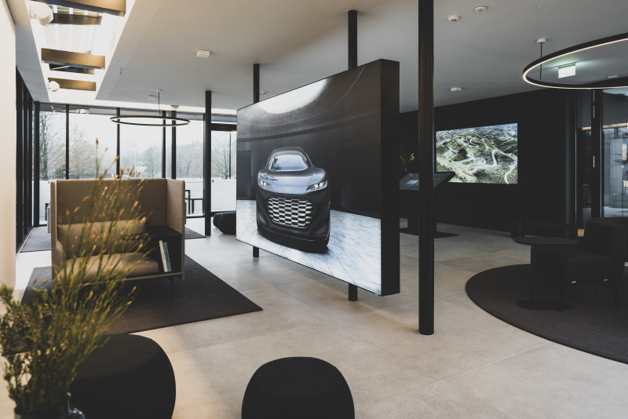
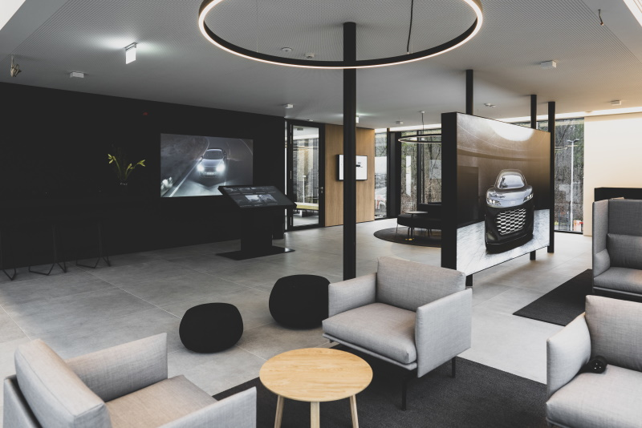

<!-- markdownlint-disable MD033 -->
<figur>
    
    <figcaption><h4>Audi-charging hub</h4></figcaption>
</figur>

 Audi charging hub åpner for kunder 23. desember Den moderne hurtigladestasjonen med reserverbare høyeffektladeplasser er rettet mot blant annet elbileiere som ikke har lademuligheter hjemme. Dessuten er Audis charging hub ment å betjene fremtidens toppetterspørsel etter lading i urbane miljøer. Et tilkoblet salongområde tilbyr en førsteklasses ladeopplevelse.

Med pilotplasseringen tester Audi for første gang sitt nye ladekonsept. "Vi ønsker å bruke den til å teste fleksibel og premium-orientert hurtigladeinfrastruktur i byrom," sier Ralph Hollmig, prosjektleder for Audi charging hub. "Vi skal dit kundene våre ikke nødvendigvis våkner om morgenen med en fulladet elbil og tenker samtidig på å øke ladebehovet i fremtiden."

<figur>
    
    <figcaption><h4>Audi-charging hub</h4></figcaption>
</figur>

## Selvforsynt og rimelig ladeinfrastruktur

Kuber er grunnlaget for Audis charging hub. De fleksible beholderkubene kan monteres og demonteres igjen i eksisterende områder i løpet av få dager. Kubene gir to hurtigladestasjoner for hver enhet og kan kombineres i ulike konstellasjoner. Brukte og bearbeidede litiumion-batterier fungerer som energilagringssystemer – det som er kjent som andre liv-batterier hentet fra demonterte utviklingskjøretøyer. Det reduserer kostnader og ressurser. Dette gjør kompleks infrastruktur med høyspentledninger og kostbare transformatorer like unødvendig som tidkrevende planleggingsprosedyrer. Audi charging hubs batterilagringsløsning vil bringe hurtigladeinfrastruktur der det elektriske nettet ikke er nok.

<figur>
    
    <figcaption><h4>Audi-charging hub</h4></figcaption>
</figur>

Takket være de drøyt 2,45 MWh mellomlagring trenger ladestasjonene i Nürnberg kun en 200 kW grønn strømforbindelse til lavspentnettet som allerede er tilgjengelig, noe som er fullt tilstrekkelig for drift av Audi charging hub. De 200 kW er nok til å fylle opp lagringsmodulene kontinuerlig. Solcellepaneler på taket gir i tillegg opptil 30 kW grønn energi. Kunder kan lade elbiler med opptil 320 kW effekt ved seks ladepunkter. Totalt kan ca 80 kjøretøy lades her per dag uten å nå grensene for energilagringssystemets kapasitet kombinert med hubens 200 kW effekttilførsel.

[Audi e-tron GT](../../models/e-tron-gt/) når en ladekapasitet på opptil 270 kW. Det gjør at firedørs Coupé kan lade nok energi til opptil 100 kilometer på omtrent fem minutter. En lading fra 5 til 80 prosent tar omtrent 23 minutter.

## Priser som Wallbox hjemme

Foreløpig kan alle som velger å bruke høyeffektladestasjonene ved Audi charging hub i Nürnberg og har en e-tron Charging Service-kontrakt ta betalt for 31 cent per kilowattime, uansett takst. 
Det gjør Audi charging hub til et reelt alternativ til å lade hjemme for Tyskerne som er vant med høyere strømpriser en nordmenn. "Vi gir folk i urbane områder lading til prisen de ville betale for å bruke Wallbox hjemme," sier Hollmig. Audi charging hub i Nürnberg er en åpen ladeplass. Inngangspartiet er til og med tilgjengelig for førere av biler av andre merker.

## Rask og ukomplisert lading

Audi-kunder kan bruke den nye reservasjonsfunksjonen i myAudi-appen: De kan enkelt bestille en av de seks ladeområdene.

<figur>
    
    <figcaption><h4>Audi ladesenterreservasjon</h4></figcaption>
</figur>

Selve ladingen er rask og ukomplisert. Med Plug and Charge (PnC) er det til og med mulig å lade modeller med Plug and Charge-funksjonalitet uten RFID-kort (radio frequency identification) ved to av de seks ladepunktene under pilotfasen. Autentiseringsprosessen skjer automatisk via kryptert kommunikasjon så snart ladekabelen kobles til kjøretøyet. For å bruke dette systemet må sjåførene ha en PnC-kompatibel modell av [Audi e-tron](../../models/e-tron/)-serien (Audi e-tron 50/55/S inkl. Sportback-derivater) med produksjonsdato etter kalenderuke 48/2021) og en aktiv e-tron Charging Service-kontrakt. Kunder kan bruke de 20 til 30 minuttene det tar å lade opp til 80 prosent ladevolum – for eksempel med en [Audi e-tron](../../models/e-tron/) eller [Audi e- tron GT](../../models/e-tron-gt/) – i salongen ovenpå.

## Attraktive tjenestetilbud øker ladetiden

Testene som starter i Nürnberg fokuserer på den nye reservasjonsfunksjonen, kundenes forventninger om en premium ladeopplevelse og tekniske aspekter som kravene til moderne batterilagringssystemer. Audi ønsker også å finne ut hvilke tider på døgnet anlegget er spesielt hyppig brukt. Målet er å etablere Audi charging hub med passende merverdi for kundene. For det formål tilbyr Audi ytterligere attraktive tjenester på stedet utover lading av elbiler: en byttestasjon for elektriske sykkelbatterier, en utlånstjeneste for elektriske scootere, informasjon om ulike Audi-produkter, samt prøvekjøringer i [Audi Q4 e- tron](../../models/q4-e-tron/) og [Audi RS e-tron GT](../../models/e-tron-gt), overvåket av Audi-eksperter. I tillegg tilbyr Audi en just-in-time leveringstjeneste for mat, en eksklusiv automat og mobil bilpleie.

<figur>
    
    <figcaption><h4>Audi ladesentersalong</h4></figcaption>
</figur>

Servicepersonalet tar vare på kundene I den drøyt 200 kvadratmeter store barrierefrie salongen, som også inkluderer en 40 kvadratmeter stor uteplass, står brukernes velvære i sentrum. Der kan de jobbe og slappe av. På en 98-tommers skjerm kan Audi-modeller konfigureres eller informasjon om Audi-charging hubens funksjonalitet eller bilens gjeldende ladenivå kan hentes.

Under pilotprosjektet i Nürnberg vil en ansatt ivareta besøkendes ønsker mellom 10:00 og 19:00. Seks ladepunkter og en salong er tilgjengelig hele døgnet. "Kundene våre vil dele flere fordeler," sier prosjektleder Hollmig. "Med et eksklusivt reservasjonsalternativ, et salongområde, kort tomgangstid takket være høy ladekapasitet, og en ny svingarm for å forenkle håndteringen av ladekabelen."

<figur>
    
    <figcaption><h4>Audi ladesentersalong</h4></figcaption>
</figur>

## Videopresentasjon av Audi Charge hub

Følgende video presenterer Audi Charge hub i detaljer.

 

{}
