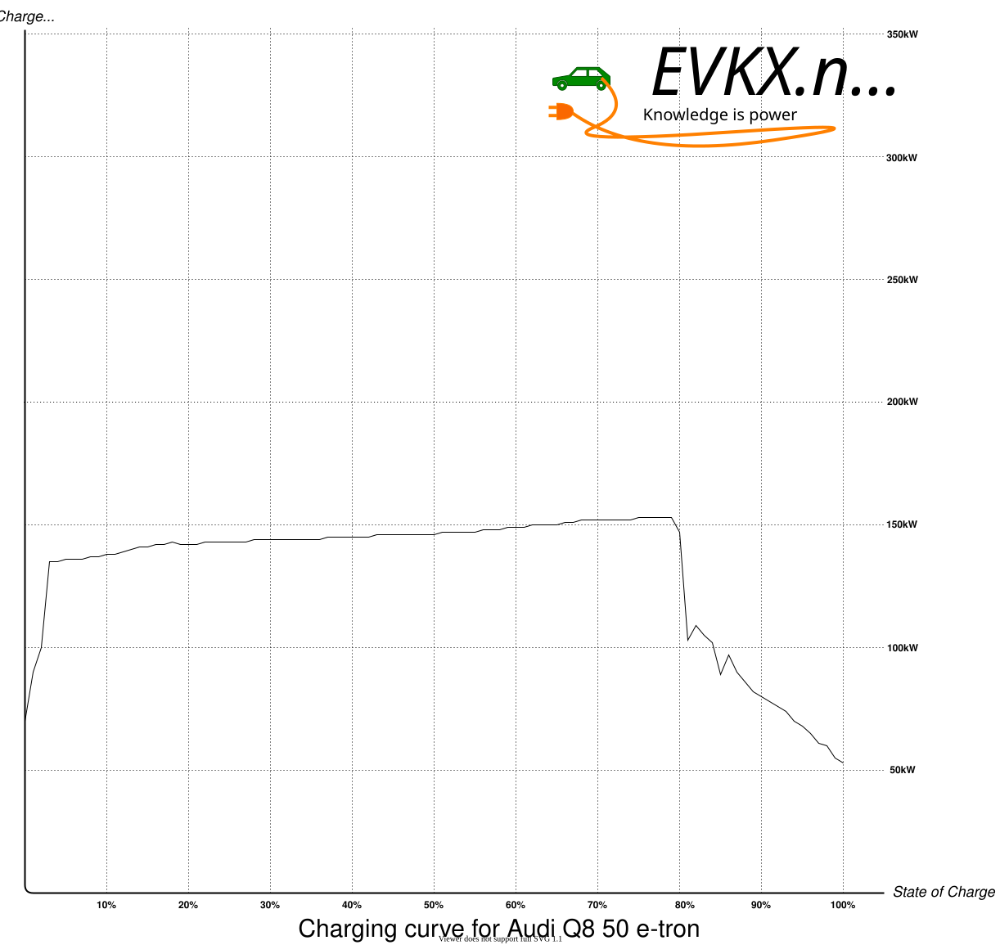

<!-- markdownlint-disable MD033 -->

> **Article de lancement historique :** Cette page a été écrite pour le Q8 e-tron révéler en novembre 2022. Dates, prix et états de compte de l'avenir décrivent les plans d'Audi à ce moment-là ; le modèle est entré depuis dans la production et a ensuite quitté la production en février 2025.

Dans cet article, vous trouverez la plupart des détails et des images haute résolution (cliquez dessus). Vous trouverez également de nombreux liens dans la description du modèle pour plus d'informations sur les options et la technologie pour l'e-tron Audi Q8.



 Avec l'Audi e-tron, le fabricant de premier plan est entré dans l'ère de l'électromobilité en 2018, marquant le début de l'avenir électrique des quatre anneaux.

Depuis, le modèle a établi des normes dans le segment des VUS électriques de luxe. Le nouveau véhicule électrique Audi Q8 e-tron s'appuie sur l'histoire de succès de ce pionnier électrique. Le VUS électrique haut de gamme et le croisé impressionnent par leur concept d'entraînement optimisé, aérodynamique améliorée, des performances de charge plus élevées et une capacité de batterie accrue, et [WLTP range](https://evkx.net/guides/understandingrange/wltp/) de 582 kilomètres dans la version SUV et de 600 kilomètres dans la version Sportback. En outre, des changements significatifs, surtout à l'avant du véhicule, donnent au nouveau SUV phare une apparence plus fraîche.

Depuis sa mise en service il y a environ quatre ans et sa vente de 150 000 unités, Audi a suivi une feuille de route électrique systématique. [eight models](../../models/).

D'ici 2026, il aura plus de 20. A ce moment, Audi ne sortira que des modèles entièrement électriques sur le marché mondial. [‘Vorsprung 2030’](../vorsprung2030/), nous avons fixé une date fixe pour notre retrait des moteurs à combustion et décidé que Audi sera une marque entièrement électrique dans les 11 ans , , a déclaré [Markus Duesmann](https://www.audi.com/en/company/profile/company-management/markus-duesmann.html), Président du Conseil d'administration d'AUDI AG. -Le nouveau Audi Q8 e-tron, avec son efficacité et sa portée améliorées et son design raffiné, est un autre élément important de notre portefeuille électrique pour inciter les gens à l'électromobilité avec des modèles émotionnels adaptés à l'usage quotidien.

Audi Membre du Conseil d'administration pour le développement technique [Oliver Hoffmann](https://www.linkedin.com/in/oliver-hoffmann-audi/) - - - - - - - - , nous avons également mis l'accent sur les avantages pour les clients que ces améliorations ont permis d'améliorer considérablement la capacité de charge et la capacité de charge. Ces changements nous ont permis d'atteindre un équilibre optimal entre la densité d'énergie et la capacité de charge et d'augmenter l'efficacité. - - - - - - - - - - - - - - - - - - - - - - - - - - - - - - - - - - - - - - - - - - - - - - - - - - - - - - - - - - - - - - - - - - - - - - - - - - - - - - - - - - - - - - -

## Nouveau visage, nouveau nom, nouvelle identité d'entreprise

En appelant ce modèle le Q8, Audi indique clairement que le Audi Q8 e-tron est le modèle de premier parmi ses VUS et croisés électriques, assis au-dessus de la [Audi Q4 e-tron](../../models/q4-e-tron) et le prochain [Audi Q6 e-tron](../../models/q6-e-tron/).



Les modèles e-tron et e-tron Q8 Sportback sont immédiatement identifiables comme étant entièrement électriques à première vue, grâce aux nouveaux designs avant et arrière qui portent systématiquement le langage de conception électrique Audi.

Quant à l'E-tron Audi, vous pouvez commander l'E-tron Audi Q8 avec [black optics or standard optics](../../models/q8-e-tron/exterior/optics/)Mais la différence est qu'un grill noir à cadre unique ne fait pas partie du paquet optique noir. (Comme [the optics on Audi e-tron GT](../../models/e-tron-gt/exterior/optics/)Par conséquent, vous pouvez commander le grill à cadre unique en gris, couleur du corps ou noir. En outre, vous pouvez spécifier l'e-tron Audi Q8 avec une bande lumineuse horizontale sur le dessus de la grille à cadre unique.



En tant que modèle de VUS électrique de marque Audi, le Q8 e-tron ouvre la nouvelle identité d'entreprise avec un design bidimensionnel des quatre anneaux à l'extérieur. De plus, le lettrage modèle avec un logo Audi sur la pilier B est également nouveau.



Pour toutes les variantes Q8, vous pouvez commander le modèle avec ou sans [S-line exterior package](../../models/q8-e-tron/exterior/s-line/). Ce paquet contient un front et un diffuseur plus sportif.

De nouvelles roues sont disponibles dans toutes les tailles pour toutes les variantes, et de nombreuses roues Audi e-tron sont également disponibles sur le Audi Q8 e-tron. Voir [Audi Q8 wheels](../../models/q8-e-tron/exterior/wheels/) pour un aperçu complet.



Comme sur l'E-tron Audi, une vaste palette de couleurs standard est disponible. De plus, vous pouvez choisir parmi environ 50 couleurs exclusives Audi.

Il y a de nouvelles couleurs disponibles dans la palette standard.

Voir [paint colors](../../models/q8-e-tron/exterior/paint/) pour un aperçu et plus de photos.

La possibilité de [painted calipers](../../models/q8-e-tron/exterior/paintedcalibers/) Cette couleur était orange sur l'E-tron Audi.

## Espace et confort

Avec une longueur de 4,915 mètres, une largeur de 1,937 mètres, et une hauteur de 1,619 mètres pour le Sportback et 1,633 mètres pour le VUS, l'e-tron Q8 offre un grand espace et un grand confort.

Les e-tron SQ8 et SQ8 Sportback e-tron sont chacun deux millimètres plus bas et 39 millimètres plus large. Son empattement de 2,928 mètres permet aussi beaucoup de place dans les sièges arrière.

En outre, il a un volume de stockage généreux de 569 litres pour le VUS et de 528 litres pour le Sportback. Il y a aussi 62 litres disponibles dans la zone de stockage avant, le soi-disant -frunk.

## Trois variantes de transmission

Pour les deux formes de corps, trois variantes de transmission sont disponibles.

Les tableaux suivants comparent les variantes actuelles d'E-tron Audi avec les différentes variantes d'E-tron Q8 pour la gamme et la consommation pour une gamme optimisée de l'équipement.

|Variante                 |  Plage WLTP                                                         |Changement |
|-------------------------------                                                                |-----------        |-------|
| [Audi e-tron 50](../../models/e-tron/variants/#audi-e-tron-50)                                |  341km/212mi      |       |
| [Audi Q8 50 e-tron](../../models/q8-e-tron/variants/#audi-q8-50-e-tron)                       |  491km/305mi      | +44%  |
| [Audi e-tron 50 Sportback](../../models/e-tron/variants/#audi-e-tron-50-sportback)            |  351km/218mi      |       |
| [Audi Q8 50 Sportback e-tron](../../models/q8-e-tron/variants/#audi-q8-50-sportback-e-tron)   |  505km/314mi      | +44%  |
| [Audi e-tron 55](../../models/e-tron/variants/#audi-e-tron-55)                                |  441km/274mi      |       |
| [Audi Q8 55 e-tron](../../models/q8-e-tron/variants/#audi-q8-55-e-tron)                       |  582km/362mi      | +32%  |
| [Audi e-tron 55 Sportback](../../models/e-tron/variants/#audi-e-tron-55)                      |  452km/281mi      |       |
| [Audi Q8 55 Sportback e-tron](../../models/q8-e-tron/variants/#audi-q8-55-sportback-e-tron)   |  600km/373mi      | +33%  |
| [Audi e-tron S](../../models/e-tron/variants/#audi-e-tron-60s)                                |  374km/232mi      |       |
| [Audi SQ8 e-tron](../../models/q8-e-tron/variants/#audi-sq8-e-tron)                           |  494km/307mi      | +32%  |
| [Audi e-tron S Sportback](../../models/e-tron/variants/#audi-e-tron-60s)                      |  379km/235mi      |       |
| [Audi SQ8 e-tron Sportback](../../models/q8-e-tron/variants/#audi-sq8-sportback-e-tron)       |  513km/319mi      | +35%  |

Ce diagramme montre la même chose, y compris les autres modèles de VUS tout électrique d'Audi. (cliquez sur le diagramme pour le grand) (cliquez sur [here](https://media.evkx.net/ehga/articles/e-tron-facelift-q8-etron-2024/range_miles.webp) pour le même diagramme en miles)



|Variante | Consommation de WLTP | Changement |
|-------|-------------|-------|
|[Audi e-tron 50](../../models/e-tron/variants/#audi-e-tron-50)                                 | 18,77kWh/100km |          |
|[Audi Q8 50 e-tron](../../models/q8-e-tron/variants/#audi-q8-50-e-tron)                        | 18,12kWh/100km | -3.4%    |
|[Audi e-tron 50 Sportback](../../models/e-tron/variants/#audi-e-tron-50-sportback)             | 18,23kWh/100km |          |
|[Audi Q8 50 Sportback e-tron](../../models/q8-e-tron/variants/#audi-q8-50-sportback-e-tron)    | 17,62kWh/100km | -3.3%    |
|[Audi e-tron 55](../../models/e-tron/variants/#audi-e-tron-55)                                 | 19,5kWh/100km  |          |
|[Audi Q8 55 e-tron](../../models/q8-e-tron/variants/#audi-q8-55-e-tron)                        | 18,21kWh/100km | - 7.1%   |
|[Audi e-tron 55 Sportback](../../models/e-tron/variants/#audi-e-tron-55)                       | 19,03kWh/100km |          |
|[Audi Q8 55 Sportback e-tron](../../models/q8-e-tron/variants/#audi-q8-55-sportback-e-tron)    | 17,33kWh/100km | -9%      |
|[Audi e-tron S](../../models/e-tron/variants/#audi-e-tron-60s)                                 | 22,99kWh/100km |          |
|[Audi SQ8 e-tron](../../models/q8-e-tron/variants/#audi-sq8-e-tron)                            | 21.46kWh/100km | -6.7     |
|[Audi e-tron S Sportback](../../models/e-tron/variants/#audi-e-tron-60s)                       | 22,69kWh/100km |          |
|[Audi SQ8 e-tron Sportback](../../models/q8-e-tron/variants/#audi-sq8-sportback-e-tron)        | 20,66kWh/100km | -9%      |

Le diagramme ci-dessous compare la consommation de tous les modèles électriques d'Audi. Cliquez sur l'image pour l'agrandir, ou voyez le même diagramme dans [mi/kWh](https://media.evkx.net/ehga/articles/e-tron-facelift-q8-etron-2024/consumption_miles.webp).



Et si vous avez plus d'équipement? Le tableau suivant compare le niveau de coupe avancé. La différence est encore plus grande.

|Variante                                                                                            |  WLTP rekkevidde                                                                         |Endring|
|-------------------------------                                                                        |-----------|-------|
| [Audi e-tron 50 Advanced](../../models/e-tron/variants/#audi-e-tron-50)                               |  315km    |       |
| [Audi Q8 50 e-tron Advanced](../../models/q8-e-tron/variants/#audi-q8-50-e-tron)                      |  458km    | +45%  |
| [Audi e-tron 50 Sportback Advanced](../../models/e-tron/variants/#audi-e-tron-50-sportback)           |  321 km    |       |
| [Audi Q8 50 Sportback e-tron Advanced](../../models/q8-e-tron/variants/#audi-q8-50-sportback-e-tron)  |  471km    | +47%  |
| [Audi e-tron 55 Advanced](../../models/e-tron/variants/#audi-e-tron-55)                               |  405km    |       |
| [Audi Q8 55 e-tron Advanced](../../models/q8-e-tron/variants/#audi-q8-55-e-tron)                      |  539km    | +33%  |
| [Audi e-tron 55 Sportback Advanced](../../models/e-tron/variants/#audi-e-tron-55)                     |  413km    |       |
| [Audi Q8 55 Sportback e-tron Advanced](../../models/q8-e-tron/variants/#audi-q8-55-sportback-e-tron)  |  556km    | +35%  |
| [Audi e-tron S](../../models/e-tron/variants/#audi-e-tron-60s)                                        |  371km    |       |
| [Audi SQ8 e-tron](../../models/q8-e-tron/variants/#audi-sq8-e-tron)                                   |  491km    | +32%  |
| [Audi e-tron S Sportback](../../models/e-tron/variants/#audi-e-tron-60s)                              |  375km    |       |
| [Audi SQ8 e-tron Sportback](../../models/q8-e-tron/variants/#audi-sq8-sportback-e-tron)               |  509km    | +35%  |

Les performances n'ont pas changé, sauf pour le modèle e-tron 50 d'Audi Q8. Ce modèle a maintenant augmenté sa puissance et le même couple que les 55 modèles.

|Variante | Puissance maximale | Torque Max | Vitesse maximale |
|-------|-------------|-------|------|
|[Audi e-tron 50](../../models/e-tron/variants/#audi-e-tron-50)                             | 230kW | 540nm    |200 km/h|
|[Audi Q8 50 e-tron](../../models/q8-e-tron/variants/#audi-q8-50-e-tron)                    | 250kW | 664nm    |200 km/h|
|[Audi e-tron 50 Sportback](../../models/e-tron/variants/#audi-e-tron-50-sportback)         | 230kW | 540nm    |200 km/h|
|[Audi Q8 50 Sportback e-tron](../../models/q8-e-tron/variants/#audi-q8-50-sportback-e-tron)| 250kW | 664nm    |200 km/h|
|[Audi e-tron 55](../../models/e-tron/variants/#audi-e-tron-55)                             | 300kW | 664nm    |200 km/h|
|[Audi Q8 55 e-tron](../../models/q8-e-tron/variants/#audi-q8-55-e-tron)                    | 300kW | 664nm    |200 km/h|
|[Audi e-tron 55 Sportback](../../models/e-tron/variants/#audi-e-tron-55)                   | 300kW | 664nm    |200 km/h|
|[Audi Q8 55 Sportback e-tron](../../models/q8-e-tron/variants/#audi-q8-55-sportback-e-tron)| 300kW | 664nm    |200 km/h|
|[Audi e-tron S](../../models/e-tron/variants/#audi-e-tron-60s)                             | 370kW | 973nm    |210 km/h|
|[Audi SQ8 e-tron](../../models/q8-e-tron/variants/#audi-sq8-e-tron)                        | 370kW | 973nm    |210 km/h|
|[Audi e-tron S Sportback](../../models/e-tron/variants/#audi-e-tron-60s)                   | 370kW | 973nm    |210 km/h|
|[Audi SQ8 e-tron Sportback](../../models/q8-e-tron/variants/#audi-sq8-sportback-e-tron)    | 370kW | 973nm    |210 km/h|

## Capacité de la batterie et performances de charge plus élevées

Comme sur le Audi e-tron, deux tailles de batterie sont disponibles sur les variantes. [Q8 50 e-tron](../../models/q8-e-tron/variants/#audi-q8-50-e-tron) La batterie 95kWh utilisée sur les 50 variantes utilise la même batterie que celle utilisée sur les variantes Audi 55 et S. Grâce au réglage du système de gestion de la batterie, la capacité de batterie utilisable pour les clients est passée de 86kWh à 89kWh.

Dans une station de recharge à haute puissance, le Audi Q8 50 e-tron atteint une performance de charge maximale de 150 kW. Avec le Q8 55 e-tron et le SQ8 e-tron, la performance de charge maximale augmente à 170 kW. La grande batterie peut être chargée de 10 à 80 pour cent pendant un arrêt de charge d'environ 31 minutes – dans des conditions idéales, cela correspond à une autonomie allant jusqu'à 420 kilomètres (selon [WLTP](https://evkx.net/guides/understandingrange/wltp/)).

Audi e-tron a été leader sur le marché en vitesse de charge moyenne depuis son introduction. Alors, comment cela se compare-t-il au lifting ? [EVKX.net](https://evkx.net), electrichasgoneaudi.net ci-dessous la courbe de charge pour le Audi Q8 50 e-tron (même que le Audi e-tron 55) et le Audi Q8 e-tron 55 avec la nouvelle batterie.

Pour répondre à cela, nous calculons la durée de trajet des anciens et nouveaux modèles à 1000km, en commençant par une batterie complète, en conduisant à 120km/h et en arrêtant uniquement pour des arrêts de charge optimaux. Le calcul suppose des conditions de conduite optimales avec des routes sèches et des températures d'environ 20 degrés Celsius.

|Variante | Consommation 120km/h | Arrêts de chargement | Durée totale | Enregistrer |
|-------|-------------|-------|------|-----|
|[Audi e-tron 50](../../models/e-tron/variants/#audi-e-tron-50)                             | 26,5kWh/100km      | 5 x (5%-68 %)    |10h32m |       |
|[Audi Q8 50 e-tron](../../models/q8-e-tron/variants/#audi-q8-50-e-tron)                    | 26 kWh/100km       | 3 x (15 %-80 %)   |9h:49m  | -43m  |
|[Audi e-tron 50 Sportback](../../models/e-tron/variants/#audi-e-tron-50-sportback)         | 25 kWh/100km       | 4 x (3 %-76 %)    |10h22m |       |
|[Audi Q8 50 Sportback e-tron](../../models/q8-e-tron/variants/#audi-q8-50-sportback-e-tron)| 24,5 kWh/100km     | 2 x (5%-80%)    |9h33m  | -49m  |
|[Audi e-tron 55](../../models/e-tron/variants/#audi-e-tron-55)                             | 27,5 kWh/100km     | 3 x (6 %-80 %)    |9h57m  |       |
|[Audi Q8 55 e-tron](../../models/q8-e-tron/variants/#audi-q8-55-e-tron)                    | 26 kWh/100km       | 2 x (1 %-74 %)    |9h36m  | -21m  |
|[Audi e-tron 55 Sportback](../../models/e-tron/variants/#audi-e-tron-55)                   | 26 kWh/100km       | 3 x (12%-80%)   |9h50m  |       |
|[Audi Q8 55 Sportback e-tron](../../models/q8-e-tron/variants/#audi-q8-55-sportback-e-tron)| 24,5 kWh/100km     | 2 x (3 %-81 %)    |9h32m  | -18 millions  |
|[Audi e-tron S](../../models/e-tron/variants/#audi-e-tron-60s)                             | 29 kWh/100km       | 3 x (2 %-82 %)    |10h05m |       |
|[Audi SQ8 e-tron](../../models/q8-e-tron/variants/#audi-sq8-e-tron)                        | 28 kWh/100km       | 3 x (16%-71%)   |9h46m  | -21m  |
|[Audi e-tron S Sportback](../../models/e-tron/variants/#audi-e-tron-60s)                   | 28 kWh/100km       | 3 x (4 %-80 %)    |10h:0m  |       |
|[Audi SQ8 e-tron Sportback](../../models/q8-e-tron/variants/#audi-sq8-sportback-e-tron)    | 26 kWh/100km       | 2 x (1 %-74 %)    |9h36m  | - 24 m  |

Comme le montre le tableau, la batterie de 95kWh est encore comparable à la nouvelle batterie et bat même la batterie plus grande en raison d'une courbe plus flattée pour cette distance.

Le Audi Q8 e-tron charge jusqu'à 11 kW à une borne de recharge ou une boîte murale. [optional AC charger](../../models/q8-e-tron/technology/onboardcharger/#optional-22kw-charger) qui supporte jusqu'à 22 kW de charge CA.

Dans des conditions idéales, avec un courant alternatif, le Audi Q8 50 e-tron peut recharger de 0 à 100% en environ neuf heures et 15 minutes (22kW: environ quatre heures et 45 minutes). Cependant, les chiffres de la grande batterie sont d'environ 11 heures et 30 minutes à 11 kW et six heures à 22 kW. [onboard-charger section](../../models/q8-e-tron/technology/onboardcharger/#capacity-based-on-network--outlet).

Le Audi Q8 e-tron est livré en standard avec la fonction Plug & Charge. Dans les bornes de recharge compatibles, le véhicule s'autorise à insérer le câble de recharge et active le point de recharge.

Le nouveau service de recharge Audi, qui sera lancé en 2023 et remplacera le service de recharge e-tron existant, permettra un accès pratique à environ 400 000 points de recharge publique en Europe. En outre, le planificateur de route e-tron fournit un support fiable lors de la recherche de points de recharge le long de votre itinéraire.

## Moteur à essieu arrière et vecteur de couple électrique révisés pour une meilleure dynamique

Pour le nouveau véhicule, Audi a modifié le moteur asynchrone sur l'essieu arrière.

Au lieu de 12 bobines produisant le champ électromagnétique, il y en a maintenant 14. Ainsi, le moteur génère un champ magnétique plus fort avec une entrée d'électricité similaire, permettant un couple plus élevé. Par conséquent, le moteur électrique a besoin de moins d'énergie pour générer le couple si cela n'est pas nécessaire.

<figure>
    
    <figcaption><h4>Moteur arrière à jour Audi Q8 e-tron</h4></figcaption>
</figure>

Audi a utilisé pour la première fois un concept à trois moteurs dans une production à grande échelle avec le modèle S de la gamme e-tron. Audi a affiné cette configuration pour le nouveau SQ8 e-tron. Un moteur électrique de 124 kW est à l'œuvre sur l'essieu avant.

Deux moteurs électriques sur l'essieu arrière, chacun avec 98 kW de puissance, alimentent séparément une roue arrière. Cette configuration permet une performance de boost de 370 kW.

L'électronique du moteur peut répartir le couple d'entraînement entre les deux moteurs électriques arrière entre les deux roues en une seconde.

[Read more in the motor section for Q8 e-tron](../../models/q8-e-tron/drivetrain/motor/)

## L'équilibre entre confort et sport

Le nouveau véhicule est équipé de série avec une absorption de choc adaptative contrôlée par l'air et la suspension. La hauteur du véhicule peut être variée de 76 millimètres, selon la situation de conduite.

Audi a ajusté la suspension pneumatique pour optimiser la dynamique latérale du véhicule. De plus, son contrôle électronique de stabilité (ESC) permettra une maniabilité encore plus grande à l'avenir, surtout dans les virages serrés. Le Audi Q8 e-tron les gère avec une agilité nettement plus grande grâce à sa nouvelle direction progressive.

Le rapport de la direction a été modifié de manière à ce que la direction réponde beaucoup plus rapidement, même lorsque les mouvements de direction sont délicats. De plus, les roulements de suspension plus rigides sur l'essieu avant supportent l'effet du rapport de direction direct. Les mouvements de direction sont ainsi transmis plus directement aux roues, et le retour d'information des réactions de direction est également amélioré. [Audi DNA](../audidna/).

## Aérodynamique améliorée

Avec le véhicule, le thème de l'aérodynamique était une priorité absolue. A ce titre, Audi a pu réduire le coefficient de traînée. Par exemple, de 0,26 à 0,24 cw pour le T8 Sportback e-tron et de 0,28 à 0,27 cw pour le T8 e-tron.

Pour le Q8 Sportback, cela signifie une réduction de la consommation de conduite à 120km/h à 1,2kWh/100km, et pour le Q8 e-tron, 0,6kWh/100km.

Les spoilers montés sur le dessous du véhicule aident à détourner l'air autour des roues. Audi a agrandi les spoilers sur l'essieu avant, et le véhicule Q8 Sportback e-tron a maintenant des spoilers sur les roues arrière.

Les spoilers montés uniquement sur l'essieu arrière du SQ8 Sportback e-tron.

La grille dispose d'un système d'auto-scellement et de volets électriques qui ferment automatiquement le radiateur. Ce système optimise encore le flux d'air à l'avant de la voiture et empêche les pertes d'énergie indésirables.

<figure>
    
    <figcaption><h4>Grille e-tron Audi Q8 avec volets</h4></figcaption>
</figure>

## Parking pratique avec assistance de parc à distance plus

Il y a des gens autour [40 driver assistance systems](../../models/q8-e-tron/technology/drivingassistance/) Jusqu'à cinq capteurs radar, cinq caméras et 12 capteurs ultrasoniques fournissent des informations environnementales analysées par l'unité centrale de contrôle de l'assistance au conducteur.

Quelque chose de nouveau est l'assistance de parc à distance plus, qui sera disponible pour commander à partir de 2023. Avec son aide, l'E-tron Audi Q8 peut manœuvrer dans les places de stationnement les plus serrées.

Les clients peuvent contrôler la procédure de stationnement via l'application myAudi sur leurs smartphones. Lorsque la voiture atteint sa position finale dans l'espace de stationnement, elle s'éteint automatiquement, met le frein de stationnement et verrouille les portes.

En quittant l'espace de stationnement, le moteur est alimenté par l'application myAudi, puis le véhicule manœuvre assez pour une entrée confortable.

La vision nocturne n'est pas disponible sur l'e-tron Q8. Les nouvelles bagues Audi rendent la configuration difficile. Ainsi, certains propriétaires d'e-trons d'Audi rateront la vision nocturne sur le nouveau modèle.

## Phares à DEL de la matrice numérique

Le Q8 e-tron est livré avec [digital Matrix LED headlights](../../models/q8-e-tron/technology/lights/#digital-matrix-led-headlights). En conduisant sur l'autoroute, le feu d'orientation marque la position de la voiture dans la voie et aide le conducteur à rester en sécurité au centre dans des espaces étroits.

- Amélioration de l ' information sur le trafic
- Le feu de voie avec un indicateur de direction
- Le feu d'orientation sur les routes de campagne

<figure>
    
    <figcaption><h4>Matrice numérique</h4></figcaption>
</figure>

## Intérieur de classe luxe

Les [glass panorama roof](../../models/q8-e-tron/exterior/panoramicroof/) L'intérieur est plus léger et renforce le sens de l'air et de l'étendue. Les éléments de verre s'ouvrent et se ferment électroniquement. Vous pouvez également bloquer la lumière du soleil avec l'ombre de soleil intégrée. Lorsque le toit panoramique est ouvert, le toit en verre à deux parties améliore le climat de l'intérieur grâce à une ventilation efficace.

Audi offre également [four-zone automatic climate control](../../models/q8-e-tron/technology/climatecontrol/#4-zone-electronic-climate-control) comme alternative à la [standard two-zone automatic climate control](../../models/q8-e-tron/technology/climatecontrol/) et une [air quality package](../../models/q8-e-tron/technology/airquality/).

Les [three-stage ventilation](../../models/q8-e-tron/interior/seats/#ventilated-seats) offre des sièges confortables, même à des températures extérieures élevées. [standard](../../models/q8-e-tron/interior/seats/#standard-seats) et sièges individuels avec cuir perforé.

Le très réglable [individual contour](../../models/q8-e-tron/interior/seats/#individual-contour-seats) les sièges sont le point fort parmi les [interior options](../../models/q8-e-tron/interior/). En plus des réglages pneumatiques de siège et dossier, vous pouvez commander des sièges individuels avec un [massage function](../../models/q8-e-tron/interior/seats/#massage).

Tous les meubles ont [optional decorative inlays](../../models/q8-e-tron/interior/inlays/) de placages de bois poreux tels que les cendres et sycomores grainés, l'aluminium ou une structure en fibre de carbone pour la ligne S et les versions de la ligne S édition.

## Affichages tactiles haute résolution et contrôle de la voix

Comme tous les modèles Audi de luxe, l'e-tron Q8 utilise le système d'exploitation de réponse tactile MMI.

Ses deux grands écrans haute résolution – le haut avec une diagonale de 10,1 pouces et le bas avec une diagonale de 8,6 pouces – remplacent presque tous les commutateurs et boutons conventionnels. Au-delà de l'opération avec les écrans à deux touches, vous pouvez activer de nombreuses fonctionnalités grâce à la commande vocale naturelle.

<figure>
    
    <figcaption><h4>Audi Q8 e-tron MMI et cockpit virtuel</h4></figcaption>
</figure>

Le concept d'affichage et de fonctionnement numérique dans le véhicule Q8 e-tron inclut la norme [Audi virtual cockpit](../../models/q8-e-tron/technology/uiandoperations/virtualcockpit/) Dans le cockpit virtuel, les graphiques décrivent tous les aspects importants de la conduite électrique, de la performance de charge à la portée.

En outre, vous pouvez également ajouter un écran tête vers le haut.

Le Audi Q8 e-tron sera livré standard avec [MMI Navigation plus](../../models/q8-e-tron/technology/uiandoperations/navigation/). En outre, son centre média prend en charge la transmission de données à grande vitesse standard LTE Advanced, et il a un point d'accès WiFi intégré pour les appareils mobiles des passagers. De plus, le système de navigation recommande intelligemment des destinations basées sur des itinéraires précédemment parcourus.

## Matériaux issus des procédés de recyclage

Audi Q8 e-tron sera certifié « net-carbone neutre » pour les clients en Europe et aux États-Unis. Audi utilise également des matériaux recyclés pour certains composants de l'E-tron Audi Q8. Ces matériaux, traités par un processus de recyclage, réduisent les ressources utilisées et assurent une boucle de matériaux fermée, efficace et durable. A l'intérieur de l'E-tron Audi Q8, Audi utilise des matériaux recyclés pour l'isolation et l'amortissement, ainsi que pour le tapis. Avec le pack d'équipement de la ligne S, le revêtement pour les sièges de sport est en cuir synthétique, et le matériau de microfibre Dinamica. Audi fabrique Dinamica jusqu'à 45 pour cent de fibres de polyester fabriquées à partir de bouteilles en PET recyclées, textiles usagés et résidus de fibres.

Contrairement à la qualité antérieure des microfibres, la production de Dinamica est également exempte de solvants – une autre contribution à la protection de l'environnement.

De plus, certains composants liés à la sécurité qui comprennent partiellement des déchets plastiques mixtes d'automobile traités par un procédé de recyclage chimique sont utilisés pour la première fois – en particulier les couvercles en plastique pour les boucles de ceinture. Dans le cadre du projet PlasticLoop, Audi a travaillé avec le fabricant de plastiques LyondellBasell pour établir un procédé dans lequel le recyclage chimique sera utilisé pour la première fois pour réutiliser les déchets plastiques mixtes d'automobile dans la production en série de l'e-tron Audi Q8. Dans ce processus, mis en œuvre conjointement avec LyondellBasell, les composants plastiques des véhicules clients sont démontés et séparés des matériaux étrangers, tels que les clips métalliques, avant d'être déchiquetés et transformés en huile de pyrolyse par recyclage chimique. Cette huile de pyrolyse est ensuite utilisée comme matière première pour produire de nouveaux plastiques dans une approche de bilan massique.

## Lancement du marché au printemps 2023

Le lancement du marché de la nouvelle Audi Q8 e-tron et de la Audi Q8 Sportback e-tron, qui sera disponible pour commande à partir de la mi-novembre, est prévu à la fin de février 2023 en Allemagne et les marchés européens les plus importants. Audi s'attend à ce que ce soit sur le marché américain à la fin avril. Le prix de base de l'Audi Q8 e-tron en Allemagne sera de 74 400 euros.

## Vidéos

Ci-dessous vous trouverez quelques vidéos des nouveaux modèles. [multimedia section](../../models/q8-e-tron/multimedia) pour le Audi Q8 e-tron.



### Audi Q8 e-tron 55 s-line en gris Chronos



### Audi SQ8 e-tron en ultra bleu



## POUVOIR DE LA PREMIÈRE MONDIALE! 2023 SPORTBACK E-TRON AUDI SQ8 - NOUVEAU NOM ET LOOK, GRANDES ÉTAPES ET BATTERIE


