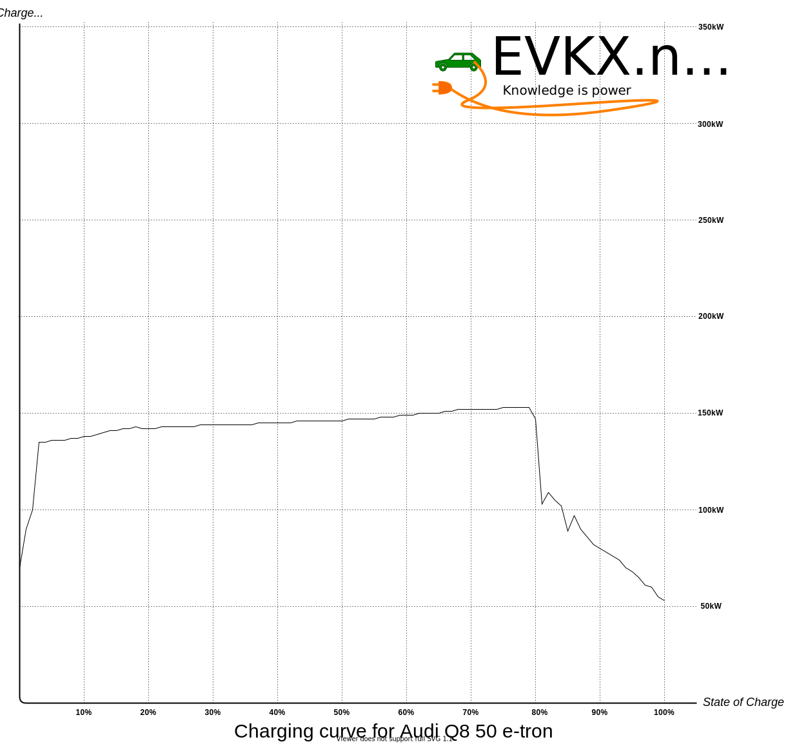

<!-- markdownlint-disable MD033 -->

I denne artikkelen finner du de fleste detaljene og høyoppløselige bilder (klikk på dem). Du finner også mange lenker i modellens beskrivelse for mer informasjon om alternativer og teknologi for Audi Q8 e-tron.

<figure>
    
    <figcaption><h4>Audi SQ8 e-tron</h4></figcaption>
</figure>

Med Audi e-tron gikk premiumprodusenten inn i elektromobilitetens tidsalder i 2018, og markerte starten på den elektriske fremtiden for de fire ringene.

Siden den gang har modellen satt standarder i det elektriske luksusklassen SUV-segmentet. Den nye Audi Q8 e-tron bygger nå videre på suksesshistorien til denne elektriske pioneren. Den førsteklasses elektriske SUV-en og crossoveren imponerer med sitt optimaliserte kjørekonsept, forbedrede aerodynamikk, høyere ladeytelse og batterikapasitet, og økt [WLTP-rekkevidde](https://evkx.net/guides/understandingrange/wltp/) på opptil 582 kilometer i SUV-versjonen og opptil 600 kilometer i Sportback-versjonen. I tillegg gir betydelige endringer, spesielt foran på kjøretøyet, den nye flaggskip-SUVen et friskere utseende.

Siden introduksjonen av Audi e-tron for rundt fire år siden og solgte 150 000 enheter, har Audi fulgt et systematisk elektrisk veikart. Som et resultat omfatter dens elektriske portefølje nå [åtte modeller](../../models/).

Innen 2026 vil den ha mer enn 20. På det tidspunktet vil Audi kun gi ut helelektriske modeller på det globale markedet. "Med vår bedriftsstrategi ['Vorsprung 2030'](../vorsprung2030/), har vi satt en fast dato for tilbaketrekning fra forbrenningsmotorer og besluttet at Audi skal være et helt elektrisk merke innen 11 år," sa [Markus Duesmann](https://www.audi.com/en/company/profile/company-management/markus-duesmann.html), styreleder for AUDI AG. "Den nye Audi Q8 e-tron, med sin forbedrede effektivitet og rekkevidde og raffinerte design, er en annen viktig komponent i vår elektriske portefølje for å få folk begeistret for elektromobilitet med emosjonelle modeller som er egnet for daglig bruk."

Audis styremedlem for teknisk utvikling [Oliver Hoffmann](https://www.linkedin.com/in/oliver-hoffmann-audi/) fokuserte også på kundefordelene som forbedres av disse forbedringene. «I den nye Q8 e-tron økte vi betydelig batterikapasitet og ladeytelse. Disse endringene tillot oss å oppnå en optimal balanse mellom energitetthet og ladekapasitet og øke effektiviteten, sa Hoffmann. "I tillegg forbedret vi motorene, den progressive styringen og chassiskontrollsystemene - og dermed de dynamiske kjøreegenskapene som er typiske for Audi i alle versjoner av Q8 e-tron."

## Nytt ansikt, nytt navn, ny bedriftsidentitet

Ved å kalle denne modellen Q8, sier Audi tydelig at Audi Q8 e-tron er toppmodellen blant sine elektriske SUV-er og crossovere, og sitter over [Audi Q4 e-tron](../../models/q4-e-tron) og den kommende [Audi Q6 e-tron](../../models/q6-e-tron/).

<figure>
    
    <figcaption><h4>Audi SQ8 e-tron front</h4></figcaption>
</figure>

Audi Q8 e-tron og Q8 Sportback e-tron kan umiddelbart identifiseres som helelektriske modeller ved første øyekast, takket være de nye designene foran og bak som systematisk bærer Audis elektriske designspråk videre.

Som på Audi e-tron, kan du bestille Audi Q8 e-tron med [svart optikk eller standardoptikk](../../models/q8-e-tron/exterior/optics/). Men forskjellen er at en sort grill ikke er en del av den svarte optikkpakken. (Akkurat som [optikken på Audi e-tron GT](../../models/e-tron-gt/exterior/optics/)). Derfor kan du bestille grillen i sølv, karosserifarge eller sort. I tillegg kan du spesifisere Audi Q8 e-tron med en horisontal lyslist på toppen av grillen.

<figure>
    
    <figcaption><h4>Audi SQ8 e-tron med lys i grill</h4></figcaption>
</figure>

Som en prestisjefylt elektrisk SUV-modell fra Audi, innleder Q8 e-tron den nye bedriftsidentiteten med en todimensjonal utforming av de fire ringene på utsiden. I tillegg er også modellbetegnelse med Audi-logo på B-stolpen ny.

<figure>
    
    <figcaption><h4>Modellbetegnelse med Audi-logo på B-stolpenr</h4></figcaption>
</figure>

For alle Q8-varianter kan du bestille modellen med eller uten [S-line eksteriørpakke](../../models/q8-e-tron/exterior/s-line/). Denne pakken inneholder en sportigere front og diffuser.

Nye felger finnes i alle størrelser for alle varianter, og mange av Audi e-tron felgene er også tilgjengelige på Audi Q8 e-tron. Se [Audi Q8 felger](../../models/q8-e-tron/exterior/wheels/) for en fullstendig oversikt.

<figure>
    
    <figcaption><h4>Audi Q8 55 Sportback e-tron med nye 22" felger</h4></figcaption>
</figure>

Som på Audi e-tron er en omfattende palett med standardfarger tilgjengelig. I tillegg kan du velge mellom rundt 50 Audi-eksklusive farger.

Det er noen nye farger tilgjengelig i standardpaletten.

Se [lakkfarger](../../models/q8-e-tron/exterior/paint/) for en oversikt og flere bilder.

Alternativet for [lakkerte kalipere](../../models/q8-e-tron/exterior/paintedcalibers/) er nå i rødt. Denne fargen var oransje på Audi e-tron.

## Plass og komfort

Med en kjøretøylengde på 4.915 meter, en bredde på 1.937 meter, og en høyde på 1.619 meter for Sportback og 1.633 meter for SUV, tilbyr Q8 e-tron god plass og høy komfort.

SQ8 e-tron og SQ8 Sportback e-tron er hver to millimeter lavere og 39 millimeter bredere. Akselavstanden på 2,928 meter gir også mye benplass i baksetene.

I tillegg har den et sjenerøst lagringsvolum på 569 liter for SUV-en og 528 liter for Sportback.
Det er også 62 liter tilgjengelig i oppbevaringsområdet foran, den såkalte "frunk".

## Tre varianter av drivlinje

For begge karoseriformene er tre drivlinjer tilgjengelig.

Tabellene nedenfor sammenligner gjeldende Audi e-tron-varianter med de forskjellige Q8 e-tron-variantene for rekkevidde og forbruk for en rekkeviddeoptimalisert utstyrsnivå. Å legge til tilleggsutstyr som større felger vil øke forbruket og redusere rekkevidden.

|Variant                 |  WLTP rekkevidde                                                         |Endring |
|-------------------------------                                                                |-----------|-------|
| [Audi e-tron 50](../../models/e-tron/variants/#audi-e-tron-50)                                |  341km    |       |
| [Audi Q8 50 e-tron](../../models/q8-e-tron/variants/#audi-q8-50-e-tron)                       |  491km    | +44%  |
| [Audi e-tron 50 Sportback](../../models/e-tron/variants/#audi-e-tron-50-sportback)            |  351km    |       |
| [Audi Q8 50 Sportback e-tron](../../models/q8-e-tron/variants/#audi-q8-50-sportback-e-tron)   |  505km    | +44%  |
| [Audi e-tron 55](../../models/e-tron/variants/#audi-e-tron-55)                                |  441km    |       |
| [Audi Q8 55 e-tron](../../models/q8-e-tron/variants/#audi-q8-55-e-tron)                       |  582km    | +32%  |
| [Audi e-tron 55 Sportback](../../models/e-tron/variants/#audi-e-tron-55)                      |  452km    |       |
| [Audi Q8 55 Sportback e-tron](../../models/q8-e-tron/variants/#audi-q8-55-sportback-e-tron)   |  600km    | +33%  |
| [Audi e-tron S](../../models/e-tron/variants/#audi-e-tron-60s)                                |  374km    |       |
| [Audi SQ8 e-tron](../../models/q8-e-tron/variants/#audi-sq8-e-tron)                           |  494km    | +32%  |
| [Audi e-tron S Sportback](../../models/e-tron/variants/#audi-e-tron-60s)                      |  379km    |       |
| [Audi SQ8 e-tron Sportback](../../models/q8-e-tron/variants/#audi-sq8-sportback-e-tron)       |  513km    | +35%  |

|Variant | WLTP forbruk | Endring |
|-------|-------------|-------|
|[Audi e-tron 50](../../models/e-tron/variants/#audi-e-tron-50)                                 | 18.77kWh/100km |          |
|[Audi Q8 50 e-tron](../../models/q8-e-tron/variants/#audi-q8-50-e-tron)                        | 18.12kWh/100km | -3.4%    |
|[Audi e-tron 50 Sportback](../../models/e-tron/variants/#audi-e-tron-50-sportback)             | 18.23kWh/100km |          |
|[Audi Q8 50 Sportback e-tron](../../models/q8-e-tron/variants/#audi-q8-50-sportback-e-tron)    | 17.62kWh/100km | -3.3%    |
|[Audi e-tron 55](../../models/e-tron/variants/#audi-e-tron-55)                                 | 19.5kWh/100km  |          |
|[Audi Q8 55 e-tron](../../models/q8-e-tron/variants/#audi-q8-55-e-tron)                        | 18.21kWh/100km | - 7.1%   |
|[Audi e-tron 55 Sportback](../../models/e-tron/variants/#audi-e-tron-55)                       | 19.03kWh/100km |          |
|[Audi Q8 55 Sportback e-tron](../../models/q8-e-tron/variants/#audi-q8-55-sportback-e-tron)    | 17.33kWh/100km | -9%      |
|[Audi e-tron S](../../models/e-tron/variants/#audi-e-tron-60s)                                 | 22.99kWh/100km |          |
|[Audi SQ8 e-tron](../../models/q8-e-tron/variants/#audi-sq8-e-tron)                            | 21.46kWh/100km | -6.7     |
|[Audi e-tron S Sportback](../../models/e-tron/variants/#audi-e-tron-60s)                       | 22.69kWh/100km |          |
|[Audi SQ8 e-tron Sportback](../../models/q8-e-tron/variants/#audi-sq8-sportback-e-tron)        | 20.66kWh/100km | -9%      |

Ytelsen har ikke endret seg, bortsett fra Audi Q8 e-tron 50-modellen. Denne modellen har nå økt kraft og samme dreiemoment som 55-modellene.

|Variant | Max ytelse | Maks dreiemoment | Toppfart |
|-------|-------------|-------|------|
|[Audi e-tron 50](../../models/e-tron/variants/#audi-e-tron-50)                             | 230kW | 540nm    |200 km/h|
|[Audi Q8 50 e-tron](../../models/q8-e-tron/variants/#audi-q8-50-e-tron)                    | 250kW | 664nm    |200 km/h|
|[Audi e-tron 50 Sportback](../../models/e-tron/variants/#audi-e-tron-50-sportback)         | 230kW | 540nm    |200 km/h|
|[Audi Q8 50 Sportback e-tron](../../models/q8-e-tron/variants/#audi-q8-50-sportback-e-tron)| 250kW | 664nm    |200 km/h|
|[Audi e-tron 55](../../models/e-tron/variants/#audi-e-tron-55)                             | 300kW | 664nm    |200 km/h|
|[Audi Q8 55 e-tron](../../models/q8-e-tron/variants/#audi-q8-55-e-tron)                    | 300kW | 664nm    |200 km/h|
|[Audi e-tron 55 Sportback](../../models/e-tron/variants/#audi-e-tron-55)                   | 300kW | 664nm    |200 km/h|
|[Audi Q8 55 Sportback e-tron](../../models/q8-e-tron/variants/#audi-q8-55-sportback-e-tron)| 300kW | 664nm    |200 km/h|
|[Audi e-tron S](../../models/e-tron/variants/#audi-e-tron-60s)                             | 370kW | 973nm    |210 km/h|
|[Audi SQ8 e-tron](../../models/q8-e-tron/variants/#audi-sq8-e-tron)                        | 370kW | 973nm    |210 km/h|
|[Audi e-tron S Sportback](../../models/e-tron/variants/#audi-e-tron-60s)                   | 370kW | 973nm    |210 km/h|
|[Audi SQ8 e-tron Sportback](../../models/q8-e-tron/variants/#audi-sq8-sportback-e-tron)    | 370kW | 973nm    |210 km/h|

## Mer batterikapasitet og høyere ladeytelse

Som på Audi e-tron er to batteristørrelser tilgjengelig på variantene. Batteriet til [Q8 50 e-tron](../../models/q8-e-tron/variants/#audi-q8-50-e-tron) har en lagringskapasitet på 89 netto kilowattimer ( 95 brutto kWh), mens de kraftigere versjonene av Q8 55 e-tron og SQ8 e-tron har 106 netto kWh (114 brutto kWh). Batteriet på 95 kWh som brukes på de 50 variantene bruker det samme batteriet som brukes på Audi 55 og S-variantene. Takket være justering av batteristyringssystemet har batterikapasiteten som kan brukes for kunder økt fra 86kWh til 89kWh.

På en lynladere når Audi Q8 50 e-tron en maksimal ladeytelse på 150 kW. Med Q8 55 e-tron og SQ8 e-tron øker den maksimale ladeytelsen til 170 kW. Det store batteriet kan lades fra ti til 80 prosent under et stopp på omtrent 31 minutter – under ideelle forhold tilsvarer dette en rekkevidde på opptil 420 kilometer (ifølge [WLTP](https://evkx.net/guides/understandingrange/wltp/)).

Audi e-tron har vært markedsledende i gjennomsnittlig ladehastighet siden introduksjonen. Så hvordan er dette sammenlignet med midtlivsoppdateringen? Sammen med [EVKX.net](https://evkx.net), gir electrichasgoneaudi.net deg
detaljer. Nedenfor er ladekurven for Audi Q8 50 e-tron (samme som Audi e-tron 55) og Audi Q8 e-tron 55 med det nye batteriet.

Hvordan påvirker dette reisehastigheten? For å svare på dette, beregner vi hvor lang tid de gamle og nye modellene trenger for å kjøre 1000 km, starter med fullt batteri, kjører i 120 km/t, og kun stopper for optimale ladestopp. Beregningen forutsetter optimale kjøreforhold med tørre veier og temperaturer rundt 20 grader Celsius.

|Variant | Consumption 120km/h | Chargestops | Total time | Saved |
|-------|-------------|-------|------|-----|
|[Audi e-tron 50](../../models/e-tron/variants/#audi-e-tron-50)                             | 26.5kWh/100km      | 5 x (5%-68%)    |10h:32m |       |
|[Audi Q8 50 e-tron](../../models/q8-e-tron/variants/#audi-q8-50-e-tron)                    | 26 kWh/100km       | 3 x (15%-80%)   |9h:49m  | -43m  |
|[Audi e-tron 50 Sportback](../../models/e-tron/variants/#audi-e-tron-50-sportback)         | 25 kWh/100km       | 4 x (3%-76%)    |10h:22m |       |
|[Audi Q8 50 Sportback e-tron](../../models/q8-e-tron/variants/#audi-q8-50-sportback-e-tron)| 24.5 kWh/100km     | 2 x (5%-80%)    |9h:33m  | -49m  |
|[Audi e-tron 55](../../models/e-tron/variants/#audi-e-tron-55)                             | 27.5 kWh/100km     | 3 x (6%-80%)    |9h:57m  |       |
|[Audi Q8 55 e-tron](../../models/q8-e-tron/variants/#audi-q8-55-e-tron)                    | 26 kWh/100km       | 2 x (1%-74%)    |9h:36m  | -21m  |
|[Audi e-tron 55 Sportback](../../models/e-tron/variants/#audi-e-tron-55)                   | 26 kWh/100km       | 3 x (12%-80%)   |9h:50m  |       |
|[Audi Q8 55 Sportback e-tron](../../models/q8-e-tron/variants/#audi-q8-55-sportback-e-tron)| 24.5 kWh/100km     | 2 x (3%-81%)    |9h:32m  | -18m  |
|[Audi e-tron S](../../models/e-tron/variants/#audi-e-tron-60s)                             | 29 kWh/100km       | 3 x (2%-82%)    |10h:05m |       |
|[Audi SQ8 e-tron](../../models/q8-e-tron/variants/#audi-sq8-e-tron)                        | 28 kWh/100km       | 3 x (16%-71%)   |9h:46m  | -21m  |
|[Audi e-tron S Sportback](../../models/e-tron/variants/#audi-e-tron-60s)                   | 28 kWh/100km       | 3 x (4%-80%)    |10h:0m  |       |
|[Audi SQ8 e-tron Sportback](../../models/q8-e-tron/variants/#audi-sq8-sportback-e-tron)    | 26 kWh/100km       | 2 x (1%-74%)    |9h:36m  | -24m  |

Som tabellen viser, er 95 kWh-batteriet fortsatt konkurransedyktig mot det nye batteriet og slår til og med det større batteriet på grunn av en flatere kurve for denne avstanden.

Audi Q8 e-tron lader opptil 11 kW på en AC-ladestasjon eller veggboks. Audi tilbyr en [valgfri AC-lader](../../models/q8-e-tron/technology/onboardcharger/#optional-22kw-lader) som støtter opptil 22 kW AC-lading.

Under ideelle forhold, ved bruk av vekselstrøm, kan Audi Q8 50 e-tron lade 0-100 % på rundt ni timer og 15 minutter (22kW: ca. fire timer og 45 minutter). Imidlertid er tallene til det store batteriet omtrent 11 timer og 30 minutter ved 11 kW og seks timer ved 22 kW. Finn ut mer i [onboard-charger-seksjonen](../../models/q8-e-tron/technology/onboardcharger/#capacity-based-on-network--outlet).

Audi Q8 e-tron leveres som standard med Plug & Charge-funksjonen. Ved kompatible ladestasjoner autoriserer kjøretøyet seg selv når ladekabelen settes inn og aktiverer ladepunktet. Fakturering skjer automatisk.

Den nye ladetjenesten Audi Charging, som skal lanseres i 2023 og vil erstatte den eksisterende e-tron Charging Service, vil gi enkel tilgang til rundt 400 000 offentlige ladepunkter over hele Europa. I tillegg gir e-tron-ruteplanleggeren pålitelig støtte når du søker etter ladepunkter langs ruten din.

## Revidert bakakselmotor og elektrisk dreiemomentvektor for bedre dynamikk

For den nye Audi Q8 e-tron modifiserte Audi den asynkrone motoren på bakakselen.

I stedet for 12 spoler som genererer det elektromagnetiske feltet, er det nå 14. Som et resultat genererer motoren et sterkere magnetfelt med tilsvarende strøminngang, noe som gir mer dreiemoment. Som et resultat krever den elektriske motoren mindre energi for å generere dreiemoment hvis dette ikke er nødvendig. Denne endringen reduserer forbruket og øker rekkevidden.

<figure>
    
    <figcaption><h4>Updated rear motor Audi Q8 e-tron</h4></figcaption>
</figure>

Med e-tron-seriens S-modell brukte Audi et tremotorskonsept for første gang i storskala produksjon.
Audi foredlet dette oppsettet for den nye SQ8 e-tron. En 124 kW elektrisk motor er i arbeid på forakselen.

To elektriske motorer på bakakselen, hver med 98 kW effekt, driver separat et bakhjul. Dette oppsettet gir mulighet for en boost ytelse på opptil 370 kW.

Motorelektronikken kan fordele drivmomentet over begge de bakre elektriske motorene mellom begge hjulene i løpet av et sekund.

[Les mer i motordelen for Q8 e-tron](../../models/q8-e-tron/drivetrain/motor/)

## Balansegangen mellom komfort og sportslighet

Den nye Audi Q8 e-tron leveres som standard med adaptiv luftfjæringskontrollert støtdemping. Høyden på karosseriet kan varieres med totalt 76 millimeter, avhengig av kjøresituasjonen.

Audi justerte luftfjæringen for å optimalisere sidedynamikken til kjøretøyet. Dessuten vil den elektroniske stabilitetskontrollen (ESC) tillate enda mer manøvrerbarhet i fremtiden – spesielt i trange svinger. Audi Q8 e-tron håndterer disse med merkbart mer smidighet takket være den reviderte progressive styringen.

Girforholdet til styresystemet ble endret slik at styringen reagerer mye raskere, selv når man gjør delikate styrebevegelser. I tillegg støtter mer stive fjæringslager på forakselen effekten av det direkte styreforholdet. Styrebevegelser overføres dermed til hjulene mer direkte, og tilbakemeldinger fra styrereaksjoner er også forbedret. I tillegg justerte Audi alle chassiskontrollsystemer, men de forblir balanserte og perfekt tilpasset – tro mot [Audi DNA](../audidna/).

## Ytterligere forbedret aerodynamikk

Med Audi Q8 e-tron var temaet aerodynamikk en topp prioritet. Ved å gjøre dette kan Audi redusere luftmotstandskoeffisienten. For eksempel fra 0,26 til 0,24 cw for Q8 Sportback e-tron og fra 0,28 til 0,27 cw for Q8 e-tron.

For Q8 Sportback betyr dette en reduksjon i forbruket ved 120 km/t ved 1,2 kWh/100 km, og for Q8 e-tron 0,6 kWh/100 km.

Hjulspoilerne montert på undervognen hjelper til med å lede luftstrømmen rundt hjulene. Audi forstørret spoilere på forakselen, og Audi Q8 Sportback e-tron har nå spoilere på bakhjulene.

Audi monterte kun spoilere på bakakselen på SQ8 Sportback e-tron.

Grillen har et selvforseglingssystem og elektriske persienner som automatisk lukker radiatoren. Dette systemet optimerer luftstrømmen i fronten av bilen ytterligere og forhindrer uønsket energitap. Skoddene forblir kun åpne ved behov.

<figure>
    
    <figcaption><h4>Audi Q8 e-tron grille with shutters</h4></figcaption>
</figure>

## Praktisk parkering med remote park assist plus

Det er rundt [40 førerassistentsystemer](../../models/q8-e-tron/technology/drivingassistance/) tilgjengelig i Audi Q8 e-tron. Opptil fem radarsensorer, fem kameraer og 12 ultralydsensorer gir miljøinformasjon analysert av den sentrale førerassistentkontrollenheten.

Noe nytt er remote park assist plus, som vil være tilgjengelig for bestilling fra og med 2023. Med dens hjelp kan Audi Q8 e-tron manøvrere seg inn på selv de trangeste parkeringsplassene.

Kunder kan kontrollere parkeringsprosedyren gjennom myAudi-appen på smarttelefonene sine. Når bilen når sin endelige posisjon på parkeringsplassen, slår den seg automatisk av, setter på parkeringsbremsen og låser dørene.

Når du forlater parkeringsplassen, slås motoren på gjennom myAudi-appen, deretter manøvrerer kjøretøyet seg nok ut for komfortabel innstigning.

Night Vision er ikke tilgjengelig på Q8 e-tron. De nye Audi-ringene gjør det vanskelig å montere. Så noen Audi e-tron-eiere vil savne Night Vision på den nye modellen.

## Digital Matrix LED headlights

## Digital Matrix LED-frontlykter

Q8 e-tron leveres valgfritt med [digital Matrix LED-frontlykter](../../models/q8-e-tron/technology/lights/#digital-matrix-led-headlights). Når du kjører på motorveien, markerer orienteringslyset bilens posisjon i kjørefeltet og hjelper føreren med å holde seg trygt i midten på trange steder. Tre andre nye funksjoner er også tilgjengelige:

- Forbedret trafikkinformasjon
- Kjørefeltlyset med retningsviser
– Orienteringslyset på landeveier

<figure>
    
    <figcaption><h4>Digital Matrix</h4></figcaption>
</figure>

## Interiør i luksusklassen

[Glasspanoramataket](../../models/q8-e-tron/exterior/panoramicroof/) får interiøret til å virke lettere og forsterker følelsen av luftighet og ekspansivitet. Glasselementene åpnes og lukkes elektronisk. Du kan også blokkere sollys med den innebygde parasollen.
Når panoramataket er åpent, forbedrer det todelte glasstaket klimaet i interiøret takket være effektiv ventilasjon. En integrert vindavviser reduserer også vindstøy.

Audi tilbyr også [fire-soners automatisk klimakontroll](../../models/q8-e-tron/technology/climatecontrol/#4-zone-electronic-climate-control) som et alternativ til [standard to- sone automatisk klimakontroll](../../models/q8-e-tron/technology/climatecontrol/) og en [luftkvalitetspakke](../../models/q8-e-tron/technology/airquality/).

[tre-trinns ventilasjon](../../models/q8-e-tron/interior/seats/#ventilated-seats) gir komfortable sitteplasser, selv ved høye utetemperaturer. Ventilasjon er tilgjengelig for [standard](../../models/q8-e-tron/interior/seats/#standard-seats) og individuelle konturseter med perforert skinn.

De svært justerbare [individual contour](../../models/q8-e-tron/interior/seats/#individual-contour-seats) setene er høydepunktet blant [interiøralternativene](../../models/q8-e-tron/interior/). I tillegg til pneumatisk justering av sete og rygg, kan du bestille individuelle konturseter med [massasjefunksjon](../../models/q8-e-tron/interior/seats/#massage).

Alle møbler har [valgfrie dekorative innlegg](../../models/q8-e-tron/interior/inlays/) av porøse trefiner som kornete ask og platan, aluminium eller en karbonfiberstruktur for S-linjen og utgave S line versjoner. Nye tillegg inkluderer lysebrunt valnøtttre og bærekraftig teknisk materiale laget delvis av resirkulerte PET-flasker.

## Høyoppløselige berøringsskjermer og stemmestyring

Som alle Audi-modeller i luksusklassen bruker Q8 e-tron operativsystemet MMI berøringsrespons.

De to store høyoppløselige skjermene – den øverste med en 10,1-tommers diagonal og den nederste med en 8,6-tommers diagonal – erstatter nesten alle konvensjonelle brytere og knotter. Utover betjening med to-touch-skjermene, kan du aktivere mange funksjoner gjennom naturlig stemmestyring.

<figure>
    
    <figcaption><h4>Audi Q8 e-tron MMI and Virtual cockpit</h4></figcaption>
</figure>

Det digitale displayet og betjeningskonseptet i Audi Q8 e-tron inkluderer standard [Audi virtual cockpit](../../models/q8-e-tron/technology/uiandoperations/virtualcockpit/) med full HD-oppløsning. I den virtuelle cockpiten viser grafikken alle viktige aspekter ved elektrisk kjøring, fra ladeytelse til rekkevidde.

I tillegg kan du også legge til en head-up-skjerm.

Audi Q8 e-tron kommer som standard med [MMI Navigation plus](../../models/q8-e-tron/technology/uiandoperations/navigation/). I tillegg støtter mediasenteret den høyhastighets dataoverføringsstandarden LTE Advanced, og den har en integrert WiFi-hotspot for passasjerenes mobile enheter. Dessuten anbefaler navigasjonssystemet intelligent destinasjoner basert på tidligere reiste ruter. På toppen av det inkluderer Audi connect Navigasjons- og Infotainment-pakken bil-til-X-tjenester.

## Materialer fra resirkuleringsprosesser

Audi Q8 e-tron vil bli sertifisert som nettokarbonnøytral1 for kunder i Europa og USA. Audi bruker også resirkulerte materialer til enkelte komponenter i Audi Q8 e-tron. Disse materialene, behandlet gjennom en resirkuleringsprosess, reduserer ressursbruken og sikrer en lukket, effektiv og bærekraftig materialkrets. I interiøret i Audi Q8 e-tron bruker Audi resirkulerte materialer til isolasjon og demping, samt til tepper. I tillegg er det dekorative innlegget over skjermen, kalt Tech Layer, tilgjengelig med et nytt antrasittfarget teknisk materiale delvis sammensatt av resirkulerte PET-flasker. Med utstyrspakken S line er trekk til sportssetene syntetisk skinn, og mikrofibermaterialet Dinamica. Audi lager Dinamica av opptil 45 prosent polyesterfibre laget av resirkulerte PET-flasker, brukte tekstiler og fiberrester.

I motsetning til tidligere mikrofiberkvalitet er produksjonen av Dinamica også løsemiddelfri – nok et bidrag til miljøvern.

I tillegg brukes noen sikkerhetsrelaterte komponenter som delvis består av blandet bilplastavfall behandlet gjennom en kjemisk resirkuleringsprosess for første gang – nærmere bestemt plastdekslene til sikkerhetsbeltespennene. Som en del av PlasticLoop-prosjektet jobbet Audi sammen med plastprodusenten LyondellBasell for å etablere en prosess der kjemisk resirkulering for første gang skal brukes til å gjenbruke det blandede bilplastavfallet i serieproduksjonen av Audi Q8 e-tron. I denne prosessen, implementert i fellesskap med LyondellBasell, blir plastkomponenter fra kundekjøretøyer demontert og separert fra fremmede materialer, for eksempel metallklemmer, før de blir makulert og behandlet til pyrolyseolje gjennom kjemisk resirkulering. Denne pyrolyseoljen brukes deretter som råmateriale for å produsere ny plast i en massebalansemetode.

## Markedslansering våren 2023

Markedslanseringen av den nye Audi Q8 e-tron og Audi Q8 Sportback e-tron, som vil være tilgjengelig for bestilling fra midten av november, er planlagt å skje i slutten av februar 2023 i Tyskland og de viktigste europeiske markedene. Audi forventer at den kommer til USA-markedet i slutten av april. Grunnprisen for Audi Q8 e-tron i Tyskland vil være 74.400 euro.

## Videoer

Nedenfor finner du noen videoer av de nye modellene. I tillegg finner du mer i [multimediaseksjonen](../../models/q8-e-tron/multimedia) for Audi Q8 e-tron.


