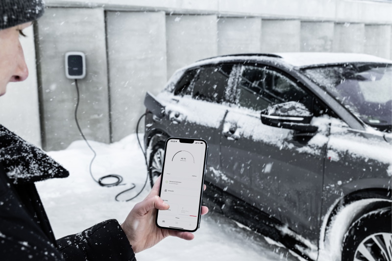

<!-- markdownlint-disable MD033 -->
<figur>
    
    <figcaption><h4>Electric mobility in winter</h4></figcaption>
</figur>

 What can Audi customers do beyond the established tips to keep the high-voltage battery in their e-tron model working efficiently during the winter and to achieve optimal range?

### Departure timer and preconditioning

Preconditioning climatizes the interior of the vehicle before departure to the desired temperature like with auxiliary heating. Apart from comfort, it is a function that also ensures more range. That is because during preconditioning with the departure timer, the energy that is needed to warm the battery in the winter is directed to the vehicle during charging via an external energy source – for instance, a home wallbox or a public charging point. The result: less heating power needs to be used while driving, which in turn benefits range. That is particularly relevant for bringing the battery to a comfortable temperature without pre-heating for energy-intensive short trips, when not much time is available.

### e-tron route planner

In the purely electric models, the Audi e-tron route planner complements the Audi MMI’s (MMI = Multi Media Interface) navigation features with about 30 pieces of detailed information and helps optimize the demands of e-mobility, especially when driving medium and longer distances: it calculates the fastest route, takes traffic and route data into account, considers the driver’s driving style, calculates how long it will take to charge the vehicle, and includes it in the total driving time. Users are also shown basic information such as the charging power or charging connections and the plug type of the respective charging points. The system also shows whether charging stations are available or occupied. The Audi e-tron route planner gives preference to high-performance HPC charging stations (HPC = High Power Charging = ultra-fast charging) and, in the e-tron GT quattro models, activates battery preconditioning while driving. With an active e-tron route planner, the particular model always looks for the most efficient path to its destination. Additionally, the range calculator on the website shows the differences in range for the Audi e-tron and the Audi e-tron Sportback – depending on external temperature, driving mode, rim size, and use of heating and air conditioning.

<figur>
    
    <figcaption><h4>Electric mobility in winter</h4></figcaption>
</figur>

### Charging at low temperatures

The intelligent battery management system (BMS) communicates with the charging point or wallbox to optimize power for the gentlest possible AC charging. Charging is regulated automatically and the system ends the charge as soon as the battery is full or a predefined charge level of, for example, 80 percent has been reached. During the charging process, the BMS monitors the voltages in the individual cells and balances them as needed. Additionally, intelligent management engages battery heating. If the battery temperature falls below a certain limit, the BMS automatically reduces charging capacity in order to prioritize early aging of the battery. In all, slow charging has a positive effect on the lifespan of the battery. Additionally, it is advisable to charge as soon as possible after driving when the outside temperature is cold. That is because the battery is still warmed up and recharges more gently and quickly.

### Range prognosis in the digital instrument panel

The range prognosis is derived from the high-voltage battery’s charge level and the energy consumption forecast. This depends on several factors. Drive system consumption has the biggest effect on it. Convenience consumers and air conditioning have far less of an effect. For the projected range, Audi distinguishes between two scenarios: the active navigation route and inactive navigation. For the active navigation route, the projected consumption from the route profile (speed limits, green lights, differences in elevation) and current traffic information such as congestion as well as average energy consumption over the last 100 kilometers (62.1 miles). Additionally, anticipated convenience and climate consumption are assessed for the entire upcoming drive. When navigation is inactive, the average of the last 100 kilometers (62.1 miles) is applied to determine drive system consumption. Convenience and climate consumption are also assessed. By turning convenience consumers on and off via the range monitor, users can see their direct impact on the range prognosis.

### High-voltage battery maintenance

Anyone who frequently makes short car trips should charge the battery to a maximum of 80 percent in order to save its capacity for longer ranges and to extend its lifespan. On the other hand, it is a good idea to avoid a long-lasting deep discharge when the charge level is below 20 percent. Anyone who frequently makes long car trips can charge up to 100 percent, but should then start driving immediately thereafter. Ideally, anyone who does not drive for longer than 12 hours should keep the charging level between 40 and 80 percent in the winter.

<figur>
    
    <figcaption><h4>Electric mobility in winter</h4></figcaption>
</figur>

### Geo-charging profile

This automated function in the Audi e-tron records in the vehicle that drivers can activate or load previously configured charging profiles at particular locations. Once location-based charging settings are set in the MMI and saved with the help of GPS coordinates, the charging settings and the timeframe for the charging process can be configured. Users can set charging profiles for several addresses.

### Predictive preconditioning

In order to be able to use the Audi e-tron GT’s high HPC charging capacity of up to 270 kW, the high-voltage battery needs to be at a particular temperature. This is achieved by means of adapted preconditioning of the battery while driving. When an HPC charging station is entered as the destination in the e-tron route planner, an algorithm calculates the anticipated arrival time and deduces the necessary heating or cooling capacity from that in order to be able to access high charging capacity at the charging station right away for short idle time. If the customer wishes, the interior temperature is also correspondingly regulated.

### Reducing driving resistance and convenience consumers

Smaller rim sizes, narrower tires, and the right air pressure can reduce the tires’ rolling resistance in the winter. By contrast, roof boxes increase aerodynamic drag. Inside the car, steering wheel and seat heating save energy because they operate close to the body and consume less electricity. Switching to air-circulation mode reduces loss of range.

<figur>
    
    <figcaption><h4>Electric mobility in winter</h4></figcaption>
</figur>

{}
