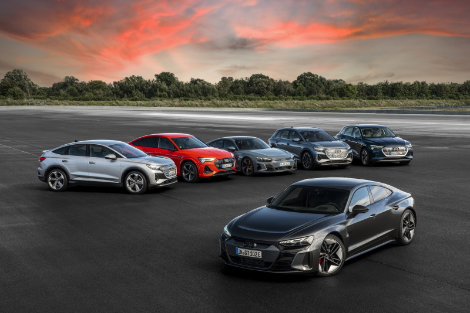

<!-- markdownlint-disable MD033 -->

> **Article historique :** Cette page résume la stratégie de Vorsprung 2030 telle qu'Audi l'a présentée en 2021. Ses dates, ses dirigeants, ses prévisions et ses cibles décrivent cette annonce et ne doivent pas être lues comme le plan de produit actuel d'Audi.

Audi a présenté **Vorsprung 2030** devant l'IAA 2021 comme cadre de transformation de l'entreprise autour de la mobilité électrique, des logiciels, de la durabilité et des services numériques. La stratégie a suivi l'annonce d'Audi qu'elle avait l'intention d'introduire seulement de nouveaux modèles entièrement électriques à l'échelle mondiale à partir de 2026 et de mettre progressivement fin à la production de moteurs à combustion d'ici 2033.

La stratégie a été élaborée après que quelque 500 employés aient examiné plus de 600 tendances en matière de mobilité. Audi a déclaré que les revenus futurs passeraient progressivement des véhicules à combustion aux voitures électriques et, plus tard, aux logiciels, aux services et aux fonctions de conduite automatisée.

## Mobilité électrique et durabilité

Audi a mis en avant la protection du climat, l'utilisation des ressources, la sécurité au travail, la responsabilité sociale, la conformité et la gestion des risques. L'entreprise a également décrit la stratégie comme un processus continu qui serait revu à mesure que les marchés et la technologie changent.

<figure>
    
    <figcaption><h4>Moyeu de recharge pour Audi</h4></figcaption>
</figure>

## Logiciel et expérience de conduite Audi

Audi a prévu de différencier ses véhicules électriques par la conception, la qualité, un caractère de conduite reconnaissable et un écosystème numérique connecté. Le plan 2021 a attribué un rôle important à CARIAD et une plateforme logicielle commune du Groupe Volkswagen, tandis que chaque marque resterait responsable de l'intégration de la technologie dans ses véhicules.

La stratégie mettait également l'accent sur les mises à jour et les fonctions logicielles qui pourraient être ajoutées après l'achat. L'organisation de développement d'Audi a pour objectif de définir des caractéristiques mesurables pour la direction, la manipulation, l'acoustique et la conduite automatisée afin que les produits futurs conservent une identité Audi cohérente.

## Production et innovation

L'entreprise a identifié la production plus efficace, les usines connectées et l'innovation interne plus rapide comme des éléments importants de la transformation. L'usine de Neckarsulm d'Audi a été décrite comme un site pilote pour la production numérique, soutenu par des travaux dans le laboratoire de production Audi et l'unité d'innovation de Berlin de l'entreprise.

## Chine

La Chine était un élément central de la stratégie 2021. Audi a prévu d'étendre les modèles électriques produits localement avec FAW et SAIC dans le cadre d'une approche --En Chine pour Chine. Les développements ultérieurs, y compris la marque AUDI Chine-exclusive créée avec SAIC, doivent être lus séparément des prévisions faites dans cette annonce de stratégie originale.


