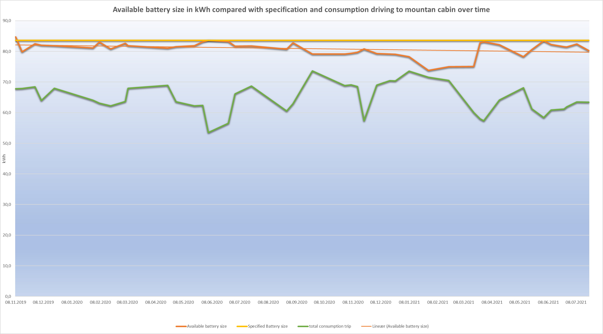
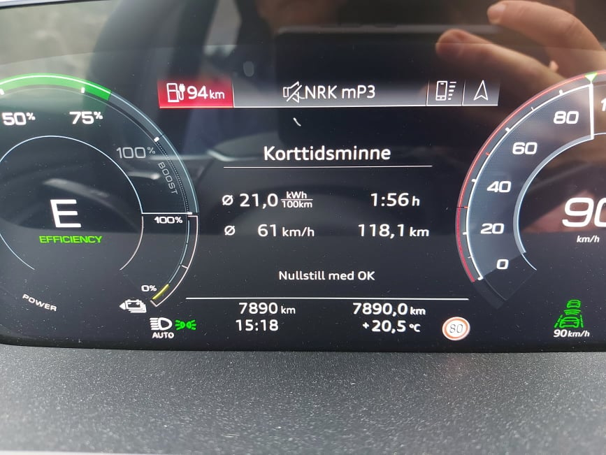

Når batteriet degraderes, reduseres den tilgjengelige batterikapasiteten. Dette fører til en kortere rekkevidde.

Hvis du vet hvor mye nettokapasitet bilen din skal ha, kan du enkelt sjekke den.

Slik sjekker du batteriet

1. Lad til 100%
2. Ta en kjøretur og bruk minst 70% av batteriet. Prøv å holde forbruket lavt.
3. Noter deg forbruk og kjøreavstand
4. Noter deg SOC på turens slutt (ladetilstand) (prosent igjen på batteriet)
5. Beregn faktisk kapasitet

For de følgende eksemplene antar vi at du har en e-tron 55 med 86,5 kWh nettokapasitet fra fabrikken.

## Beregning i kilometer

### Km eksempel 1

Hvis du kjører 280 kilometer med et forbruk på 25kWh/100
Du begynte med 100% og endte opp med 16%.

Først beregner du den totale energien som brukes

(280 * 25)/100 = 70kWh totalt på turen.

Hvis du har 16% igjen har du brukt 84% på turen (100-16)

84% = 70kWh batteri.

Full kapasitet (100%) kan deretter beregnes:

(70/84)*100 = 83,333 kWh

 83.333 er batteriets faktiske kapasitet.

83,33/86,5 = 96,34%. Det betyr en reduksjon på nesten 4% fra den opprinnelige kapasiteten.

## Hva påvirker kapasiteten

Bare ett avvik fra kapasiteten betyr ikke nødvendigvis at batteriet ditt er degradert.

Hvis du har et høyt forbruk, vil det være noe tap på grunn av intern motstand.

Hvis batteriet var i ubalanse, vil det også påvirke batterikapasiteten.

For folk som liker å holde styr på dette, anbefaler vi å spore dette fra begynnelsen av eierskapet. På denne måten vil du kjenne bilen din mer.

Følgende eksempel viser statistikken fra en e-tron 55 2020v1 med 83,6 kWh kapasitet fra den var ny.

## Hva hvis avviket er veldig stort?

Hvis avviket er veldig stort kan det tyde på at det har oppstått en feil på batteriet og bilen må på verksted.

Da er det en stor fordel at du har beregnet dette og i større grad vet det er et avvik enn at det bare er en følelse om kortere rekkevidde.

Nedenfor er et eksempel fra bil med feil på battericelle.

Her er bilen kjært 118.1km med et forbruk på 21. Prosenten har gått ned fra 100% - 25%.

Beregnet som over gir dette en totalakapasitet på batteriet på 33kWh. Langt under sitt originale 86.5kWh.

Ny batterimodul ble byttet på garanti.

## Hvordan beskytte batteriet?

Hvis du ønsker å leser mer hvordan man beskytter batteriet mot degradering så kan du lese [denne guiden](/nb/guides/protectingbattery/).

Hvis du ønsker å lære enda mer om batteri kan du lese vår [artikkel om batteri](/technology/battery/).

{}
