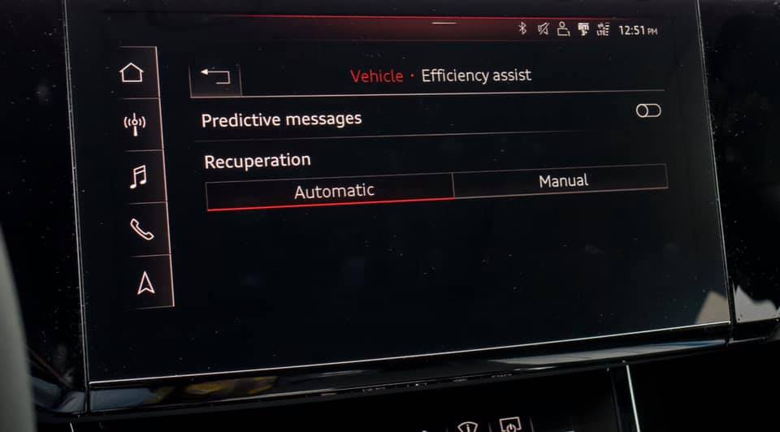
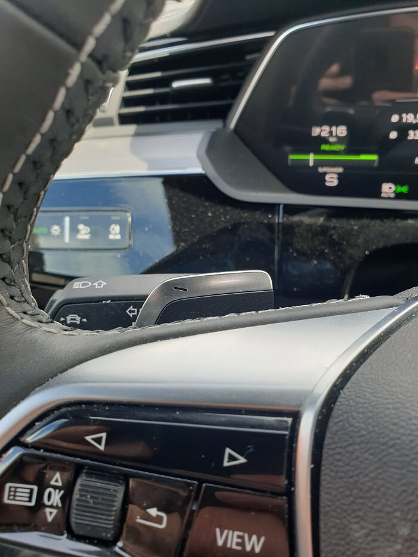
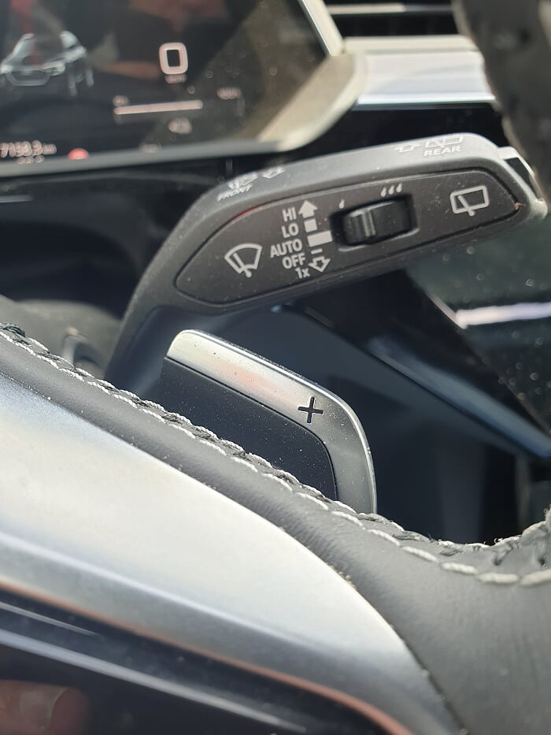

In this way, you never need to use the brake pedal (you can if it is an emergency). That is the reason they call it "one-pedal-driving"

Audi has not made it possible to enable one pedal driving permanent. It is a little different on the different models but the principle Audi
follows are the same.

They rather want their drivers to maximize the efficiency  with coasting instead of automatic reducing speed when you lift the foot of the gas pedal.

One pedal driving is less efficient since you lose energy compared to coasting. 

This is because you only get approx 80% of the kinetic energy the moving car has, back to the battery, when doing recuperation. (Assuming the traffic and road allow to coast)  

You are  also forced to have the foot on the pedal at a specific position to freeroll/coast to find the position when no energy is going out of the battery and nothing is going in.

### Audi e-tron

On Audi e-tron can set recuperation to manual (MMI -> Vehicle -> Efficiency Assistant -> Recuperation)  and then you can every time you start a drive, set recuperation to the max with the steering wheel recuperation paddles, and then it will regenerate every time you lift your foot of the "gas pedal" and works as "one-pedal-driving".

With the wheel paddles, you can set the recuperation to 3 different levels. (for more or less braking). High, medium and off.

This is not recommended for experienced drivers. If you learn to coast you will get the best comfort and the best range.
Next time it will be reset back. For drivers coming from other EV's, this might be the way to unlearn the bad habit.

If you set it recuperation to automatic it will only recuperate when you are getting close to other cars or you are close to an intersection or other reasons you need to slow down.  Otherwise, it will coast and save the maximum amount of energy as long you don't press the accelerator.

### Audi Q4 e-tron

On Audi Q4 e-tron you can set the car in B-mode with help of the shifter. In B-mode the car will regenerate when lifting the watt pedal.

Driving in D-mode and using the brake pedals that automaticly gives regen gives the best effiency. Coast whenever you can.

## More information

[In depth article on InsideEevs](https://insideevs.com/news/341641/the-nitty-gritty-details-on-audis-two-pedal-ev-braking-system/)
