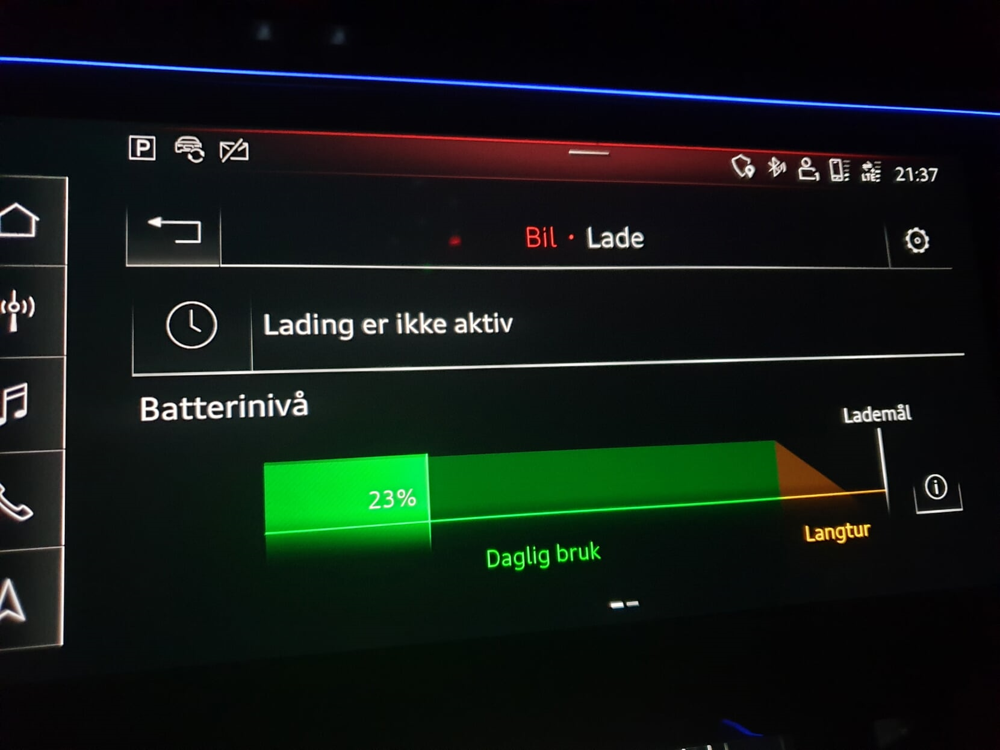
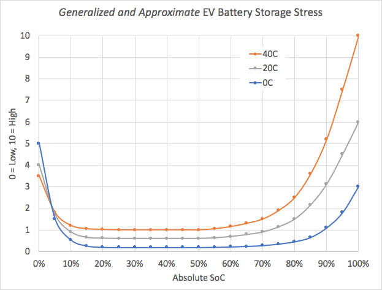
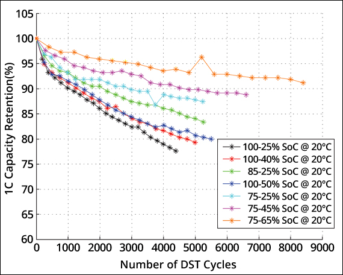

Viele Faktoren erhöhen den Abbau, aber die folgenden sind die wichtigsten Faktoren.

### Hochgeschwindigkeits-Ladung

High-Speed-Ladung ist der einzige Faktor, der die Degradation am meisten erhöht.

Sie sollten versuchen, zu Hause so viel wie möglich aufzuladen.

### hoher oder niedriger Ladezustand über eine lange Zeit

Die meisten Elektrofahrzeuge haben einen Puffer zum Schutz der Batterie und das gleiche hat die rein elektrischen Audi-Modelle. In der Tabelle unten sehen Sie den Gesamtpuffer für alle E-Elektro-Modelle von Audi.

| Modell | Batterie | Puffer | Verfügbar |
|------|-------|-------|-------|
| [e-tron 55/S](/models/e-tron/drivetrain/battery/) | 95 kWh | 8,5 kWh (9%)  | 86,5 kWh |
| [e-tron 50](/models/e-tron/drivetrain/battery/) | 71 kWh | 6,3kWh (8,9 %)  | 64,7 kWh |
| [(RS) e-tron GT](/models/e-tron-gt/drivetrain/battery/) | 93,4 kWh | 9,7kWh (10,4%)  | 83,7 kWh |
| [Q4 e-tron 40/45/50](/models/q4-e-tron/drivetrain/battery/#battery-q4-40-e-tron-and-q4-50-e-tron)  | 82 kWh | 5,4kWh (6,6%)  | 76,6 kWh |
| [Q4 e-tron 35](/models/q4-e-tron/drivetrain/battery/#battery-q4-35) | 55 kWh | 3kWh (5,45 %)  | 52 kWh |

Aber viele Leute glauben, dass dieser Puffer ihn vor dem Aufladen zu 100% schützt. Aber in den meisten Fällen ist der gesamte oder fast der gesamte Puffer unten, um die Batterie vor dem Leerlaufen zu schützen.

So hat auch e-tron 55 einen relativ großen Puffer, das Aufladen zu 100% ist nicht gut für den Akku. Audi empfiehlt, nicht mehr als 80% täglich aufzuladen. Das zeigt das MMI und die Bedienungsanleitung.

Die folgende Grafik zeigt einen generalisierten Spannungspegel in Abhängigkeit vom Ladungspegel.

Auf dieser Grundlage ist das Optimum wahrscheinlich, es zwischen 30 und 70% zu halten, aber wie viel besser es ist, wenn man es nur auf 100% auflädt, ist unmöglich zu wissen.

Die Puffer sind in Wirklichkeit Grenzen für die maximale und minimale Spannung, die jede Zelle haben kann. Mit einem 4% Puffer oben bedeutet die Spannung auf jeder Zelle ist auf ein Maximum von 96% der maximalen Spannung begrenzt.

### Anzahl der Ladezyklen

Die Anzahl der Ladungszyklen beeinflusst den Abbau.

Das folgende Diagramm zeigt, wie Ladegewohnheiten den Batterieabbau beeinflussen können. 

Auf dieser Grundlage ist es am besten, die Ladewerte um 50% zu halten.

### Hohe Temperatur

Hohe Temperaturen schaden der Batterie. Wenn Sie in einem Gebiet mit hohen Temperaturen leben, sollten Sie versuchen, das Auto den ganzen Tag in der Heizsonne zu parken.

Mehr über Degradation finden Sie in unserem [battery guide](../../../technology/battery/).


