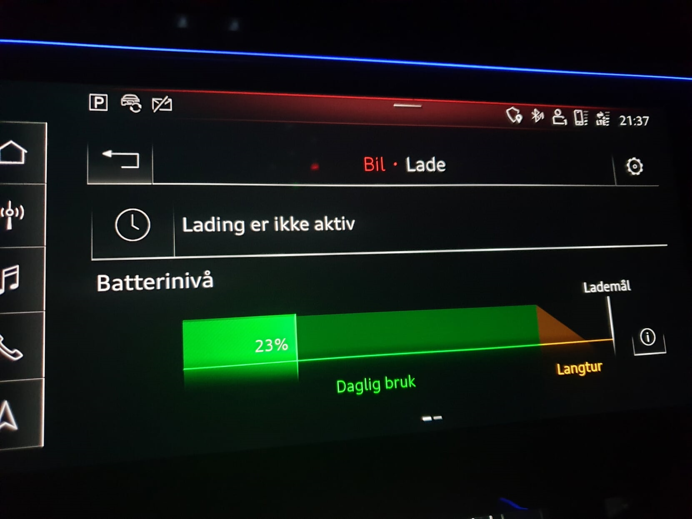
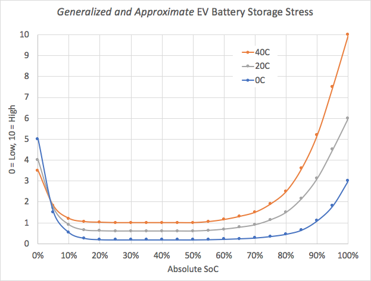
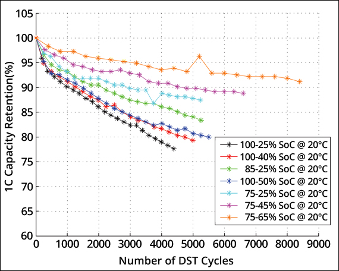

De nombreux facteurs augmentent la dégradation, mais les facteurs suivants sont les plus importants.

### Charge à grande vitesse

La charge à grande vitesse est le seul facteur qui augmente le plus la dégradation.

Vous devriez essayer de charger à la maison autant que possible.

### État de charge élevé ou faible sur une longue période

La plupart des véhicules électriques disposent d'un tampon pour protéger la batterie et les modèles tout électrique Audi. Dans le tableau ci-dessous, vous voyez le tampon total pour tous les modèles e-électriques d'Audi.

| Modèle | Batterie | Bouffer | Disponible |
|------|-------|-------|-------|
| [e-tron 55/S](/fr/models/e-tron/drivetrain/battery/) | 95 kWh | 8,5kWh (9 %)  | 86,5 kWh |
| [e-tron 50](/fr/models/e-tron/drivetrain/battery/) | 71 kWh | 6,3kWh (8,9%)  | 64,7 kWh |
| [(RS) e-tron GT](/fr/models/e-tron-gt/drivetrain/battery/) | 93,4 kWh | 9,7kWh (10,4 %)  | 83,7 kWh |
| [Q4 e-tron 40/45/50](/fr/models/q4-e-tron/drivetrain/battery/#battery-q4-40-e-tron-and-q4-50-e-tron)  | 82 kWh | 5,4kWh (6,6%)  | 76,6 kWh |
| [Q4 e-tron 35](/fr/models/q4-e-tron/drivetrain/battery/#battery-q4-35) | 55 kWh | 3kWh (5,45 %)  | 52 kWh |

Mais beaucoup de gens croient que ce tampon le protège contre la charge à 100%. Mais dans la plupart des cas, tout ou presque tout tampon est sur le fond pour protéger la batterie de l'exécution vide.

Ainsi, même e-tron 55 a un tampon relativement grand, charge à 100% n'est pas bon pour la batterie. Audi recommande de ne pas charger plus de 80% sur une base quotidienne. Ceci est indiqué dans le MMI et le manuel d'utilisation.

Le graphique ci-dessous montre un niveau de contrainte généralisé selon le niveau de charge.

Sur cette base, l'optimal est probablement de le garder entre 30 et 70%, mais combien mieux il est comparé à seulement charge à 100% est impossible à savoir.

Les tampons sont en réalité des limites sur la tension maximale et minimale de chaque cellule. Avoir un tampon de 4% sur le dessus signifie que la tension sur chaque cellule est limitée à un maximum de 96% de la tension maximale.

### Nombre de cycles de charge

Le nombre de cycles de charge affecte la dégradation.

Le diagramme ci-dessous illustre comment les habitudes de charge peuvent affecter la dégradation de la batterie. 

Sur cette base, le meilleur est de maintenir les niveaux de charge autour de 50%.

### Haute température

Les températures élevées font mal à la batterie. Si vous vivez dans une zone aux températures élevées, vous devriez essayer d'éviter que la voiture soit garée au soleil chaud toute la journée.

Vous pouvez en trouver plus sur la dégradation dans notre [battery guide](/fr/technology/battery/).


