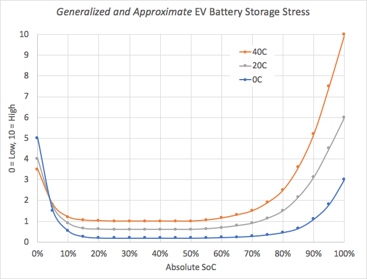

Many factors increase degradation but the following are the most important factors.

### High-Speed Charging

High-speed charging is the single factor that increases the degradation the most.

You should try to charge at home at much as possible.

### High or low state of charge over a long time

Most EV's has a buffer to protect the battery and the same has the all-electric Audi models. In the table below you see the total buffer for all e-electric models from Audi.

| Model | Battery | Buffer | Avaiable |
|------|-------|-------|-------|
| [e-tron 55/S](/models/e-tron/drivetrain/battery/) | 95 kWh | 8.5kWh (9%)  | 86.5 kWh |
| [e-tron 50](/models/e-tron/drivetrain/battery/) | 71 kWh | 6.3kWh (8.9%)  | 64.7 kWh |
| [(RS) e-tron GT](/models/e-tron-gt/drivetrain/battery/) | 93.4 kWh | 9.7kWh (10.4%%)  | 83.7 kWh |
| [Q4 e-tron 40/45/50](/models/q4-e-tron/drivetrain/battery/#battery-q4-40-e-tron-and-q4-50-e-tron)  | 82 kWh | 5.4kWh (6.6%)  | 76.6 kWh |
| [Q4 e-tron 35](/models/q4-e-tron/drivetrain/battery/#battery-q4-35) | 55 kWh | 3kWh (5.45%)  | 52 kWh |

But many people believe this buffer protects it against charging to 100%. But in most cases, all or almost all buffer is on the bottom to protect the battery from running empty.

So even e-tron 55 has a relatively  large buffer, charging to 100% is not good for the battery. Audi recommends not to charge more than 80% on daily basis. This is shown in the MMI and the user manual.

The graph below shows a generalized stress level depending on the charge level.

Based on this the optimal is probably to keep it between 30 and 70%, but how much better it is compared to just charge to 100% is impossible to know.

The buffers are in reality limits on the max and minimum voltage each cell can have. Having a 4% buffer on top means the voltage on each cell is limited to a max of 96% of the max voltage.

### Number of charge cycles

The number of charge cycles affects the degradation.

The diagram below shows hows the battery degrade based on charging habits.

Based on this, the best is to keep the charging levels around 50%.

### High Temperature

High temperatures hurt the battery. If you live in an area with high temperatures, you should try to avoid having the car parked in the heating sun all day.

You can find more about degradation in our [battery guide](../../../technology/battery/).

{}
