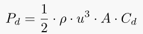

<!-- markdownlint-disable MD033 -->

Wir werden zuerst das Konzept erklären und Ihnen dann einige Szenarien geben, um zu zeigen, wie viel regeneriert wird.

Wir werden dann in die Physik gehen und die Mathematik hinter den Szenarien für diejenigen erklären, die die Details verstehen wollen.

Am Ende diskutieren wir, ob die Regeneration von Energie immer die beste Option ist.

## Wie funktioniert das?

Die Regeneration erfolgt, wenn die Elektromotoren als Generatoren verwendet werden, um die Geschwindigkeit eines fahrenden Fahrzeugs zu reduzieren.

Bei quattro-Modellen wie dem Audi e-tron können beide Motoren je nach Szenario für regenerative Bremsen eingesetzt werden.

Für Segel- und Leichtbremsung wird nur der Hintermotor verwendet, aber bei Kurvenfahrt oder Festbremsung werden beide Motoren verwendet.

Die Bremsen mischen sich auch in den physischen Bremsen, wenn nötig, und mischen sie nahtlos mit den regenerativen Bremsen.

<figure>
    
    <figcaption><h4>Regeneration von Küsten</h4></figcaption>
</figure>

Das folgende Video zeigt im Detail, wie die verschiedenen Motoren eingesetzt werden.



## Wie viel kann regeneriert werden?

Die folgenden Szenarien verwenden Mathematik und Physik, um zu erklären, wie groß die Vorteile des regenerativen Bremsens sind.

Die Details hinter der Berechnung werden im Kapitel Physik erklärt, aber Sie sollten wissen, dass ein sich bewegendes Objekt kinetische Energie hat, die regeneriert werden kann, und ein Auto, das sich in einer erhöhten Position befindet, potentielle Energie hat, die regeneriert werden kann.

Darüber hinaus gibt es aerodynamischen Widerstand und Rollwiderstand, die Kräfte sind, die gegen die Bewegung des Autos arbeiten.

Der Antriebsstrang ist auch nicht verlustfrei, was bedeutet, dass bei der Energieumwandlung etwas Energie verloren geht. Entweder von der Leistung der Batterie in die Bewegung des Autos oder umgekehrt, von der Bewegung des Autos in die Kraft der Batterie. Beim Audi e-tron liegt dieser Wirkungsgrad bei etwa 80%.

### Szenario 1: Pikes Peak

Nehmen wir den Pikes Peak als Beispiel. Dieser Berg ist 14,110 ft (4300 Meter) hoch, aber wenn man den Berg hinunter fährt, [first 18.6 miles](https://www.google.com/maps/dir/Pikes+Peak,+Colorado+80809,+United+States/38.9057543,-104.9779289/@38.8779104,-105.0432721,10824m/data=!3m1!1e3!4m9!4m8!1m5!1m1!1s0x8714a806033005bd:0xa67b8c79d6580c1e!2m2!1d-105.0422595!2d38.8408707!1m0!3e0) Sie [have dropped 6538 ft](https://www.slashgear.com/audi-e-tron-pikes-peak-recuperation-challenge-first-drive-ev-tech-07540279/)  (1993 Meter)

1993 Meter für einen Audi e-tron 55 bei 2900kg ist 15,74kWh in potentieller Energie.

<figure>
    
    <figcaption><h4>Pikes Peak im Audi e-tron</h4></figcaption>
</figure>

18,6 Meilen ist 30 km. Die Geschwindigkeit nach unten ist niedrig und basierend auf Rollwiderstand und Geschwindigkeit bei 40 km / h haben einen Energieverbrauch von 10,52 kWh / 100 km.

Für 30 km / 18,6 Meilen bedeutet dies insgesamt 3,15 kWh. Diese Energie wird aus der potenziellen Energie entnommen.

Das bedeutet 12,59 kWh Regeneration. Bei 80% Effizienz würde das 10,07 kWh zurück in die Batterie bedeuten.

Im Video unten sehen Sie einen realen Test von genau dieser Reise und wie viel sie sich regenerieren können.



### Szenario 2: Vollständiger Stopp von 75mph

In diesem Szenario bewegt sich das Auto mit 120,7 km / h und muss einen vollen Halt für ein rotes Licht machen.

<figure>
    
    <figcaption><h4>Machen Sie einen Full Stop von 75mph</h4></figcaption>
</figure>

Wie in der Grafik unten 75mph für einen 2900kg Audi e-tron gezeigt, ergibt sich die kinetische Gesamtenergie von 0,473 kWh.

Mit einem Wirkungsgrad von 80% bedeutet dies, dass das Auto 0,38 kWh zurück in die Batterie bringen kann.

Eine volle Fahrt auf 100 km mit 10 vollen Haltestellen wie diese würde dann 3,8 kWh für die gesamte Reise im Vergleich zu einem Auto mit nur Reibungsbremsen sparen.

Das bedeutet eine Verbrauchsreduzierung von 3,8 kWh/100 km.

### Szenario 3: Reduzieren Sie die Geschwindigkeit von 30 mph, um vollständig zu stoppen

<figure>
    
    <figcaption><h4>Machen Sie einen Full Stop von 75mph</h4></figcaption>
</figure>

Dieses Szenario ist ein typisches Stadtfahrszenario. Bei einer Fahrt mit 48,28 km/h hat der Audi e-tron eine kinetische Gesamtenergie von 0,0756kWh.

Basierend auf dem 80%-Wirkungsgrad des Antriebsstrangs spart dies 0,061 kWh zurück zur Batterie.

Wenn Sie 100 km im Stadtverkehr fahren und 100 Haltestellen wie diese machen müssen, sparen Sie 6,05 kWh Energie.

Dies reduziert den Energieverbrauch um 6,05 kWh/100 km im Vergleich zu einem Auto mit nur Reibungsbremsen.

### Szenario 4: Abfahrt vom Saltfjellet Berg

Dieser Berg liegt in Nordnorwegen und die Hauptstraße von Süden nach Norden führt über ihn (E6).

Wenn wir [this section](https://www.google.com/maps/dir/66.6848804,15.4189889/66.8133394,15.4007768/@66.7980852,15.1624003,10z/data=!3m1!4b1) Auf der Straße, auf der es bergab geht, sehen wir, dass der Start bei 650 Metern liegt und bei 125 Metern (410 Fuß) über dem Meeresspiegel endet. Bei einer Entfernung von 16,4 km (10,2 Meilen) ergibt dies einen Rückgang von 3,1%.

Das bedeutet eine potentielle Energie von 4,147 kWh.

Die Geschwindigkeitsbegrenzung beträgt 80 km / h (49,7 mph) und basierend auf dem Standardverbrauch auf einer trockenen Straße würde dies bedeuten, dass dieses Auto 2,49 kWh benötigt, um diese Strecke zu rollen, die von der potenziellen Energie angetrieben wird.

Der Rest könnte regeneriert werden, und mit 80% Effizienz gibt dies 1,3 kWh zurück in die Batterie.

1,3kWh sollte 6,8 km zusätzliche Reichweite in 80 km / h (49,7mph) geben

## Physik verstehen

### Kinetische Energie

Ein bewegtes Objekt hat kinetische Energie, die vom Gewicht des Objekts und der Geschwindigkeit des Objekts abhängt.

Die Formel lautet

Wobei

- KE = kinetische Energie in Joule
- m = Masse eines Körpers
- v = Geschwindigkeit eines Körpers in Metern/Sekunde

Darüber hinaus ist 1 Joule 2.778 · 10−4 Wh

In allen Berechnungen auf dieser Seite verwenden wir den Audi e-tron 55 mit einem Gewicht von 2900 kg in den Beispielen (Auto + Fahrer).

|Geschwindigkeit km/h | mph | m/s | Kinetische Energie |
|----|-----|-----|-----|
| 50 kmh | 31.07 mph | 13,89 m/s |  0,0777 kWh |
| 80 km/h | 49,7 mph | 22,222 m/s| 0,199 kWh |
| 104,7 km/h | 65 mph | 29,0575 m/s | 0,34 kWh |
| 120,7 km/h | 75 mph | 33,528 m/s | 0,453 kWh |

Sie können dies verwenden [kinetic energy calculator](https://www.omnicalculator.com/physics/kinetic-energy) für andere Geschwindigkeiten. Siehe auch die Grafik unten.

### Rotation kinetische Energie

Zusätzlich zur kinetischen Energie des Autos selbst enthalten die Räder, die sich auf dem Auto drehen, auch kinetische Rotationsenergie, die regeneriert werden kann.

Die Formel für Rotationsenergie

- E: die kinetische Rotationsenergie, ausgedrückt in Joule.
- I: Trägheitsmoment des Objekts, ausgedrückt in kg*m2.
- ω: die Winkelgeschwindigkeit des Körpers, ausgedrückt in Radianten pro Sekunde

Für ein Radträgheitsmoment kann berechnet werden

I = M * R2

Für einen Audi e-tron berechnen wir die Radoption 265/40 R22. Mit einem geschätzten Gewicht von 30 kg pro Rad und einem Radius von 38,54 cm erhalten Sie

I = 30 * 0.3854^2 = 4,4559948

Für 80 km/h dreht sich das Rad mit 566,89 U/min und die resultierende kinetische Energie wäre 8,724 Wh oder 0,008724 kWh für 4 Räder.

Hinweis: Dies ist nicht 100% korrekt, da die Formel auf einem Rad mit der gleichen Form von Mitte bis Kante basiert.

Wenn Sie berechnen möchten, können Sie die [Rotational Kinetic Energy calculator](https://www.omnicalculator.com/physics/rotational-kinetic-energy)

### Gravitation/Potenzielle Energie

Potenzielle Energie existiert, wenn sich das Auto an einem erhöhten Ort im Vergleich zum Ziel befindet.

Die Formel ist ganz einfach.

- U: Gravitationsenergie im Joule
- m: Masse in kg
- g: Gravitationsfeld 9,8 m/s^2 auf der Oberfläche
- h: Höhe in Metern

Zum Beispiel hat der Audi e-tron 55 auf 2900 kg, der sich auf 1000 Metern (3280 Fuß) über dem Meeresspiegel befindet, die potenzielle Energie von 7,8998 kWh (28,482,85 Joule).

In Gebieten mit Höhe wird die potenzielle Energie die größte Quelle für regenerierte Energie sein.

Siehe [potential energy calculator](https://www.omnicalculator.com/physics/potential-energy)

### Zusammenfassung

Die folgende Grafik zeigt die gesamte kinetische Energie und die beiden Arten von kinetischer Energie.

<figure>
    
    <figcaption><h4>Graphik über kinetische Energie</h4></figcaption>
</figure>

## Energieverbrauch verstehen

Bevor wir Ihnen ein Beispiel geben, wie viel Energie regeneriert werden kann, müssen wir den Energieverbrauch erklären, weil dies das Ergebnis beeinflusst.

### Verbrauch durch aerodynamischen Luftwiderstand

Ein fahrendes Auto wird Kräfte haben, die auf dem Luftwiderstand basieren, der gegen die Bewegung drückt.

<figure>
    
    <figcaption><h4>Audi e-tron im Windkanal</h4></figcaption>
</figure>

Die Formel für Drag lautet:

- P: Luftdichte (1,225 am Boden bei 15 °C)
- u: Geschwindigkeit in Metern/Sekunde
- A: Frontalbereich des Autos (2,65m2 auf Audi e-tron)
- CD: 0.28 auf Audi e-tron 55

Basierend auf diesem Beispiel. 80 km / h erfordert Leistung von 4,9 kW (6,23 kWh / 100 km), um den aerodynamischen Widerstand zu überwinden

Beachten Sie, dass die Leistung, die benötigt wird, um ein Objekt durch eine Flüssigkeit zu schieben, mit der Geschwindigkeit ansteigt, so dass ein Audi e-tron 55, der mit 160 km/h fährt, 39,89 kW (24,94 kWh/100 km) benötigt, um den Widerstand zu überwinden.

Die Temperatur beeinflusst die Dichte. Bei -25 beträgt die Dichte 1,4224 und der Verbrauch steigt bei 80 km/h auf 7,23 kWh/100 km an.

Für alle Berechnungen zu diesem Artikel gehen wir von 15 °C aus

### Rollwiderstand

Neben der Schleppkraft gibt es Rollwiderstand von Rädern und anderen Antriebskomponenten, der gegen Bewegung arbeitet.

Es ist nicht leicht, diese Zahl zu finden, aber mit Kenntnis des Gesamtverbrauchs und des durch den Luftwiderstand verursachten Verbrauchs sowie der Effizienz des Antriebsstrangs ist es möglich, den Rollwiderstand des Audi e-tron abzuschätzen.

Nach der Fahrerhistorie scheint es, als ob das Fahren auf einer trockenen Straße mit 80 km/h im Sommer etwa 19 kWh/100 km Energie aus der Batterie benötigt. Wenn wir von einem Wirkungsgrad von 80% im Antriebsstrang ausgehen, haben wir einen Energiebedarf von 15,2 kWh/100 km insgesamt einschließlich Luftwiderstand.

Wenn wir die für den Luftwiderstand benötigte Energie wegnehmen, haben wir rund 8,95 kWh/100 km, um den Rollwiderstand zu überwinden.

Diese Zahl ist eine Schätzung: Auf nassen Straßen oder Straßen mit Schnee steigt der Rollwiderstand.

### Zusammenfassung des Verbrauchs

Das folgende Diagramm zeigt den berechneten Verbrauch, der zur Überwindung des Widerstands und des Rollwiderstands und des Verbrauchs der Batterie benötigt wird, basierend auf einem Wirkungsgrad von 80% des Antriebsstrangs, der real nicht bekannt ist, aber voraussichtlich bei etwa 80% liegen wird.

<figure>
    
    <figcaption><h4>Berechneter Verbrauch</h4></figcaption>
</figure>

Siehe auch [full table](https://media.evkx.net/ehga/guides/regen/consumptiontable.webp) mit kinetischer Energie und Verbrauch für alle Geschwindigkeiten von 1-100 mph (1-161 km/h)

## Ist Regen immer die beste Option?

Da regeneratives Bremsen nur 80% effizient ist, ist es am besten, es zu vermeiden, wenn Sie können. Für Szenario 1, Pikes Peak fahren ist unmöglich ohne regeneratives Bremsen. Wenn Sie nicht Regener verwenden, werden Sie abstürzen. Aber wenn Sie eine flache Straße in den Szenarien 2 und 3 annehmen, würden Sie besser tun, wenn Sie nach vorne schauen und das Auto an Land lassen, also nutzt es den Rollwiderstand und den aerodynamischen Widerstand, um die Geschwindigkeit zu reduzieren.

Dies würde bedeuten, dass Sie Ihren Fuß früh genug vom Wattpedal heben müssen, damit Sie an dem Punkt anhalten, den Sie selbst wollen.

Wie viel Energie würde das sparen? Zwei Faktoren reduzieren den Gesamtverbrauch.

- Sie werden nicht verlieren 20% der kinetischen Energie beim Regenerieren
- Sie werden nicht verlieren 20% der Energie versuchen, die Geschwindigkeit zu halten

Theoretisch kann das sparen

- Szenario 2: 1,89 kWh/100 km
- Szenario 3: 3,02 kWh/100 km

Aber das ist im besten Fall, wo man genau berechnen kann, wo man den Fuß des Wattpedals heben soll. In der realen Welt wäre dieser Vorteil kleiner, da man am Ende etwas Kraft hinzufügen oder bremsen müsste, wenn man nicht in der Lage ist, dies richtig zu berechnen.

## Kannst du im Auto sehen, wie viel regeneriert wurde?

Ein häufiges Missverständnis ist, dass Sie sich die im Auto gemeldete Reichweite ansehen können, um zu sehen, wie viel regeneriert wurde.

Der Entfernungsmesser basiert seine Berechnung auf den letzten 100 km gefahren. Wenn wir Szenario 4 nehmen und annehmen, dass das Auto vom Meeresspiegel bis nach oben bei 650 Metern in 80 km / h (49,7 mph) gefahren wurde, würde der Verbrauch 25,4 kWh / 100 km bei 650 Metern betragen.

Beim Audi e-tron 55 mit 86,5 kWh Batteriekapazität würde die Reichweite auf 340 km (211 Meilen) für eine volle Batterie basierend auf diesem Verbrauch berechnet.

Nach dem Abfahren des Straßenabschnitts Szenario 4 würde der Gesamtverbrauch der Batterie von 25,4 kWh/100 km auf 21 kWh/100 km reduziert.

Dies würde die berechnete Reichweite auf 411 km (255 Meilen) für eine geladene 100% Batterie erhöhen (je nach realem SOC weniger). Auf dieser Grundlage könnte man fälschlicherweise glauben, dass man 71 km (44 Meilen) regeneriert hat, aber das Richtige ist 6,8 km. (4,2 Meilen)

Diese Art von Anstieg konnte man sogar in Szenarien sehen, in denen es keine Regeneration gibt, sondern nur einen Rückgang, der den Verbrauch reduzierte.

Der einzige Weg, um zu wissen, wie viel Sie regeneriert haben, ist zu sehen, wie viel der Ladezustand der Batterie von oben nach unten des Berges ändert.

<figure>
    
    <figcaption><h4>Ladezustand, der einzige Weg, um zu sehen, wie viel Sie regeneriert haben</h4></figcaption>
</figure>

## Ein Pedalfahren vs manuelle / automatische Regener

Bei elektrischen Audis können Sie regenerative Bremsen auf unterschiedliche Weise verwenden

- Handbuch, nur mit dem Bremspedal
- Automatisch, so dass das Auto entscheiden, wann es sich regenerieren soll
- Handbuch, mit Lenkradpaddeln zur Regeneration
- Ein Pedal fahren - automatische regenerieren beim Heben des Fußes von Wattpedal

Alle Methoden verwenden die gleichen elektrischen Antriebskomponenten, um zu bremsen, so dass sie die gleiche Effizienz haben.

Aber ein-Pedal-Fahren hat eine etwas reduzierte Effizienz in Szenarien, in denen der Fahrer den Übergang von der Nutzung von Strom zum Segeln wünscht.

Da Sie Ihren Fuß auf dem Pedal an einer bestimmten Position halten müssen, um keine Energie zu verbrauchen oder zu bremsen, werden Sie immer mehr Zeit damit verbringen, in diese Position zu kommen, als den Fuß direkt vom Pedal zu heben.

Deshalb empfiehlt Audi, zur Energieeinsparung eine automatische Regenerierung mit Segeln zu verwenden.

Der Unterschied ist gering, wahrscheinlich weniger als 10% des Unterschieds zwischen Segeln und regenerativem Bremsen in den Szenarien, in denen Segeln möglich ist.

Für Szenarien wie Szenario 1 gibt es keinen Unterschied, da Sie regenerative Bremsen durchführen, um das Auto auf der Straße zu halten.

Da der Unterschied so gering ist, sollten Sie basierend auf Ihrer persönlichen Präferenz wählen.

Sie können mehr lesen über [one-pedal-driving](../onepedaldriving/)
