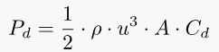

<!-- markdownlint-disable MD033 -->

Nous allons d'abord expliquer le concept et ensuite vous donner quelques scénarios pour montrer combien est régénéré.

Nous allons ensuite aller en physique et expliquer les mathématiques derrière les scénarios pour ceux qui veulent comprendre les détails.

En fin de compte, nous discutons si la régénération de l'énergie est toujours la meilleure option.

## Comment ça marche ?

La régénération se produit lorsque les moteurs électriques sont utilisés comme générateurs pour réduire la vitesse d'un véhicule en mouvement.

Pour les modèles quattro, comme le Audi e-tron, les deux moteurs peuvent être utilisés pour le freinage à récupération selon le scénario.

Pour le freinage par le câble et le freinage léger, seul le moteur arrière est utilisé, mais lorsqu'il s'agit d'un virage ou d'un freinage dur, les deux moteurs sont utilisés.

Les freins se mélangent également dans les freins physiques si nécessaire en les mélangeant sans heurt avec les freins régénératifs.

<figure>
    
    <figcaption><h4>Régénération du cabotage</h4></figcaption>
</figure>

La vidéo suivante montre en détail comment les différents moteurs sont utilisés.



## Combien peut-on régénérer?

Les scénarios suivants utilisent les mathématiques et la physique pour expliquer l'ampleur des avantages du freinage régénératif.

Les détails derrière le calcul sont expliqués dans le chapitre de physique, mais vous devez savoir qu'un objet mobile a de l'énergie cinétique qui peut être régénérée et une voiture située en position élevée a de l'énergie potentielle qui peut être régénérée.

En outre, il y a la résistance aérodynamique à la traînée et au roulement qui sont des forces qui agissent contre le mouvement de la voiture.

La motorisation n'est pas non plus sans perte, ce qui signifie que l'énergie est perdue dans la conversion de l'énergie. Soit de l'alimentation sur la batterie au mouvement de la voiture, soit inversement, du mouvement sur la voiture à l'alimentation sur la batterie. Sur l'E-tron Audi, cette efficacité est d'environ 80%.

### Scénario 1: Pics de pic

Prenons le pic Pikes comme exemple. Cette montagne est de 14,110 pieds (4300 mètres) de haut, mais si vous conduisez [first 18.6 miles](https://www.google.com/maps/dir/Pikes+Peak,+Colorado+80809,+United+States/38.9057543,-104.9779289/@38.8779104,-105.0432721,10824m/data=!3m1!1e3!4m9!4m8!1m5!1m1!1s0x8714a806033005bd:0xa67b8c79d6580c1e!2m2!1d-105.0422595!2d38.8408707!1m0!3e0) vous [have dropped 6538 ft](https://www.slashgear.com/audi-e-tron-pikes-peak-recuperation-challenge-first-drive-ev-tech-07540279/)  (1993 mètres)

1993 mètres pour un Audi e-tron 55 à 2900 kg est 15,74kWh en énergie potentielle.

<figure>
    
    <figcaption><h4>Déplacer Pikes Peak en Audi e-tron</h4></figcaption>
</figure>

La vitesse de descente est faible et basée sur la résistance au roulement et la vitesse à 40km/h ont une consommation d'énergie de 10,52kWh/100km.

Pour 30km, cela signifie 3,15 kWh au total, cette énergie sera tirée de l'énergie potentielle.

Cela signifie que 12,59kWh régénérer. Avec 80% d'efficacité, cela signifie 10,07kWh de retour dans la batterie.

Dans la vidéo ci-dessous vous voyez un test réel de exactement ce voyage et combien ils sont capables de se régénérer.



### Scénario 2 : Arrêt complet de 75mi/h

Dans ce scénario, la voiture se déplace à 75mph (120,7km/h) et doit faire un arrêt complet pour un feu rouge.

<figure>
    
    <figcaption><h4>Faire un arrêt complet à partir de 75mph</h4></figcaption>
</figure>

Comme le montre le graphique ci-dessous, pour un Audi e-tron de 2900kg, l'énergie cinétique totale est de 0,473 kWh.

Avec 80% d'efficacité de la motorisation, cela signifie que la voiture sera en mesure de récupérer 0,38kWh à la batterie.

Un voyage complet sur 100km (62 miles) avec 10 arrêts complets comme celui-ci permettrait d'économiser 3,8kWh pour le voyage total par rapport à une voiture avec seulement des freins à friction.

Cela signifie une réduction de la consommation de 3,8kWh/100km.

### Scénario 3 : Réduire la vitesse de 30 mi/h à l'arrêt complet

<figure>
    
    <figcaption><h4>Faire un arrêt complet à partir de 75mph</h4></figcaption>
</figure>

Ce scénario est typique de la ville. En conduisant à 30 mi/h (48,28km/h), l'E-tron Audi a une énergie cinétique totale de 0,0756kWh.

Basé sur l'efficacité de 80% du groupe motopropulseur, cela permet d'économiser 0,061kWh retour à la batterie.

Si vous conduisez 100km dans le trafic urbain et devez faire 100 arrêts comme cela, vous économisez 6,05 kWh énergie.

Cela réduit la consommation d'énergie de 6,05kWh/100km par rapport à une voiture avec seulement des freins à friction

### Scénario 4 : En descendant de la montagne de Saltfjellet

Cette montagne est située dans le nord de la Norvège et la route principale du sud au nord passe au-dessus (E6).

Si on prend [this section](https://www.google.com/maps/dir/66.6848804,15.4189889/66.8133394,15.4007768/@66.7980852,15.1624003,10z/data=!3m1!4b1) de la route où il commence à descendre nous voyons que le départ est à 650 mètres (2132pieds) et il se termine à 125 mètres (410 pieds) au-dessus du niveau de la mer. Avec une distance de 16,4 km (10,2 miles), cela donne un déclin de 3,1%

Cela signifie une énergie potentielle de 4,147 kWh.

La limite de vitesse est de 80 km/h (49,7mi/h) et, en fonction de la consommation standard sur une route sèche, cela signifie que cette voiture nécessite 2,49kWh pour rouler cette distance entraînée par l'énergie potentielle.

Le reste pourrait être régénéré, et avec 80% d'efficacité, cela donne 1,3kWh de retour dans la batterie.

1,3 kWh devrait donner une autonomie supplémentaire de 6,8 km en 80 km/h (49,7 mi/h)

## Comprendre la physique

### Énergie cinétique

Un objet mobile a une énergie cinétique. Cette énergie dépend du poids de l'objet et de la vitesse de l'objet.

La formule est :

où

- KE = énergie cinétique dans Joule
- m = masse d ' un corps
- v = vitesse d ' un corps en mètres/seconde

En outre, 1 Joule est de 2,778·10−4 Wh

Dans tous les calculs sur cette page, nous utilisons le Audi e-tron 55 avec un poids de 2900kg dans les exemples (voiture + conducteur). Le tableau suivant montre combien d'énergie cinétique cette voiture aura en commun vitesses-

|Vitesse km/h | mph | m/s | Énergie cinétique |
|----|-----|-----|-----|
| 50 kmh | 31,07 mi/h | 13,89 m/s |  0,07777 kWh |
| 80 km/h | 49,7 mi/h | 22.222 m/s| 0,199 kWh |
| 104,7 km/h | 65 mi/h | 29.0575 m/s | 0,34 kWh |
| 120,7 km/h | 75 mi/h | 33.528 m/s | 0,453 kWh |

Vous pouvez utiliser ceci [kinetic energy calculator](https://www.omnicalculator.com/physics/kinetic-energy) pour les autres vitesses. Voir aussi le graphique ci-dessous.

### Énergie cinétique rotative

En plus de l'énergie cinétique de la voiture elle-même, les roues tournant sur la voiture contiennent également de l'énergie cinétique rotationnelle qui peut être régénérée.

La formule pour l'énergie rotationnelle

- E: l'énergie cinétique rotationnelle, exprimée en Joules.
- I: le moment d'inertie de l'objet, exprimé en kg*m2.
- - - la vitesse angulaire du corps, exprimée en radians par seconde

Pour un moment d'inertie de roue peut être calculé

I = M * R2

Pour un Audi e-tron, nous faisons le calcul pour l'option de roue 265/40 R22. Avec un poids estimé de 30 kg par roue et un rayon de 38,54 cm vous obtenez

I = 30 * 0,3854^2 = 4 4559948

Pendant 80 km/h, la roue tourne avec 566,89 tr/min et l'énergie cinétique qui en résulterait serait de 8,724 Wh ou 0,008724 kWh pour 4 roues.

Note : Ce n'est pas 100% correct puisque la formule est basée sur une roue avec la même forme du centre au bord. Mais elle est assez proche pour ce genre de calcul.

Si vous voulez calculer, vous pouvez essayer la [Rotational Kinetic Energy calculator](https://www.omnicalculator.com/physics/rotational-kinetic-energy)

### Énergie gravitationnelle/potentielle

L'énergie potentielle existe lorsque la voiture est située à un endroit élevé par rapport à la destination.

La formule est assez simple.

- U: énergie gravitationnelle en joule
- m: masse en kg
- g: champ gravitationnel de 9,8 m/s^2 sur surface
- h: hauteur en mètres

Par exemple, le Audi e-tron 55 sur 2900kg situé à 1000 mètres (3 280 pieds) au-dessus du niveau de la mer aura l'énergie potentielle de 7,8998 kWh (28,492,85 Joule)

Dans les zones à élévation, l'énergie potentielle sera la plus grande source d'énergie régénérée.

Voir [potential energy calculator](https://www.omnicalculator.com/physics/potential-energy)

### Résumé

Le graphique suivant montre l'énergie cinétique totale et les deux types d'énergie cinétique.

<figure>
    
    <figcaption><h4>Graphique sur énergie cinétique</h4></figcaption>
</figure>

## Comprendre la consommation d'énergie

Avant de vous donner un exemple de la quantité d'énergie régénérée, nous devons vous expliquer la consommation d'énergie.

### Consommation par traînée aérodynamique

Une voiture en mouvement aura des forces basées sur la résistance à l'air qui pousseront contre le mouvement.

<figure>
    
    <figcaption><h4>Audi e-tron dans un tunnel à vent</h4></figcaption>
</figure>

La formule pour la traînée est la suivante:

- P: Densité de l ' air (1,225 au sol à 15 °C)
- u: Vitesse en mètres/seconde
- A: Zone frontale de la voiture (2,65m2 sur Audi e-tron)
- CD: 0.28 sur Audi e-tron 55

Sur la base de ce qui est un exemple. 80km/h nécessite une puissance sur 4,9kW (6.23kWh/100km) pour surmonter la traînée aérodynamique

Notez que la puissance nécessaire pour pousser un objet à travers un fluide augmente à mesure que le cube de la vitesse, de sorte qu'un Audi e-tron 55 voyageant à 160km/h nécessite 39,89 kW (24,94 kWh/100km) pour surmonter la traînée.

La température affecte la densité. A -25, la densité est de 1,4224 et la consommation à 80 km/h augmente à 7,23kWh/100km.

Pour tous les calculs sur cet article, nous supposons 15 °C

### Résistance au roulement

En plus de la force de traction, il y a une résistance au roulement des roues et autres éléments du groupe motopropulseur qui fonctionne contre les mouvements.

Il n'est pas facile de trouver ce nombre, mais en connaissant la consommation totale et la consommation causée par la traînée, et l'efficacité sur la transmission il est possible d'estimer la résistance au roulement sur l'E-tron Audi.

Sur la base de l'historique du conducteur, il semble que la conduite sur une route sèche à 80 km/h en été nécessite environ 19kWh/100km d'énergie de la batterie. Si nous supposons 80% d'efficacité dans la transmission, nous avons un besoin énergétique de 15.2kWh/100km au total, y compris la traînée.

Si nous prenons l'énergie nécessaire pour la traînée, nous avons environ 8,95kWh/100km pour surmonter la résistance au roulement.

Sur les routes humides ou avec la neige, la résistance au roulement augmente.

### Résumé de la consommation

Le diagramme suivant montre la consommation calculée nécessaire pour surmonter la résistance à la traînée et au roulement et la consommation de la batterie basée sur l'efficacité de 80% de la motorisation. L'efficacité réelle n'est pas connue, mais elle devrait être d'environ 80%.

<figure>
    
    <figcaption><h4>Consommation calculée</h4></figcaption>
</figure>

Voir aussi [full table](https://media.evkx.net/ehga/guides/regen/consumptiontable.webp) avec énergie cinétique et consommation pour toutes les vitesses de 1 à 100 mph (1 à 161 km/h)

## Regen est-il toujours la meilleure option ?

Pour le scénario 1, conduire Pikes Peak est impossible sans freinage régénératif. Si vous n'utilisez pas de régen, vous allez vous écraser. Mais si vous prenez la route plate sur les scénarios 2 et 3, vous feriez mieux si vous regardez en avant et laissez la voiture côte, donc il utilise la résistance au roulement et la traînée aérodynamique pour réduire la vitesse.

Cela signifie que vous devez lever votre pied de la pédale de watt assez tôt pour que vous vous arrêtiez au point que vous voulez par lui-même.

Alors combien d'énergie cela économiserait-il? Deux facteurs réduisent la consommation totale.

- Vous ne perdrez pas 20% de l'énergie cinétique lors de la régénération
- Vous ne perdrez pas 20% de l'énergie en essayant de garder la vitesse

Théorique ceci peut sauver

- Scénario 2: 1,89 kWh/100km
- Scénario 3: 3,02 kWh/100km

Mais c'est dans le meilleur scénario où vous pouvez calculer exactement où lever le pied de la pédale de watt. Dans le monde réel, cet avantage serait plus petit car vous auriez besoin d'ajouter de la puissance ou du freinage à la fin lorsque vous n'êtes pas en mesure de calculer correctement.

## Tu vois dans la voiture combien a été régénéré ?

Un malentendu commun est que vous pouvez regarder la gamme rapportée dans la voiture pour voir combien a été régénéré.

Le compteur de la gamme base son calcul sur les 100 derniers km parcourus. Si nous prenons le scénario 4 et supposons que la voiture a été conduite du niveau de la mer au sommet à 650 mètres en 80km/h (49.7 mi/h), la consommation serait de 25,4kWh/100km à 650 mètres.

Sur le Audi e-tron 55 avec une capacité de 86,5kWh, la portée serait calculée à 340km (211 miles) pour une batterie complète en fonction de cette consommation.

Après avoir descendu le scénario 4 de la section routière, la consommation totale de la batterie serait réduite de 25,4kWh/100km à 21kWh/100km.

Cela augmenterait la portée calculée à 411km (255 miles) pour une batterie chargée à 100% (moins selon le réel SOC). Sur cette base, vous pouvez croire à tort que vous avez régénéré 71km (44 miles), mais le bon est 6.8km.(4.2 miles)

Ce type d'augmentation que vous pourriez même voir dans des scénarios où il n'y a pas de régénération, mais juste un déclin qui a réduit la consommation.

La seule façon de savoir combien vous avez régénéré est de voir combien l'état de charge de la batterie change de haut en bas de la montagne.

<figure>
    
    <figcaption><h4>État de charge, la seule façon de voir combien vous avez régénéré</h4></figcaption>
</figure>

## Une pédale de conduite vs régen manuel/automatique

Sur les Audis électriques, vous pouvez utiliser des freins régénératifs de différentes façons

- Manuel, uniquement avec la pédale de frein
- Automatique, laissant la voiture décider quand se régénérer
- Manuel, en utilisant des palettes de volant pour se régénérer
- Une pédale de conduite - se régénérer automatiquement lors du levage du pied hors watt pédale

Toutes les méthodes utilisent les mêmes composants de transmission électrique pour faire le freinage, donc ils ont la même efficacité.

Mais la conduite à une seule vitesse a un peu moins d'efficacité dans les scénarios où le conducteur veut passer de l'utilisation de la puissance à la mise en côte.

Puisque vous devez garder votre pied sur la pédale à une position spécifique pour ne pas utiliser d'énergie ou de freinage, vous passerez toujours plus de temps à venir à cette position par rapport à soulever le pied directement de la pédale. En outre, il faut un certain entraînement pour garder le pied en position parfaite.

C'est pourquoi Audi recommande d'utiliser la régen automatique avec la côte pour économiser l'énergie.

La différence est faible, probablement moins de 10 % de la différence entre le freinage par le câble et le freinage par récupération dans les scénarios où le freinage par le câble est possible.

Pour les scénarios comme le scénario 1, il n'y a pas de différence puisque vous ferez du freinage régénératif pour garder la voiture sur la route.

Puisque la différence est si petite, vous devriez choisir en fonction de votre préférence personnelle.

Vous pouvez en savoir plus sur [one-pedal-driving](../onepedaldriving/)
