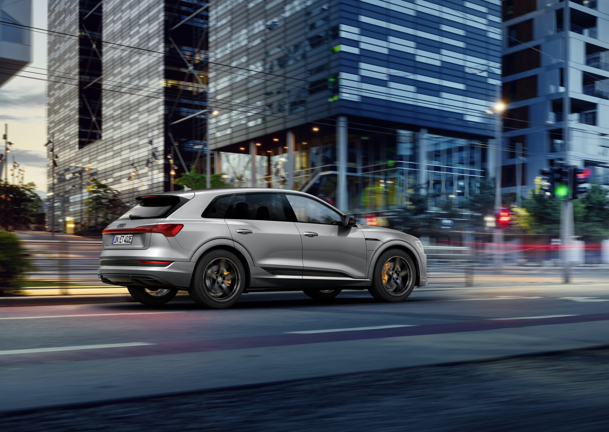

<!-- markdownlint-disable MD033 -->

Vi vil først forklare konseptet og deretter gi deg noen scenarier for å vise hvor mye som regenereres.

Vi vil så gå inn i fysikken og forklare regnestykket bak scenariene for de som ønsker å forstå detaljene.

Til slutt diskuterer vi om regenerering av energi alltid er det beste alternativet.

## Hvordan virker det?

Regenereringen skjer når de elektriske motorene brukes som generatorer for å redusere hastigheten til et kjøretøy i bevegelse.

For quattro-modeller, som Audi e-tron, kan begge motorene brukes til regenerativ bremsing avhengig av scenariet.

Ved lett bremsing brukes kun den bakre motoren, men ved svinger eller hard bremsing brukes begge motorene.

Bremsene blander også inn de fysiske bremsene om nødvendig, og blander dem sømløst med de regenerative bremsene. Dette skjer ved hard bremsing.

<figur>
    
    <figcaption><h4>Coasting regneration</h4></figcaption>
</figur>

Videoen nedenfor viser i detalj hvordan de forskjellige motorene brukes.



## Hvor mye kan regenereres?

De følgende scenariene bruker matematikk og fysikk for å forklare hvor store fordelene med regenerativ bremsing er.

Detaljene bak beregningen er forklart i fysikk-kapittelet, men du bør vite at et objekt i bevegelse har kinetisk energi som kan regenereres
og en bil plassert i en forhøyet posisjon (som et fjell) har potensiell energi som kan regenereres.

I tillegg kommer aerodynamisk luftmotstand og rullemotstand som er krefter som virker mot bevegelsen til bilen.

### Scenario 1: Pikes Peak

La oss ta Pikes Peak som et eksempel. Dette fjellet er 4300 meter høyt, og hvis du kjører ned de [første 30 kilometerne](https://www.google.com/maps/dir/Pikes+Peak,+Colorado+80809,+United+States/38.9057543,-104.9779289/@38.8779104,-105.0432721,10824m/data=!3m1!1e3!4m9!4m8!1m5!1m1!1s0x8714a806033005bd:0xa67b8c79d6580c1e!2m2!1d-105.0422595!2d38.8408707!1m0!3e0) har du [redusert høyden med 1993 meter](https://www.slashgear.com/audi-e-tron-pikes-peak-recuperation-challenge-first-drive-ev-tech-07540279/) 

1993 meter for en Audi e-tron 55 på 2900 kg er 15,74 kWh i potensiell energi.

<figur>
    
    <figcaption><h4>Audi e-tron på vei ned Pikes Peak</h4></figcaption>
</figur>

Hastigheten ned er lav og har basert på rullemotstand og hastighet på 40km/t et energiforbruk på 10,52kWh/100km.

For 30km betyr dette 3,15 kWh totalt. Denne energien vil bli tatt fra den potensielle energien.

Dette betyr 12,59 kWh å regenerere. Med 80 % effektivitet vil dette bety 10,07 kWh tilbake i batteriet.

I videoen under ser du en virkelighetstest av akkurat denne turen og hvor mye de klarer å regenerere.



### Scenario 2: Full stopp fra 120km/t

I dette scenariet beveger bilen seg i 120,7 km/t (75 mph) og må stoppe for rødt lys.

Som vist i grafen nedenfor gir 120,7 km/t for en 2900 kg Audi e-tron den totale kinetiske energien på 0,472626718 kWh.

Med 80 % drivverkseffektivitet betyr dette at bilen vil kunne få 0,38 kWh tilbake til batteriet.

En hel tur på 100 km (62 miles) med 10 fulle stopp som dette vil da spare 3,8 kWh for den totale turen sammenlignet med en bil med kun friksjonsbremser.

Dette betyr en forbruksreduksjon på 3,8kWh/100km.

### Scenario 3: Reduser hastigheten fra 48 km/t til helt stopp

Dette scenariet er et typisk bykjøringsscenario. Ved kjøring i 30 mph (48,28 km/t) har Audi e-tron en total kinetisk energi på 0,075620275 kWh.

Basert på drivverkets effektivitet på 80 % gir dette 0,06059 kWh tilbake til batteriet.

Hvis du kjører 100 km i bytrafikk og trenger å gjøre 100 stopp som dette sparer du 6,05 kWh energi.

Dette reduserer energiforbruket med 6,05 kWh/100 km sammenlignet med en bil med kun friksjonsbremser

### Scenario 4: Kjøring ned fra Saltfjellet

Dette fjellet ligger i Nord-Norge og hovedveien fra sør til nord går over det (E6).

Hvis vi tar [denne seksjonen](https://www.google.com/maps/dir/66.6848804,15.4189889/66.8133394,15.4007768/@66.7423002,15.420291,132881m/data) hvor det begynner for å gå nedover ser vi at starten er på 650 meter (2132 fot) og den ender på 125 meter (410 fot) over havet.
Med en avstand på 16,4 km (10,2 miles), gir dette en nedstigning på 3,1 %

Dette gir potensiell energi på 4.147 kWh.

Fartsgrensen er 80 km/t (49,7 mph) og basert på standardforbruk på tørr vei, vil dette bety at denne bilen krever 2,49 kWh for å rulle denne distansen drevet av potensiell energi.

Resten kunne regenereres, og med 80 % effektivitet gir dette 1,3kWh tilbake i batteriet.

1,3 kWh skal gi 6,8 km ekstra rekkevidde i 80 km/t (49,7 mph)

## Forstå fysikken bak

### Kinetisk energi

Et objekt i bevegelse har kinetisk energi. Denne energien avhenger av vekten til objektet og hastigheten til objektet.

Formelen er

 

Hvor

- KE = kinetisk energi i Joule
- m = massen til en kropp
- v = hastigheten til et legeme i meter/sekund

I tillegg er 1 Joule 2,778·10⁻⁴ Wh

I alle beregninger på denne siden bruker vi Audi e-tron 55 med en vekt på 2900kg i eksemplene (bil + sjåfør). Tabellen nedenfor viser hvor mye kinetisk energi denne bilen vil ha i vanlige hastigheter-

|Hastighet km/t | mph | m/s | Kinetisk energi |
|----|-----|-----|-----|
| 50 kmt | 31,07 mph | 13,89 m/s | 0,077696331 kWh |
| 80 km/t | 49,7 mph | 22.222 m/s| 0,1989 kWh |
| 104,7 km/t | 65 mph | 29,0575 m/s | 0,340083 kWh |
| 120,7 km/t | 75 mph | 33,528 m/s | 0,452773 kWh |

Du kan bruke denne kalkulatoren for [kinetisk energi](https://www.omnicalculator.com/physics/kinetic-energy) for andre hastigheter. Se også grafen under.

### Rotasjonsenergi

I tillegg til den kinetiske energien til selve bilen, inneholder hjulene som spinner på bilen også rotasjonsenergi som kan regenereres.

Formelen for rotasjonsenergi

- E: den rotasjonskinetiske energien, uttrykt i Joule.
- I: treghetsmomentet til objektet, uttrykt i kg*m².
- ω: vinkelhastigheten til kroppen, uttrykt i radianer per sekund

For et hjul er formelen for [treghetsmoment](https://no.wikipedia.org/wiki/Treghetsmoment)

I = M * R²

For en Audi e-tron gjør vi beregningen for hjulalternativet 265/40 R22. Med en estimert vekt på 30 kg per hjul og en radius på 38,54 cm får du

I = 30 * 0,3854^2 = 4,4559948

For 80 km/t vil hjulet spinne med 566,89 rotasjoner i minuttet og den resulterende kinetiske energien vil være 8,724333 Wh eller 0,008724333 kWh for 4 hjul.

Merk: Dette er ikke 100 % nøyaktig siden formelen er basert på et hjul med samme form fra senter til ytterkant og vil variere på utformingen av selve felgen. Men det er nærme nok for denne typen beregninger.

Hvis du vil beregne selv, kan du prøve [Rotational Kinetic Energy-kalkulatoren](https://www.omnicalculator.com/physics/rotational-kinetic-energy)

### Gravitasjons-/potensialenergi

Potensiell energi eksisterer når bilen er plassert på et høyt sted sammenlignet med destinasjonen.

Formelen er ganske enkel.

- U: gravitasjonsenergi i joule
- m: masse i kg
- g: gravitasjonsfelt 9,8 m/s^2 på overflaten
- h: høyde i meter

For eksempel vil Audi e-tron 55 på 2900 kg plassert på 1000 meter (3280 fot) over havet ha en potensiell energi på 7,8998 kWh (28,492,85 Joule)

I områder med høydeforskjeller (som mange steder i Norge) vil den potensielle energien være den største kilden til regenerert energi.

Se [potensiell energikalkulator](https://www.omnicalculator.com/physics/potential-energy)

### Sammendrag

Grafen nedenfor viser den totale kinetiske energien og de to typene kinetisk energienergi

<figur>
    
    <figcaption><h4>Graff over kinetisk energi</h4></figcaption>
</figur>

## Forstå energiforbruk

Før vi gir deg et eksempel på hvor mye energi som kan regenereres, må vi forklare energiforbruket. For dette påvirker resultatet.

### Forbruk ved aerodynamisk luftmotstand

En bil i bevegelse vil ha krefter basert på luftmotstand som vil presse mot bevegelsen.

<figur>
    
    <figcaption><h4>Audi e-tron i vindtunnel</h4></figcaption>
</figur>

Formelen for luftmotstand er:

- P: Lufttetthet (1,225 på bakken ved 15 °C)
- u: Hastighet i meter/sekund
- A: Frontareal på bilen (2,65m2 på Audi e-tron)
- CD: 0,28 på Audi e-tron 55

Basert på dette som eksempel. 80 km/t krever kraft på 4,9 kW (6,23 kWh/100 km) for å overvinne aerodynamisk luftmotstand

Legg merke til at kraften som trengs for å skyve en gjenstand gjennom en væske øker etter hvert som kuben av hastigheten, så en Audi e-tron 55 kjører i 160 km/t
krever 39,89 kW (24,94 kWh/100 km) for å overvinne luftmotstand.

Temperaturen påvirker tettheten. Ved -25 er tettheten 1,4224 og forbruket ved 80 km/t øker til 7,23kWh/100km.

For alle beregninger på denne artikkelen antar vi 15 °C

### Rullemotstand

I tillegg til dragkraft er det rullemotstand fra hjul og andre drivverkskomponenter som motvirker bevegelse.

Det er ikke lett å finne dette tallet, men med å kjenne til totalforbruk og forbruk forårsaket av luftmotstand, og effektiviteten på drivverket er det mulig å estimere rullemotstanden på Audi e-tron.

Basert på historikken til Audi eiere virker det som å kjøre på tørr flat vei i 80 km/t i sommertemperatur krever rundt 19 kWh/100 km energi fra batteriet.
Hvis vi antar 80 % effektivitet i drivverket, har vi et energibehov på 15,2 kWh/100 km totalt inkludert luftmotstand.

Hvis vi tar bort energien som trengs for luftmotstand, har vi rundt 8,95 kWh/100 km for å overvinne rullemotstanden.

Dette tallet er et estimat. På våte veier eller veier med snø øker rullemotstanden.

### Forbrukssammendrag

Diagrammet nedenfor viser det beregnede forbruket som er nødvendig for å overvinne luftmotstand og rullemotstand og forbruk fra batteriet basert på 80 % effektivitet av drivverket. Den reelle effektiviteten er ikke kjent, men den forventes å være rundt 80 %.

<figur>
    
    <figcaption><h4>Beregnet forbruk</h4></figcaption>
</figur>

Se også [full tabell](consumptiontable.png) med kinetisk energi og forbruk for alle hastigheter fra 1–100 mph (1–161 km/t)

## Er regenerering alltid det beste alternativet?

Siden regenerativ bremsing bare er 80 % effektiv, er det best å unngå å bruke den når du kan. For scenario 1 er det umulig å kjøre ned Pikes Peak uten regenerativ bremsing. Hvis
du ikke bruker regen du vil krasje. Men hvis du antar flat vei på scenario 2 og 3, ville du gjort det bedre om du ser fremover og lar bilen rulle slik at den bruker
rullemotstand og aerodynamisk luftmotstand for å redusere hastigheten til full stopp.

Dette vil bety at du må løfte foten fra wattpedalen tidlig nok slik at du stopper på det punktet du ønsker av seg selv.

Så hvor mye energi vil det spare? To faktorer reduserer totalforbruket.

– Du vil ikke miste 20 % av den kinetiske energien ved regenering
– Du vil ikke miste 20 % av energien ved å prøve å holde farten til det punktet du må bremse.

Teoretisk kan dette spare

- Scenario 2: 1,89 kWh/100 km
- Scenario 3: 3,02 kWh/100 km

Men dette er i beste fall hvor du kan beregne nøyaktig hvor du skal løfte foten av wattpedalen. I den virkelige verden vil denne fordelen være mindre siden du ville ende opp med å måtte legge til litt kraft eller bremse på slutten når du ikke er i stand til å beregne dette 100%.

For scenario 4 vil bilen oppnå en hastighet på ca 130km/t hvis man ikke regenerer. Det kan fort bli dyrt hvis Pelle Politibil står i bunnen av bakken.

## Kan du se i bilen hvor mye som ble regenerert?

En vanlig misforståelse er at du kan se på rekkevidden som er rapportert i bilen for å se hvor mye som ble regenerert.

Rekkeviddeberegningen baserer sin beregning på de siste 100 km kjørt. Hvis vi tar scenario 4 og antar at bilen har blitt kjørt fra havnivå og opp til toppen i 650 meter i 80 km/t (49,7 mph) vil forbruket være 25,4 kWh/100 km ved 650 meter.

På Audi e-tron 55 med 86,5 kWh batterikapasitet, vil rekkevidden bli beregnet til 340 km (211 miles) for et fullt batteri basert på dette forbruket.

Etter å ha kjørt nedover veistrekning scenario 4 vil det totale forbruket fra batteriet reduseres fra 25,4 kWh/100 km til 21 kWh/100 km.

Dette vil øke den beregnede rekkevidden til 411 km (255 miles) for et ladet 100 % batteri (mindre avhengig av den virkelige SOC). Basert på dette kan du feilaktig tro at du har regenerert 71 km (44 miles), men det riktige er 6,8 km. (4,2 miles)

Denne typen økning kan du til og med se i scenarier der det ikke er noen regenerering, men bare en slak nedoverbakke som reduserte forbruket.

Den eneste måten å vite hvor mye du har regenerert er å se på hvor mye ladetilstanden til batteriet endres fra topp til bunn av fjellet.

## En-pedalskjøring vs manuell/automatisk regenerering

På elektriske Audier kan du bruke regenerative bremser på forskjellige måter

- Manuell, kun ved bruk av bremsepedalen
- Automatisk, lar bilen bestemme når den skal regenereres
- Manuell, ved hjelp av rattpadler for å regenerere
- En-pedals-kjøring - fast regenerering når du løfter foten av wattpedalen

Alle metodene bruker de samme elektriske drivverkkomponentene for å bremse slik at de har samme effektivitet.

Men en-pedals-kjøring har litt redusert effektivitet i scenarier der sjåføren ønsker å gå over fra å bruke strøm til rulling.

Siden du må holde foten på pedalen i en bestemt posisjon for ikke å bruke energi eller bremsing, vil du alltid bruke mer tid på å komme til denne posisjonen sammenlignet med å løfte foten direkte fra pedalen. I tillegg krever det litt trening for å holde foten i perfekt posisjon.

Derfor anbefaler Audi å bruke automatisk regen med frihjul for å spare energi.

Forskjellen er liten, trolig mindre enn 10 % av forskjellen mellom rulling og regenerativ bremsing i scenariene der rulling er mulig.

For scenarier som scenario 1 er det ingen forskjell siden du vil utføre regenerativ bremsing for å holde bilen på veien.

Siden forskjellen er så liten, bør du velge basert på dine personlige preferanser.