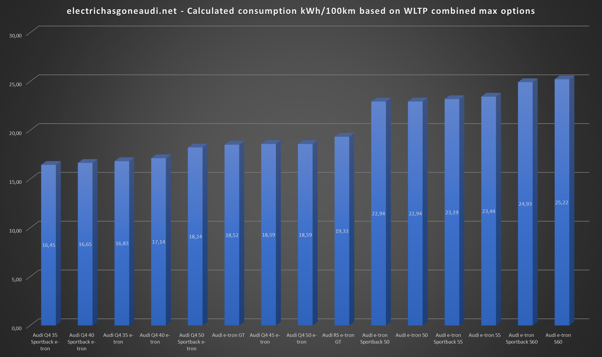

The range of electric cars are typical given as a [WLTP range](https://en.wikipedia.org/wiki/Worldwide_Harmonised_Light_Vehicles_Test_Procedure) (Worldwide Harmonised Light Vehicles Test Procedure) in
Europe or [EPA](https://en.wikipedia.org/wiki/Fuel_economy_in_automobiles#EPA_testing_procedure:_2008_and_beyond) in US.

Below you see a the range of the different current and some future models. The range is from 341km (211 miles) to 700km (435 miles) according to the WLTP combined standard.

The most important aspect of range is of course how large the battery is. Larger battery means more energy to use.

The below chart show the available battery size for the different models.

But the battery is not the only factor in the stated range. Another important factor is how efficient the car is.

And with efficient it means how much energy is used from the battery for a given distance. In europe it is typical stated as kWh/100km meaning
how many kWh is needed to drive 100km. In US it is rated as miles per kWh, meaning how far can you go with 1 kWh.

The below diagram show the calculated consumption in kWh/100km for the different all-electric models are according to WLTP combined rating.

## What affects the effiency?

The effiency or WLTP consumption is affected by many things.

### Aerodynamic drag

The aerodynamic drag affects how much energy is needed to move. The shape of the body affects it but also the design of the wheels.

Audi A6 e-tron concept is currently the model with the lowes drag with a cW value on only 0.22

### Rolling resistance

The [rolling resistance](https://en.wikipedia.org/wiki/Rolling_resistance) sometimes called rolling friction or rolling drag, is the force resisting the motion when a body (such as a ball, tire, or wheel) rolls on a surface.

This is affected by the widh of the tires, the weight of the car, the tyre compound and the tyre pressure.

### Weight

A heavier car requires more energy to move.

### The efficency of the drivetrain/motors

### The internal restiance of the battery

Many of the above factor is fixed. Like the e-tron Sportback has less drag then the e-tron SUV because of the body shape. 

But other factors are affected by the equipment you add to your car. If you buy wider tires, you will get a higher consumption and then a shorter range. 

The below diagram show the maxium consumtion based on selecting factory options to the car. 

From the diagram you can se that an Audi e-tron 55 have a consumption on 19.61 kWh/100km in the basic trim, but 23.44 kWh/100km in the top trim.
Reducing the range from 441km to 369km. 

## What other things affect the consumption?

### The driving style

### The weather

### The temprature

