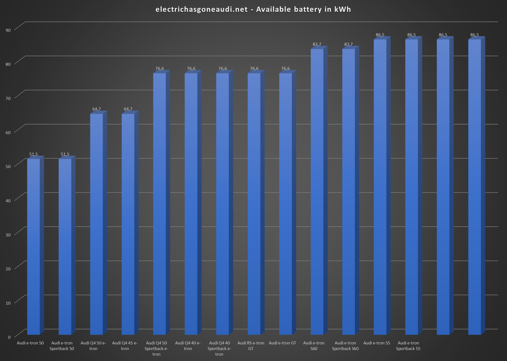
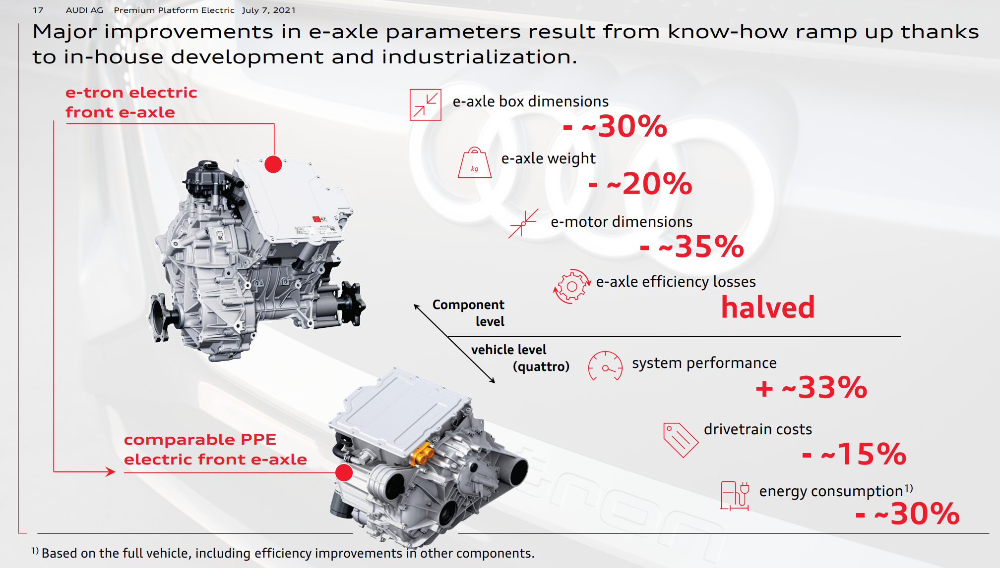
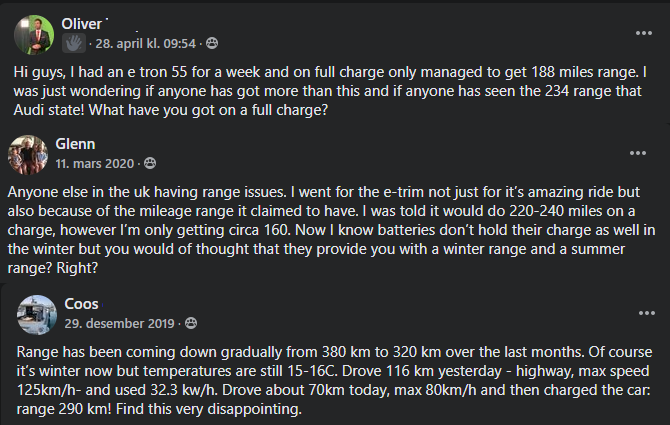

Rekkevidden på elektriske biler er typisk oppgitt som [WLTP rekkevidde](https://en.wikipedia.org/wiki/Worldwide_Harmonised_Light_Vehicles_Test_Procedure) (Worldwide Harmonised Light Vehicles Test Procedure) i
Europa eller [EPA](https://en.wikipedia.org/wiki/Fuel_economy_in_automobiles#EPA_testing_procedure:_2008_and_beyond) i USA.

Nedenfor ser du rekkevidden til de forskjellige nåværende og noen fremtidige Audi -modeller. Rekkevidden er fra 341 km (211 miles) til 700 km (435 miles) i henhold til WLTP kombinert standarden. 

Det viktigste aspektet av rekkevidde er selvfølgelig hvor stort batteriet er. Et større batteri betyr mer energi å bruke.

Tabellen nedenfor viser tilgjengelig batteristørrelse for de forskjellige modellene. 

Men batteriet er ikke den eneste faktoren som påvirker rekkevidden. En annen viktig faktor er hvor effektiv bilen er.

Og med effektivitet betyr det hvor mye energi som brukes fra batteriet for å kjøre en gitt avstand. I Europa er det typisk oppgitt som kWh/100km, noe som betyr hvor mange kWh som trengs for å kjøre 100km. I USA og Storbritannia er den vurdert som miles per kWh, noe som betyr hvor langt du kan kjøre på 1 kWh.

Diagrammet nedenfor viser det beregnede forbruket i kWh/100km for de forskjellige helelektriske modellene i henhold til WLTP-kombinert standarden.

## Hva påvirker WLTP forbruket?

Effektiviteten eller WLTP -forbruket påvirkes av mange egenskaper til bilen.

### Luftmotstand

Luftmotstandend eller aerodynamisk drag påvirker hvor mye energi som kreves for å forflytte bilen. Utformingen av karosseriet
påvirker det men også utformingen av felger.

Audi A6 e-tron concept er for øyblikket modellen med lavest [drag coefficient](https://en.wikipedia.org/wiki/Drag_coefficient) med en Cw  verdi på kun 0.22

### Rullemotstand

 [Rullemotstand](https://en.wikipedia.org/wiki/Rolling_resistance) er kraften som motvirker bevegelsen når et objekt som en ball eller hjul ruller på en overflate.

For et hjul er dette påvirket av bredden på hjulet, vekten på bilen, sammensettingen av gummi og dektrykk.

Audi RS e-tron GT har veldig brede dekk med 285 mm for å få best trekkraft. Dette øker rullemotstanden. Som et alternativ kan du få 305 mm brede dekk som øker veigrepet og reduserer rekkevidden.

Noen dekkprodusenter har begynt å produsere dekk for elbiler, med lav rullemotstand.

### Vekt

En tung bil krever mer energi å forflytte.

### Effektivtet til drivverk og motorer

Elektriske motorer er som standard svært effektive, men det er fortsatt noen forskjellige teknologier som gir ulikt forbruk basert på oppsettet.

Permanent begeistret synkron bruker mindre energi i bruk, men har høyere motstand mot kyst.
Induksjonsmotorer bruker litt mer energi på å bevege seg, men har nesten null kystmotstand.

Nyere biler kombinerer ofte disse to teknikkene med en bakre synkron motor som alltid er i bruk og en induksjonsmotor foran. Eksempel Audi Q4 e-tron quattro 50.

Audi jobber med den nye PPE -plattformen, og allerede nå vet vi det
dette drivverket vil ha en forbedret effektivitet.

### The internal resistance of the battery

The internal resistance in the battery causes heat loss in the battery.

### Factors vary based on selected options

Many of the above factors are fixed. Like the e-tron Sportback has less drag than the e-tron SUV because of the body shape.

But other factors are affected by the equipment you add to your car. If you buy wider tires, you will get a higher consumption and then a shorter range.

The below diagram shows hows adding the max options of the car increase the WLTP consumption.

From the diagram, you can see that an Audi e-tron 55 has a consumption of 19.61 kWh/100km in the basic trim, but 23.44 kWh/100km in the top trim.
Reducing the range from 441km (274 miles)  to 369km (229 miles).

## What affects the real-world consumption

In the real world, it is almost impossible to get the same range as given by WLTP or EPA. This is because that range is based on
ideal driving conditions with specific behavior.  

### Road condition

Road conditions are one of the factors that affect consumption. If it is dry tarmac the rolling resistance is much lower than
if the road is wet or is packed with snow.

### The speed

High speed increases the consumption because of higher drag.

### The temperature

The temperature affects the range in different ways. If it is cold the air is denser and it is a higher aerodynamical drag.

In addition, warm and cold weather could increase the consumption of air condition system in the car.

### The driving style

You as a driver can improve range a lot.

- Look ahead and coast as much as possible
- When needing to reduce speed, start reducing when possible so early that you only use recuperation.

## How does the range indicator work on electric Audi

The range indicator on all-electric Audis is much more advanced than many other brands.

While some brands show the same range no matter what and ignore the driving condition or the driving style to the owner,
all-electric Audis tries to learn
from previous trips and this causes a lot of questions about range from owners since range varies and drops when driving condition worsens.

Below you see some typical questions.

So how does the range indicator works? 

The range indicator  base its range on the following data

- Average consumption on the latest trips
- The state of charge (of much is the battery charged)
- The planned route in the navigation system

So assume you have an e-tron 55 with 86.5kWh battery and you have charged it to 100%.

If your average consumption was 25kWh/100 on the previous trips, the range indicator, or GOM (guessometer) that many calls it
would calculate you would have a range on 346km.  If your average consumption was 20kWh/100km it would calculate 432km. And if you are one that likes speed and had an average of 30kWh/100 km your
calculated range would be 288km.

But this is the best guess based on previous trips. If you change behavior on the next trip, the range calculated would be wrong.

If you have done many short trips in cold weather, you would have spent lots of energy to heat up the car. But this average consumption is not relevant if you the next day are taking a long drive. The car would then underestimate the range.

If a route is defined in the car navigation system the car would adjust range based on elevation and road ahead.
