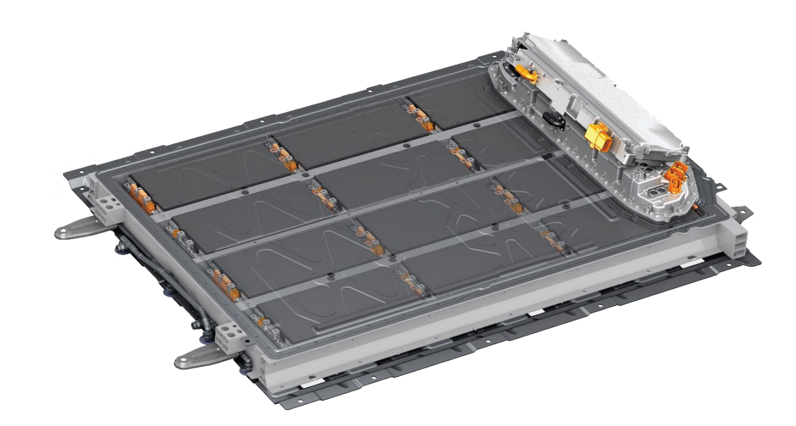

<!-- markdownlint-disable MD033 -->

I mars 2022 presenterte Audi også Audi A6 Avant-konseptet til denne bilen.

<figur>
    
    <figcaption><h4>Audi A6 e-tron-konsept</h4></figcaption>
</figur>

Forventningen er at A6 e-tron lanseres i 2023 og de første eierne vil motta den tidlig i 2024.

<figur>
    
    <figcaption><h4>Audi A6 e-tron Avant-konsept</h4></figcaption>
</figur>

Den vil være basert på den nye [PPE-plattformen](../../technology/bev-platforms/ppe/) som utvikles sammen med Porsche.

<figure>
    
     <figcaption><h4>Audi A6 e-tron drivetrain</h4></figcaption>
</figure>

## Batteri og rekkevidde

Den vil bli levert i to batteristørrelser

- 12 moduler med 100 kWh brutto (94 kWh netto)
- 10 moduler med 83,3kWh brutto (78kWh netto).

Dette vil gi Audi A6 e-tron en WLTP-rekkevidde på omtrent 520-700 km avhengig av trimnivået for det største batteriet. (13,4 - 18 kWh/100 km)

Batteriet vil ha en 800-volts arkitektur for høyytelseslading.

## Motor og ytelse

Forventningen er at den kommer i forskjellige versjoner

- Audi A6 e-tron / Audi A6 Avant e-tron med lite batteri
- Audi A6 / Audi A6 Avant e-tron med stort batteri
- Audi A6 quattro / Audi A6 Avant e-tron quattro med stort batteri
- Audi S6 Avant e-tron
- Audi RS6 Avant e-tron

Audi vil bruke ulike motoroppsett på de ulike variantene.

## UI og MMI

Audi A6 e-tron kommer med en ny generasjon MMI.

Den vil være basert rundt [Android Automotive](https://source.android.com/devices/automotive/start/what_automotive)

## Alternativer

Audi A6 e-tron vil være tilgjengelig med flere alternativer.

- S-line eksteriør
- Svart optikk
- Forskjellige hjul
- Ulike seter inkludert seter med massasje og ventilasjon
- Ulike førerassistentsystemer
- Luftfjæring
- Virtuelle speil

<figur>
    
    <figcaption><h4>Audi A6 e-tron med virtuelle speil</h4></figcaption>
</figur>

Audi planlegger å redusere antall kombinasjoner av ekstrautstyr. Så i stedet for at de fleste alternativene tilbys separat som Audi e-tron, vil de introdusere utstyrspakker.

### Hold deg oppdatert om Audi A6 e-tron

Bli med i vår [Audi A6 e-tron Owners Norway](https://www.facebook.com/groups/752306502112784) facebookgruppe eller bli med i den internasjonale [Audi A6 e-tron Owners](https://www.facebook.com/groups/5590477234297637) facebookgruppe for å bli oppdatert med all siste info og diskutere bilen med andre.

## Bilder og video

<figur>
    
    <figcaption><h4>Audi A6 e-tron-konsept</h4></figcaption>
</figur>

<figur>
    
    <figcaption><h4>Audi A6 e-tron-konsept</h4></figcaption>
</figur>

Audi A6 e-tron tilhenger



Audi A6 e-tron eksteriørdetaljer



{}
