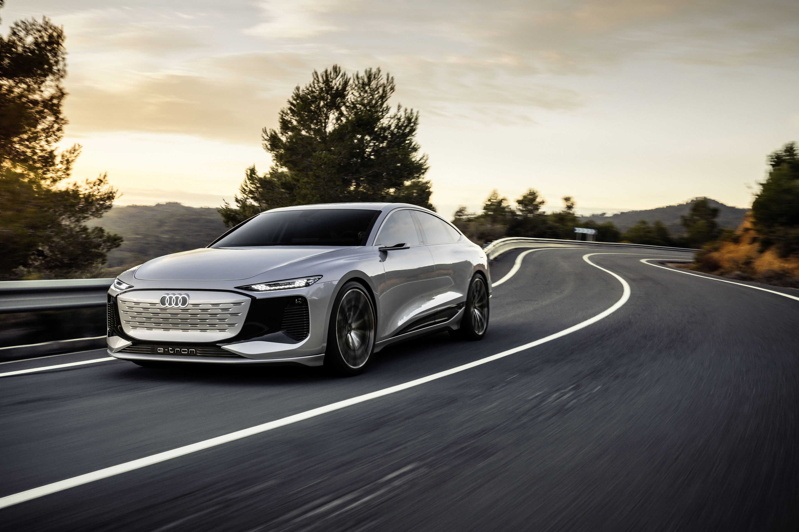
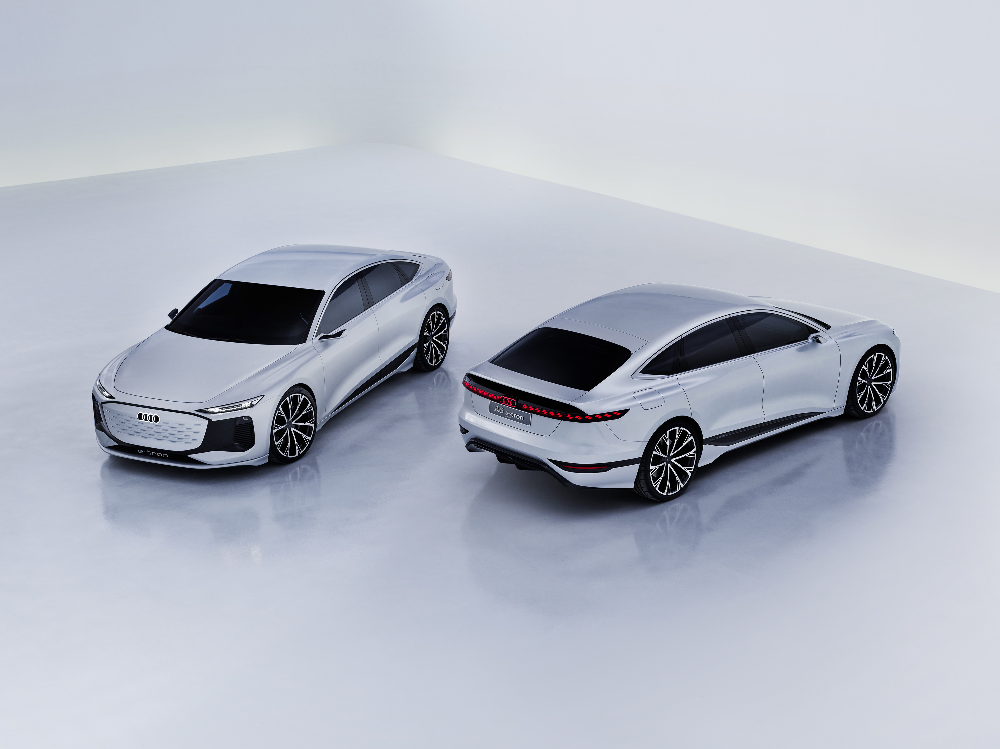

Konseptet har 700 km WLTP rekkevidde, et batteri på 100 kWh netto. Indikerer at det reelle forbruket for WLTP vil være 14,2 kWh/100 km.

Hvis dette holder til den endelige produksjonsmodellen, vil dette være veldig imponerende.

Det forventes å bli en Audi A6 Avant og en Audi RS6 e-tron

{}
