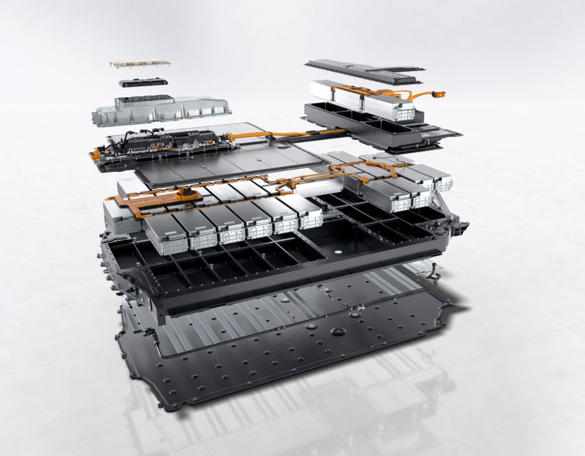

The battery for Audi e-tron is totally on 93.4kWh. It has totally 33 modules with 12 cells each that gives totally 396 cells.

The waterproof housing is a sandwich construction consisting of a cover at the top and a bulkhead plate at the bottom. The truss-design battery frame with multiple subdivisions is mounted in between. The cooling elements are glued on underneath the bulkhead plate.

The battery housing is secured by means of a steel protective plate. For the battery frame, the developers opted for a lightweight aluminium design. On the one hand, this provides a lot of installation space for the cell modules - and consequently a high battery capacity. On the other hand, this has made it possible for the vehicle weight to be kept low. Modern joining techniques are used such as MIG welding (metal welding with inert gases) on the battery frame, laser welding on the bulkhead and protection plates and heat-conducting adhesive on the line system under the battery (see below).

The cell type is [LG Pouch Cell](https://www.youtube.com/watch?v=Q2Lczd7MjGc) produced in [Poland](https://www.google.no/maps/search/lg+chem+poland/@51.0183429,16.8906359,995m/data=!3m1!1e3). It is based on [NCM 712 technology](https://en.wikipedia.org/wiki/Lithium-ion_battery)

Each module weighs aprox 13kg.

Each cell is on 64.6 ah and with nominal voltage on 3.65
In each module the cells are grouped in 2 cells. The cells are coupled in paralell
giving it 64.6ah + 64.6ah = 129.2ah capacitance.

The 6 groups with 2 cells are then coupled in serial. Giving it 6 x 3.65 volt it 21.9 volt for each module

21.9 volt * 129.2ah * 33 modules = 93.400 kWh capacitiy.

36 modules a 21.9 volt is then coupled in serial giving it 722.9 volt in total at nominal voltage.

Fully charged it cell 4.25Volt in total 835Voltage. Empty each cell has 3.08 volt.

Total battery weight is 630 kg

Max charging speed is 270kW.

{}
