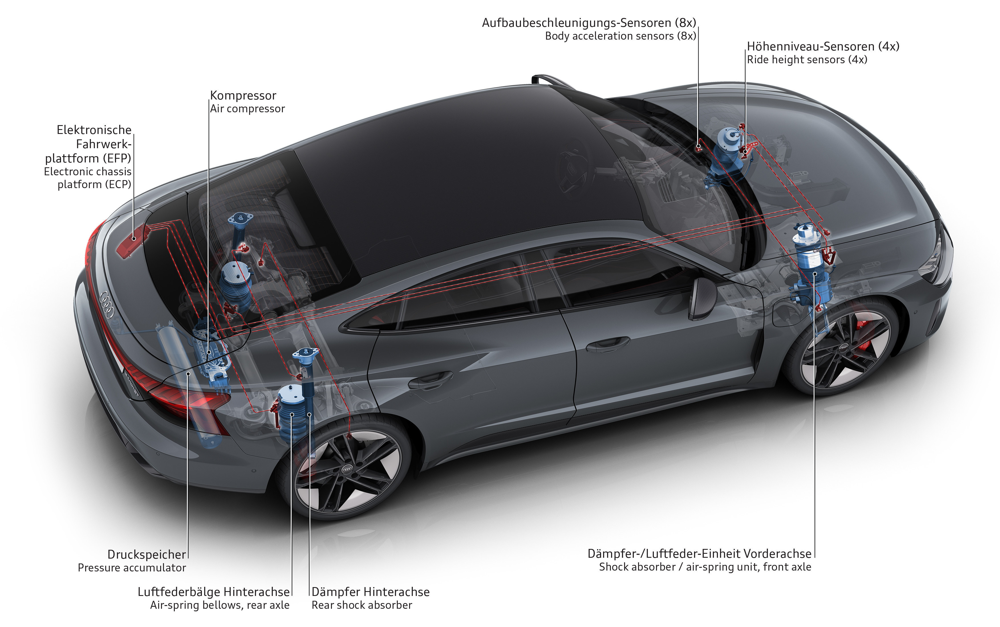

 
It is a congenial partner to the dynamic drive, while always remaining confident and relaxed no matter how much strain is put on it. The gran turismo philosophy becomes a perfect experience here, too.

The wheel suspensions are designed as a sporty double wishbone construction. It has a classic design on the front axle, while the upper wishbones in the rear are divided into individual links. Almost all parts, including the links and subframes, are forged or cast from aluminum. The electromechanical steering has a sporty and direct ratio of 15.4:1 but without any excessive sharpness. 

As part of the optional dynamic package with id **PA2** on Audi e-tron GT and included as standard on RS e-tron GT, Audi supplies all-wheel steering. A spindle drive turns the rear wheels by a maximum of 2.8 degrees here– in opposite directions up to about 50 km/h (31.1 mph) to increase agility and handling, and in the same direction from about 80 km/h (49.7 mph) to maintain stability. Between 50 (31.1 mph) and 80 km/h (49.7 mph), depending on the driving situation, there is a continuous transition between a steering angle in opposite directions and a steering angle in the same direction. When maneuvering, the all-wheel steering reduces the turning circle by roughly 0.6 meters (2.0 ft).

## Precision-controlled: air suspension and damping

While the adaptive air suspension is optional in the Audi e-tron GT quattro, it comes as standard in the RS model. Its compressor generates a working pressure of up to 19 bar, and the three-chamber air suspension on the front and rear axles enables comfortable basic suspension. The chambers in the bellows are activated and deactivated depending on the driving situation. During smooth driving, all three of them contribute to the suspension, while only one or two chambers are active in the case of dynamic requirements such as heavy braking or high transverse acceleration – this strategy reduces the movement of the body.

The air suspension can adjust the body to different heights. It lowers the body by up to 10 millimeters (0.4 in) at a speed of 90 km/h (55.9 mph), and by another 12 millimeters (0.5 in) at 180 km/h (111.8 mph). When driving at a speed below 30 km/h (18.6 mph), the driver can set a lift mode that raises the body by 20 millimeters (0.8 in), for example when driving into underground parking garages. The adaptive air suspension works closely together with the controlled dampers (standard) that adjust to the circumstances at millisecond intervals. Both systems are managed by a central control unit, the electronic chassis platform (ECP). This connection ensures maximum precision.

## Four driving modes: Audi drive select

In the Audi drive select dynamic handling system (standard), the driver can specify how the dampers, electric motors, two-speed transmission, and controlled rear-axle differential lock are to operate. They can switch between the “comfort,” “efficiency,” “dynamic,” and “individual” modes via a physical switch. In “efficiency” mode, the body is lowered to the low level to promote better airflow and the top speed is limited to 140 km/h (87.0 mph); however, the driver can override this limit by stepping heavily on the accelerator pedal. In “dynamic” mode, the electric all-wheel drive, the suspension systems, and the active aerodynamics are set to a sporty mode.

## For dynamic handling: rear-axle differential lock

The controlled rear-axle differential lock, which is integrated in the ECP control operations, is available as standard with the RS e-tron GT and as part of the dynamic package option with the e-tron GT. The multi-plate clutch is its core element. It can be actuated fully variably, and the locking range extends from zero to 100 percent. The driver can perceive this on slippery road surfaces and during maximum full-stop braking in particular: In this case, the lock opens up completely, allowing the Electronic Stabilization Control (ESC) to brake each wheel with great precision. It improves traction and stability, increasing lateral acceleration and reducing load change behaviour through targeted torque vectoring. The rear wheel on the inside of the bend is braked in a targeted manner as the car enters a sharp corner – resulting in the car turning slightly into the bend.

## Animation: Audi RS e-tron GT – three-chamber air suspension and all-wheel steering

This animation shows the function of the Three-chamber air suspension and the all-wheel steering in the chassis of the Audi RS e-tron GT.



{}
