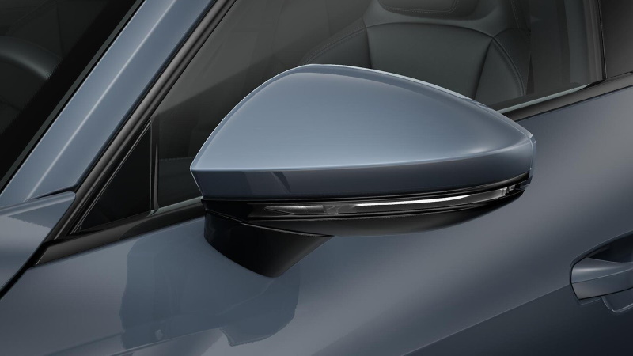
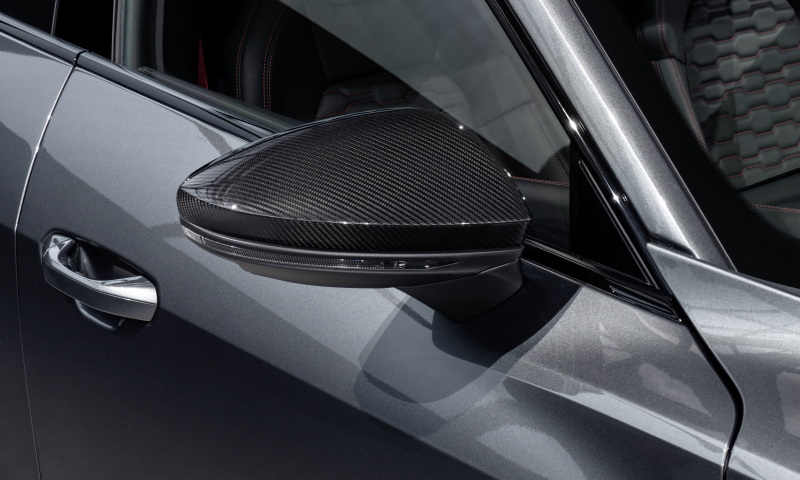

<!-- markdownlint-disable MD033 -->

## Functionality

Electric adjustable mirrors are standard on Audi e-tron (option ID 6XD). They are controlled in the drivers door on the joystick.

There are some optional mirros

- Heated with memory : **6XG**
- heated, auto dimmed and electric retractable : **6XK**
- heated, auto dimmed, electric retractable with memory : **6XL**

## Mirror Style

<figure>
    
    <figcaption><h4>Painted mirrors in body color option ID 6FA</h4></figcaption>
</figure>

<figure>
    
    <figcaption><h4>Painted mirrors in body color option ID 6FA</h4></figcaption>
</figure>

<figure>
    
    <figcaption><h4>Black mirror Option ID 6FJ</h4></figcaption>
</figure>

<figure>
    
    <figcaption><h4>Carbon mirro Option ID 6FQ</h4></figcaption>
</figure>

{}
