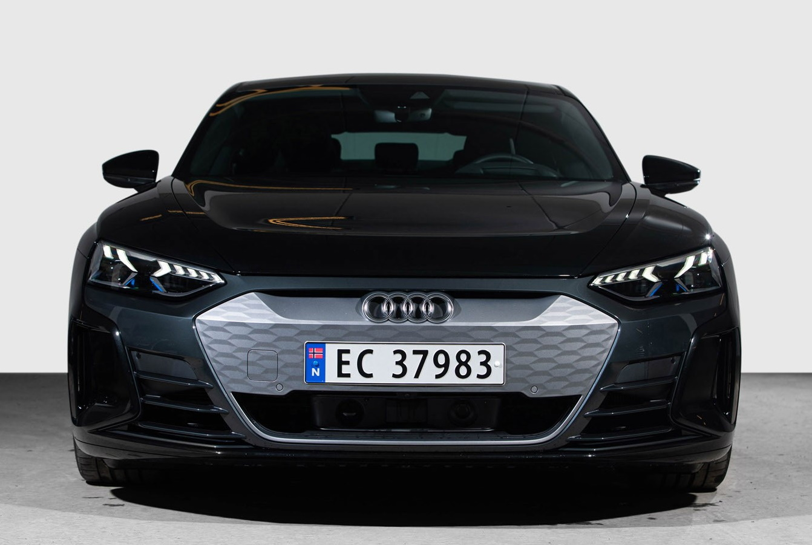
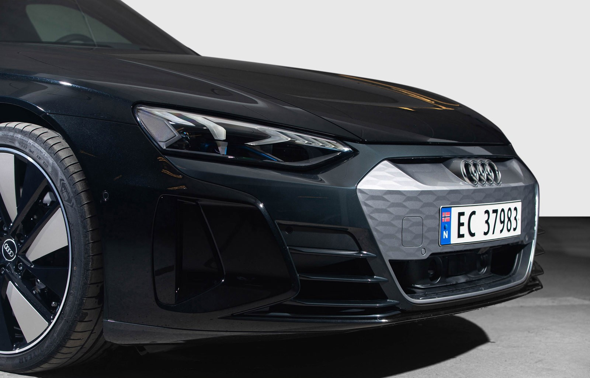
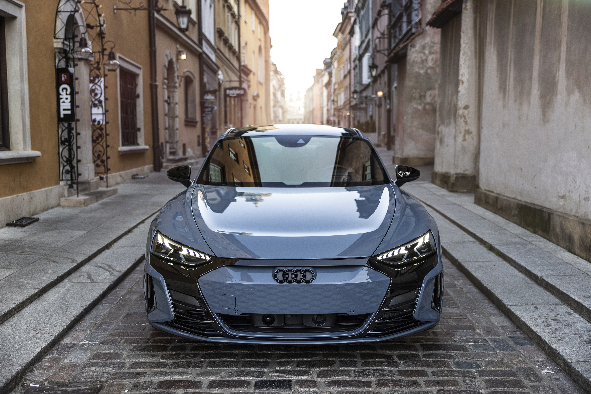
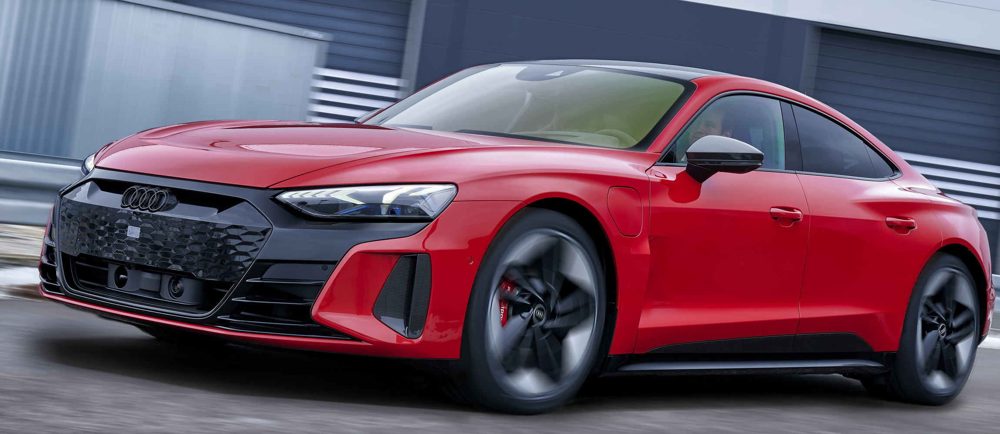
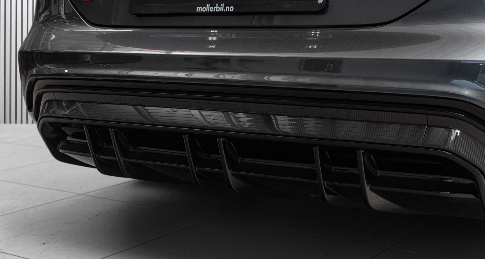

## Optics

### Standard optics

This is the optics that is standard on Audi e-tron GT. Front elements in Manhatten grey.

")

")

")

### Black optics

This has option **4ZD** and is standard on Audi RS e-tron GT

")

")

### Black optics Plus

This has option **4ZP**.

")

### Carbon optics

This has option **SL3**

## Singleframe grill

The grill can be delivered in 3 different stylings

### Singleframe in Hekla grey

This has option id **6HO** and is standard on Audi e-tron GT. This is only available with standard optics. Not avaiable on RS e-tron GT.

### Singleframe in body color

This has option id **6H1** and is standard on Audi RS e-tron GT. Can be combined with all optics packages. 

### Singleframe in polished black

This has option id **6H2**. Only avaiable with black optic, black optic plus and carbon optics.

{}
