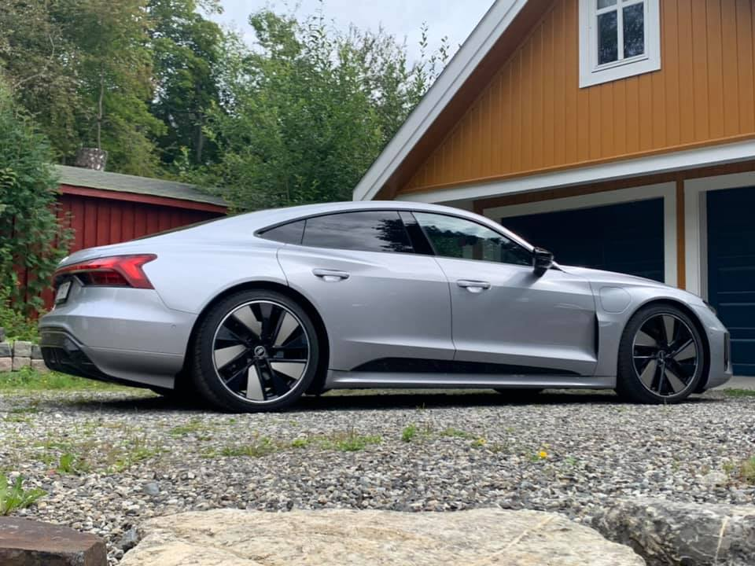
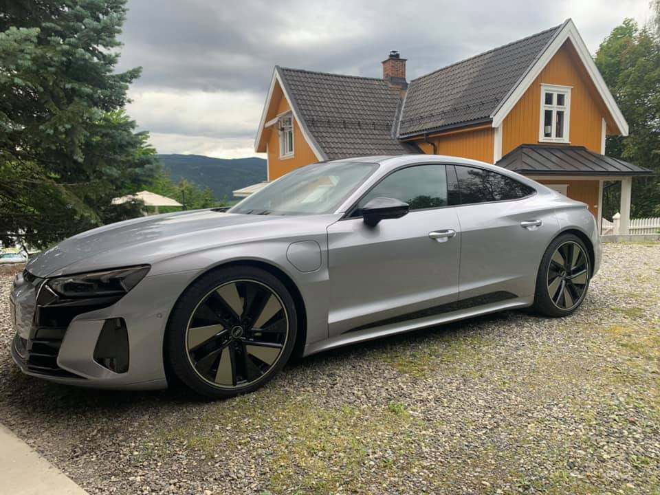
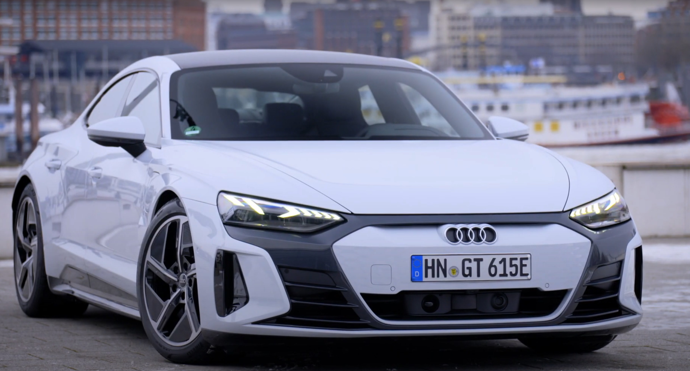
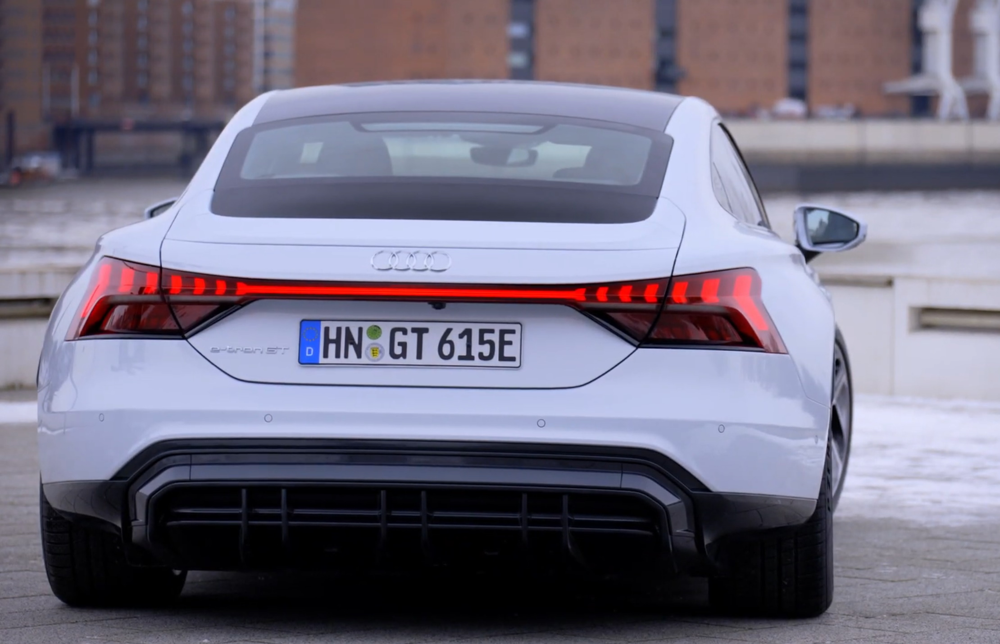

<!-- markdownlint-disable MD033 -->

## Paint colors

The different standard colors are

### Ibis White

Color Code: **T9**

<figure>
    
    <figcaption><h4>Audi RS e-tron GT in Ibis White with carbon optics</h4></figcaption>
</figure>

<figure>
    
    <figcaption><h4>Audi RS e-tron GT in Ibis White with carbon optics</h4></figcaption>
</figure>

<figure>
    
    <figcaption><h4>Audi RS e-tron GT in Ibis White with carbon optics</h4></figcaption>
</figure>

<figure>
    
    <figcaption><h4>Audi RS e-tron GT in Ibis White with carbon optics</h4></figcaption>
</figure>

<figure>
    
    <figcaption><h4>Audi e-tron GT in Ibis White with black optics</h4></figcaption>
</figure>

<figure>
    
    <figcaption><h4>Audi e-tron GT in Ibis White with black optics</h4></figcaption>
</figure>

See video below from Auditography



### Tango Red

Color Code: **Y1**

<figure>
    
    <figcaption><h4>Audi e-tron GT in Tango Red</h4></figcaption>
</figure>

<figure>
    
    <figcaption><h4>Audi e-tron GT in Tango Red</h4></figcaption>
</figure>

<figure>
    
    <figcaption><h4>Audi e-tron GT in Tango Red</h4></figcaption>
</figure>

<figure>
    
    <figcaption><h4>Audi e-tron GT in Tango Red</h4></figcaption>
</figure>

<figure>
    
    <figcaption><h4>Audi RS e-tron GT in Tango Red</h4></figcaption>
</figure>

### Ascari Blue

Color Code **9W**

### Florett Silver

Color Code: **L5**

### Suzuka Grey

Color Code: **M1**



### Daytona Grey

Color Code: **6Y**



### Tactile Green

Color Code: **V0**





### Kemora Grey

Color Code: **82**



### Mythos black

Color Code: **OE**

## Audi Exclusive Paint colors

It is possible to order Audi e-tron GT with Audi exclusive Paint colors. There are lots of colors to choose from.

Below you see some of the colors you can choose from.

<figure>
    
    <figcaption><h4>Pearl effect paint finishes</h4></figcaption>
</figure>

<figure>
    
    <figcaption><h4>Crystal effect paint finishes</h4></figcaption>
</figure>

<figure>
    
    <figcaption><h4>Uni paint finishes</h4></figcaption>
</figure>

<figure>
    
    <figcaption><h4>Metallic paint finishes</h4></figcaption>
</figure>

<figure>
    
    <figcaption><h4>Metallic paint finishes</h4></figcaption>
</figure>

### Nardo Grey

Color Code: **Y1**

<figure>
    
    <figcaption><h4>Audi e-tron GT in Nardo Grey</h4></figcaption>
</figure>