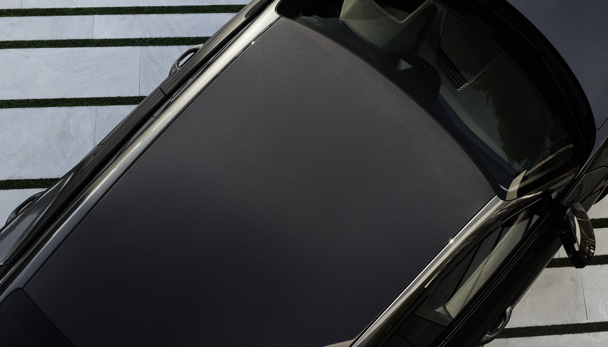

## Panoramic glass sunroof

You can order panoramic roof with option id **3FU**

## Carbon roof

As an option you can replace the panoramic roof with a carbon roof to reduce roof weight.

Option **3FI**

{}
