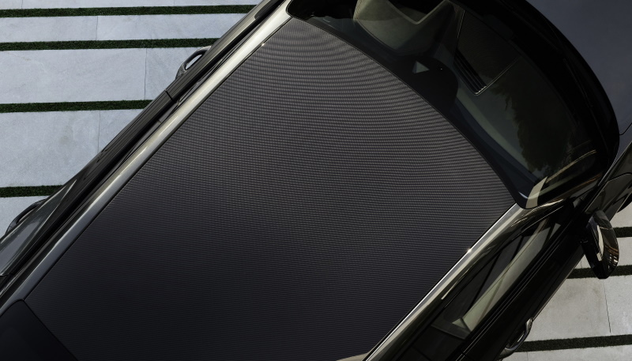
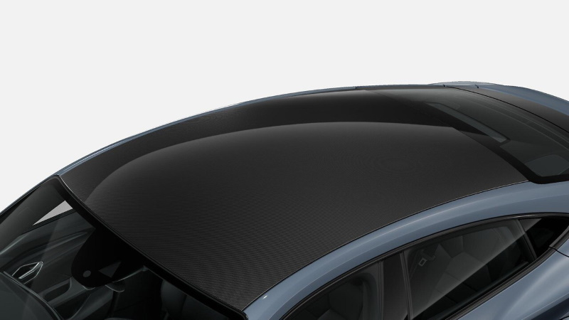

<!-- markdownlint-disable MD033 -->

## Panorama glasstak

Tonet panoramasoltak som slipper lys inn i kupeen og gir bedre romfølelse.
Tilvalg  **3FU**. Dette er standard tak på Audi e-tron GT og Audi RS e-tron GT.

<figure>
    
    <figcaption><h4>Panorama glasstak</h4></figcaption>
</figure>

<figure>
    
    <figcaption><h4>Panorama glasstak</h4></figcaption>
</figure>

<figure>
    
    <figcaption><h4>Panorama glasstak</h4></figcaption>
</figure>

<figure>
    
    <figcaption><h4>Panorama glasstak</h4></figcaption>
</figure>

<figure>
    
    <figcaption><h4>Panorama glasstak</h4></figcaption>
</figure>

## Karbontak

Som et tilvalg kan du erstatte Panorama glasstak med karbontak.

Karbon er et robust og lett materiale. Den synlige fiberstrukturen har en flott visuell effekt. Materialets egenskaper gir økt
smidighet og dynamikk.

Karbontaket til Audi e-tron GT quattro består av karbonfiberforsterket plast. Dette er et høyteknologisk materiale som er
svært stabilt og lett. Karbontaket reduserer bilens totale vekt og senker bilens tyngdepunkt. Dette betyr økt smidighet og
kjøredynamikk ved sportslig kjøring. Den synlige strukturen av tynne karbonfibre demonstrerer både sportslige egenskaper
og høy kvalitet.

Karbonfiberforsterket plast, også kalt karbon, har lenge vært i bruk innen motorsporten. Her kommer det høyteknologiske
materialets fordeler veldig tydelig frem. Komponenter av karbon er svært stabile og lette. Brukt på riktig sted kan en 
komponent av karbon redusere bilens totale vekt, i tillegg til å senke bilens tyngdepunkt, slik tilfellet er for karbontaket på
Audi e-tron GT quattro. Dette betyr at bilens smidighet og dynamikk øker under sportslig kjøring. Karbontakets synlige
fiberstruktur gir også en flott visuell effekt. Den sportslige designen og de tynne karbonfibrene i plasten gjenspeiler den
svært høye kvaliteten.

Dine fordeler:

- Synlig karbonfiberstruktur gir et sportslig kvalitetspreg
- Bilens vekt reduseres
- Bilens tyngdepunkt senkes, dette øker bilens smidighet og dynamikk

Tilvalg **3FI**

<figure>
    
    <figcaption><h4>Karbontak</h4></figcaption>
</figure>

<figure>
    
    <figcaption><h4>Karbontak</h4></figcaption>
</figure>

<figure>
    
    <figcaption><h4>Karbontak</h4></figcaption>
</figure>

{}
