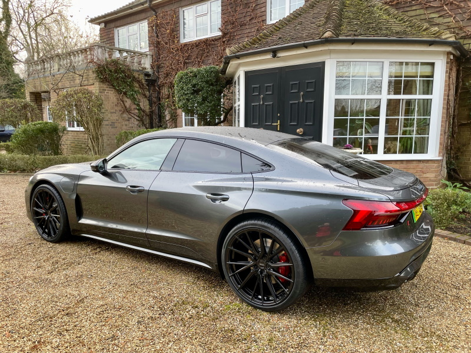

<!-- markdownlint-disable MD033 -->
## 22" Vossen HF4T

Vossen HF4T in Sating Black 10x22 5/130 (Flat) front and 12 x 22 5/130 (deep) in rear with 285/30 tires front and 335/25 tires rear.

<figure>
    
    <figcaption><h4>Vossen HF4T in Sating Black 10x22 5/130 (Flat) front and 12 x 22 5/130 (deep) in rear</h4></figcaption>
</figure>

<figure>
    
    <figcaption><h4>Vossen HF4T in Sating Black 10x22 5/130 (Flat) front and 12 x 22 5/130 (deep) in rear</h4></figcaption>
</figure>

## 21" GMP Rebel

<figure>
    
    <figcaption><h4>GMP Rebel 21 x 9.5 Front and 21 x 11.5 Rear</h4></figcaption>
</figure>
