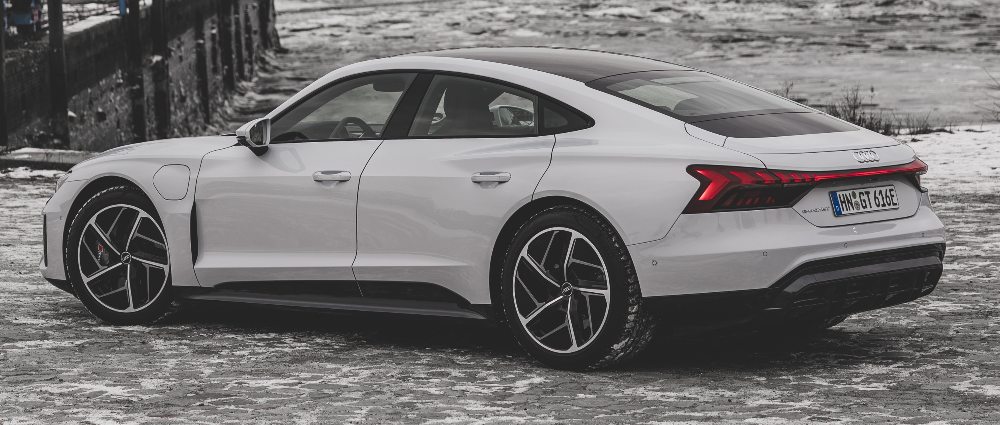

## Privacy glass

You can order privacy glass with option id **QL5**

This option makes a big difference in the way the e-tron look.

{}

## Acoustic windows side windows

Options ID **VW0**

## Front window with climate comfort glass and noise insulation

Option Id **4GY**