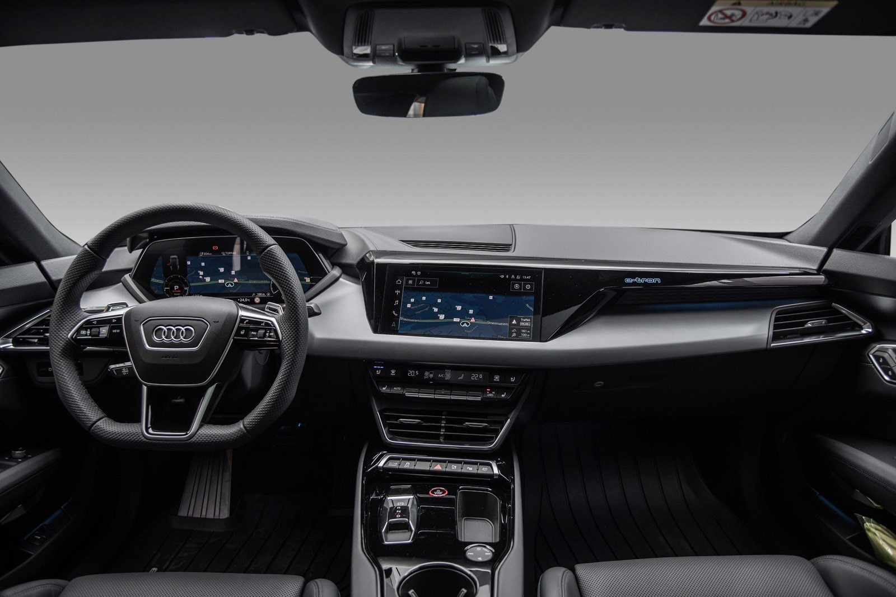
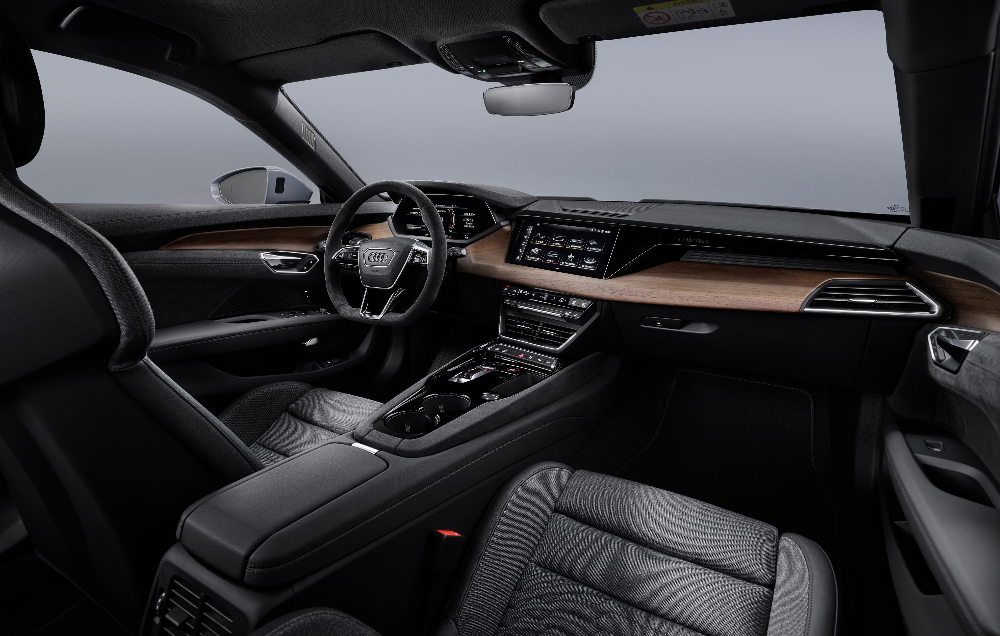
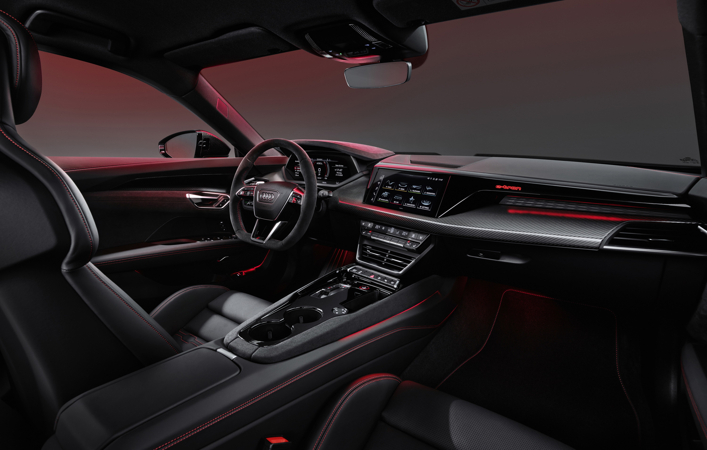

There are serveral levels of interior trim and different design packages.

## Standard

## Upper and lower part of dashboard in leather and Dinamica

For sports seats plus front and sports seats pro front:
Interior elements above and below in fine Nappa leather / Dinamica microfiber include:

- Upper side of the instrument panel with instrument panel cover, door panels, armrests in the doors and center console in black fine Nappa leather
- Door trim inserts in black Dinamica microfiber

Additional color combinations for sports seats per front:

Interior elements above and below in Fine Nappa leather / Dinamica microfiber in the color combination Fine Nappa leather black / santos brown with contrasting seams in steel gray include:

- Upper side of the instrument panel with instrument panel cover and door panels in fine Nappa leather, black with Contrast stitching in steel gray; Color-matched lower dashboard
- Armrests in the doors and center console in fine Nappa leather, santos brown with tone-on-tone stitching
- Door trim inserts in Dinamica microfiber, santos brown
- In conjunction with the sport contour leather steering wheel, black, contrasting stitching in steel gray

## The black leather-free design package

Leather-free black design package for sports seats plus front:

- Seat covers optionally in microfiber Dinamica / synthetic leather mono.pur 550 combination black or in Kaskade fabric /

Imitation leather mono.pur 550 combination black

- Interior elements above and below in synthetic leather / microfiber Dinamica black
- Sport contour steering wheel in Alcantara, 3-spoke, multifunction plus and shift paddles, flattened at the bottom in black

Microfiber Dinamica / synthetic leather mono.pur 550 combination for sports seats plus front includes:

- Seat center panels and seat side bolsters on the inside of the front seats and the two outer seats in the rear in microfiber

Dinamica black; Seat center section with waterfall quilting in black

-  Outside seat side bolsters, headrests with shoulder area and middle seat in the rear in imitation leather mono.pur 550
black

Cascade fabric / synthetic leather mono.pur 550 combination for sport seats plus front includes:

- Seat center panel, inner seat side bolsters and headrests with shoulder area of ​​the front seats and the two outer ones
Seats in the rear in fabric cascade; Seat center section with waterfall quilting in glossy black
- Outside seat side bolsters and middle seat in the rear in imitation leather mono.pur 550 black

Interior elements above and below in synthetic leather / microfiber Dinamica includes:

- Upper side of the instrument panel, door panels, armrests in the doors and lower center console in black synthetic leather
with seams in black
- Instrument panel cover, door trim inserts and upper center console in black Dinamica9 microfiber
Black stitching

Note: can only be ordered in conjunction with front sports seats plus

## RS-design packages

If the car have Sport Pro seats it can be ordered with RS designpackages. They exists in two colors. Red or grey.

The packages include

- Sport wheel in alcantara
- Upper dashboard in nappa leather
- Upper part of instrument panel in alcantara
- Red or grey stitchings

