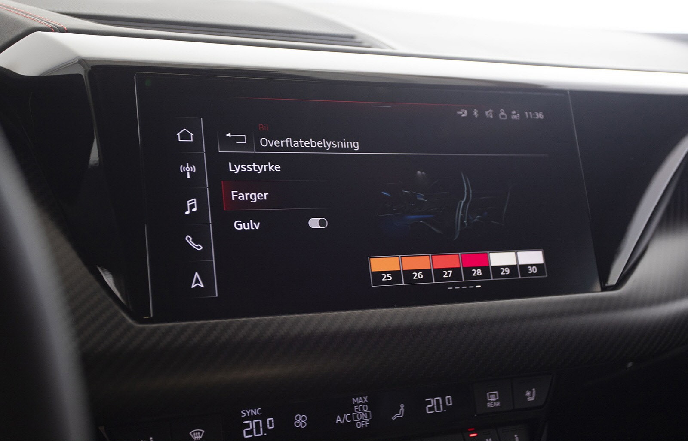

## Standard interiørlys

Følgende interiørlys er standard på Audi e-tron GT

- LED-takmodul foran og bak (hvit)
- bagasjeromslys, venstre og høyre (hvit)
- opplyst hanskerom
- Gulvbelysning foran/bak
- Sminkespeil med lys
- Lyser i dørhåndtak innvendig

## Ambientbelsniung

Hvite lys med alternativ-ID **QQ1** og flerfarget med 30 fargealternativer per kontrollerbar
område med alternativ-ID **QQ2**.

Fargen kan endres basert på kjøremodusen din i [Audi Drive Select](/models/e-tron-gt/technology/audidriveselect/).

