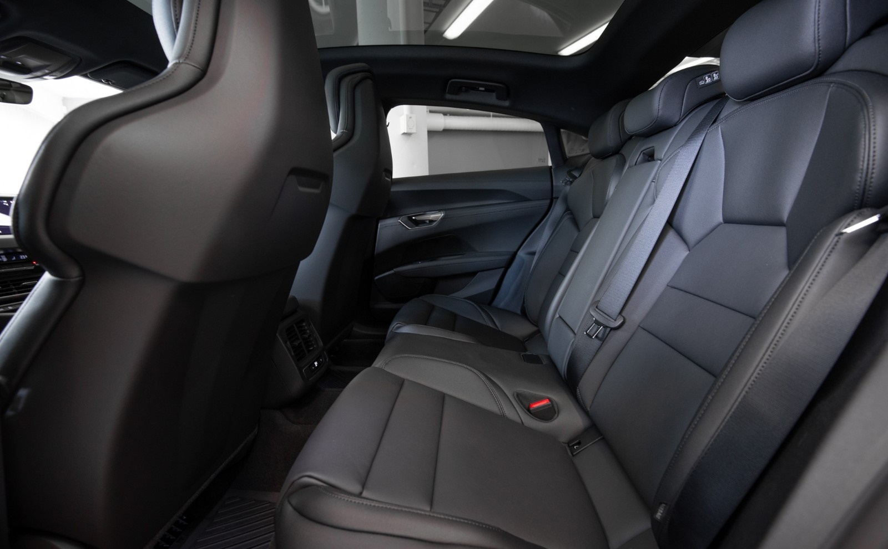
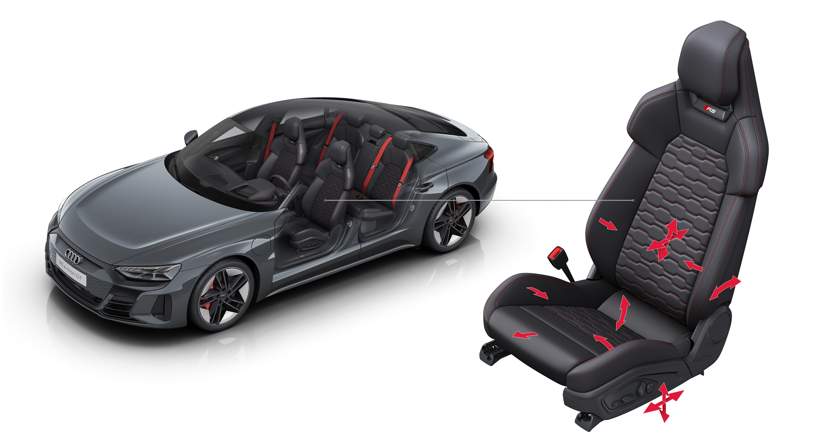
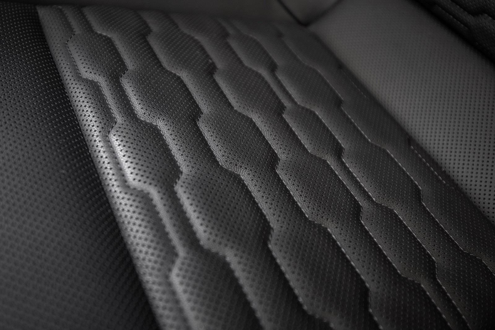
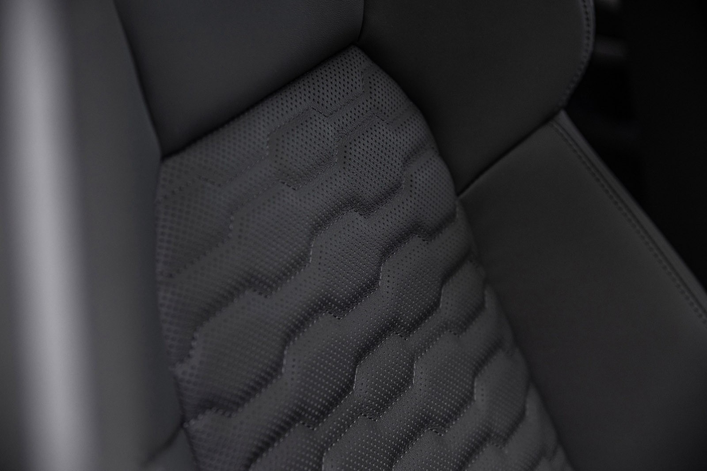

Available as standard in the e-tron GT quattro are the sport seats with electric eight-way adjustment and artificial leather/pearl Nappa leather covers. The RS e-tron GT is equipped with sport seats plus with 14-way adjustment, lumbar support and seat heating. The sport seats pro with 18-way adjustment, pneumatic side bolsters, climate control, and (upon request) a massage function are available as an option for both models. In both seat variants, a bezel in the area of the head restraint further sharpens the sporty contour. The seats and steering wheel of the RS model feature special badges, and the pedal caps and footrest are made of stainless steel.

### Electric adjustment

All seats have electric adjustment of seat height, back angel and horisontal placement.

### Memory

On Sport Plus seat you can add memory. It is standard on Sport Pro seats.

### 4-way lumbar support

On Sport Plus and Pro seats you have 4-way electric lumbar support that can be adjusted to how you like it. 

### Ventilated seats

Sport Pro has ventilated seats.

### Massage

With the optional massage function on Sport Pro seats, the user can select from three different intensities in 8 different programs to have ten air chambers massage their back.

The massage is controlled from the MMI.

| **Seat type** | **Sport** | **Sport Plus** | **Sport Pro**|
|-------|-------|-------|-------|
|Adjustment of headrest height | N/A  |N/A ||N/A  |
|Adjustment of headrest distance| N/A  | N/A | N/A  |
|Front seat heating| standard |standard | standard |
|Rear seat heating| option | option | option |
|Power 4-way lumbar adjustment | standard |standard | standard |
|Power seat adjustment driver | standard |standard | standard |
|Power seat adjustment passenger | standard |standard | standard |
|Driver seat memory | option | option |  standard |
|Passenger seat memory | N/A | option | standard |
|Front seat ventilation|  N/A |N/A |standard |
|Front seat massage| N/A |N/A |option |
|Extending thigh support |N/A | standard | standard |
|Rear seat split | 40:20:40 |40:20:40 | 40:20:40 |

## Sport Seats

Sport seats are only available with black leather/artifical leather mono.pur 555 combination

## Sport Plus Seats

Upholstery is available either as a combination of artificial leather and the Kaskade material or as a mixture of mono.pur 550 artificial leather and the microfiber material Dinamica. In both cases, the covers consist predominantly of materials such as polyester fibers that were made from recycled PET bottles, textiles, or residual fibers. Each set of Kaskade covers is made of 119 recycled plastic bottles. Dinamica is a breathable microfiber material made proportionally from recycled polyester fibers and recycled PET. Kaskade is reminiscent of natural fibers such as wool and offers a very pleasant seating feel. The stitching of the seat center panels of both covers is based on the look of the Singleframe.

For the Color & Trim concept of the Audi e-tron GT the materials were completely redefined and a leather-free interior was developed. This video shows how the fabric Kaskade was developed for the Audi e-tron GT.



## Sport Pro Seats

Sport Pro seats are the most advanced seats. They have 18-way adjustment to make it possible to adjust it for a perfect fit for the driver/passenger.

Sport pro seats are available with perforated leather in different colors.

