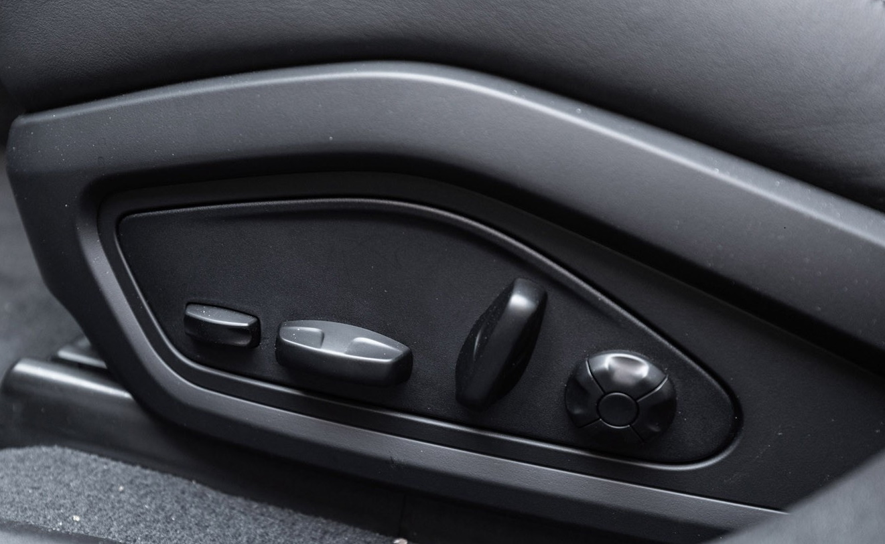
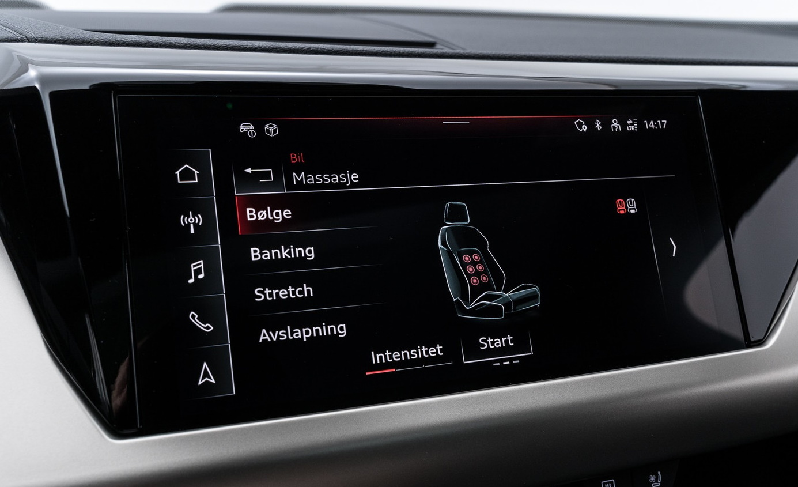
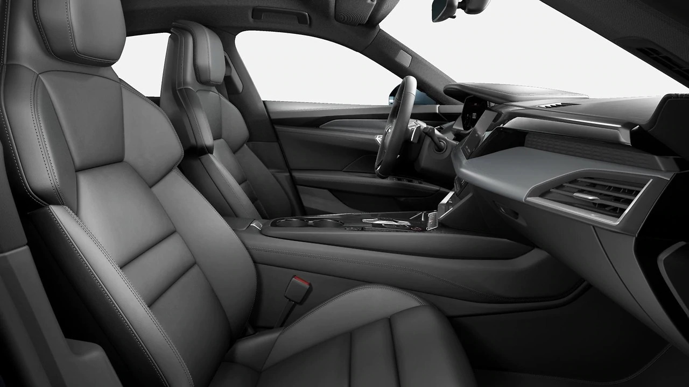
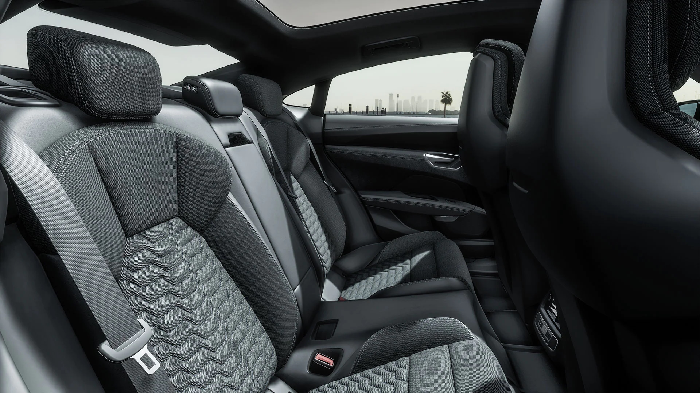
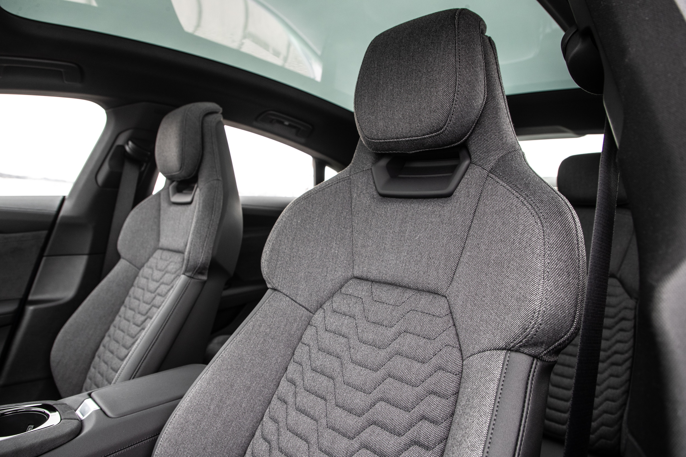

Each seat type have different seat materials in different colors to choose from. Making it possible to configure the interior just as you like it.

### Electric adjustment

All seats have electric adjustment of seat height, back angel and horisontal placement.

### Memory

On Sport Plus seat you can add memory. It is standard on Sport Pro seats.

### 4-way lumbar support

On Sport Plus and Pro seats you have 4-way electric lumbar support that can be adjusted to how you like it. 

### Ventilated seats

Sport Pro has ventilated seats.

### Massage

With the optional massage function on Sport Pro seats, the user can select from three different intensities in 4 different programs to have ten air chambers massage their back.

The massage is controlled from the MMI.

| **Seat type** | **Sport** | **Sport Plus** | **Sport Pro**|
|-------|-------|-------|-------|
|Adjustment of headrest height | N/A  |N/A ||N/A  |
|Adjustment of headrest distance| N/A  | N/A | N/A  |
|Front seat heating| standard |standard | standard |
|Rear seat heating| option | option | option |
|Power 4-way lumbar adjustment | standard |standard | standard |
|Power seat adjustment driver | standard |standard | standard |
|Power seat adjustment passenger | standard |standard | standard |
|Driver seat memory | option | option |  standard |
|Passenger seat memory | N/A | option | standard |
|Front seat ventilation|  N/A |N/A |standard |
|Front seat massage| N/A |N/A |option |
|Extending thigh support |N/A | standard | standard |
|Rear seat split | 40:20:40 |40:20:40 | 40:20:40 |

## Sport Seats

Sport seats are only available with black leather/artifical leather mono.pur 555 combination

## Sport Plus Seats

Sport seats are available with animal free Dynamica microfiber/artificial mono.pur550 leather and cascade fabric/artifical mono.pur 550 leather.

## Sport Pro Seats

Sport pro seats are available with perforated leather in different colors.

