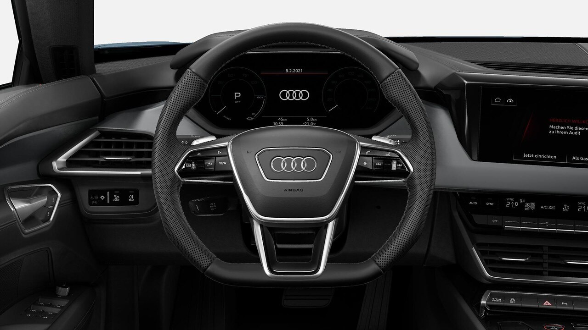
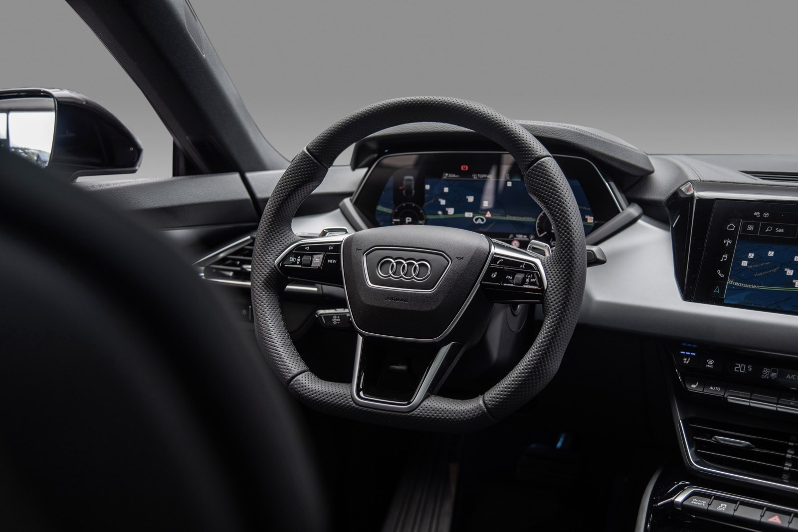

### Sport med perforert skinn

Dette er standardrattet på Audi e-tron GT

### Sport med perforert skinn og varme

Dette er standardrattet på Audi RS e-tron GT

### Sport med alcantare

Dette er tilvaLG **2PF**

### Elektrisk Justering

Audi e-tron GT har elektrisk justert ratt som ekstrautstyr.

Denne er tilvalg  **2C7**
