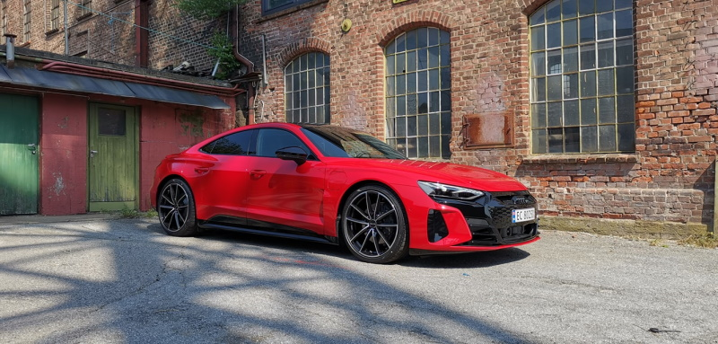

<!-- markdownlint-disable MD033 -->

> Diese Liste beschreibt die ursprüngliche E-tron-GT-Baureihe MY2021–2024, ist kein Konfigurator für die überarbeiteten Modelle MY2025 und neuer.

## Farbe und Lackierung

| Titel | Beschreibung | ID |
|-----|------|------|
|  [Ibis White](../../exterior/paint/#ibis-white)   | Nichtmetallmetall   |  A2   |
|  [Mythos black](../../exterior/paint/#mythos-black)  | Metallisch   |  OE   |
|  [Florett Silver](../../exterior/paint/#florett-silver) | Metallisch   |  L5   |
|  [Tactile green](../../exterior/paint/#tactile-green) | Metallisch | V0 |
|  [Kemora Grey](../../exterior/paint/#kemora-grey) | Metallisch | 8R |
|  [Suzuka grey](../../exterior/paint/#suzuka-grey) | Metallisch   |  M1   |
|  [Tango red](../../exterior/paint/#tango-red)| Metallisch   |  Y1   |
|  [Daytona Grey](../../exterior/paint/#daytona-grey) | Metallisch, nur S/S-Leitung | 6Y |
|  [Ascari Blue](../../exterior/paint/#ascari-blue) | Metallisch  | 9W |
|  [Audi exclusive individual](../../exterior/paint/#audi-exclusive-paint-colors) | Mehrere Farben | Q0Q0 |
|  [Singleframe grille in hekla grey](../../exterior/optics/#singleframe-in-hekla-grey) |    | 6HD |
|  [Singleframe grille in body color](../../exterior/optics/#singleframe-in-body-color) |    | 6H1 |
|  [Singleframe grille in polished black](../../exterior/optics/#singleframe-in-polished-black) |    | 6H2 |

## Räder

| Titel | Beschreibung | ID |
|-----|------|------|
| [19" 5-segment aero design](../../exterior/wheels/#19-5-segment-aero-design) |  | 47G |
| [20" 5 twin spoke offset design platina](../../exterior/wheels/#20-5-double-arm-offset-design-platina-grey) |  | 47K |
| [20" 5 double arm offset design black](../../exterior/wheels/#20-5-double-arm-offset-design-blackaluminium) |  |  47H |
| [20" 5 arm aero design](../../exterior/wheels/#20-5-arm-aero-design) |  |  47I |v-design-wheels-for-e-tron-s | Winter | CA0 |
| [21" 5 double arm concav module](../../exterior/wheels/#21-5-dobbel-arm-concav-module-black) |  | 44I|
| [21" 10 spoke trapez module design black](../../exterior/wheels/#21-10-arm-trapez-modul-design-black-polished) | | 47J|
| [21" 10 spoke trapez module design platina](../../exterior/wheels/#21-10-arm-trapez-modul-design-platina-grey) | | 47L|
| [21" 10 spoke trapez module design titan](../../exterior/wheels/#21-10-arm-trapez-modul-design-titan-grey-polished) | | 54C|

## Radzubehör

| Titel | Beschreibung | ID |
|-----|------|------|
| Reifenreparatursatz | | 1G8 |
| Diebstahlsicherungsbolzen und Bolzenwarnung | Standard | 1PC |
| [TPMS](../../technology/tpms/) | Direkt | 7K3 |

## Aufladen und Heizen

| Titel | Beschreibung | ID |
|-----|------|------|
| Wärmepumpe | Standard | 9M3 |
| [Comfort precondition](../../technology/climatecontrol/#auxiliary-air-conditioner-with-extra-convenience) |  | GA2 |
| Wallmount mit Clip für connect |  | NJ2 |
| [Double Charge port](../../technology/onboardcharger/#optional-charge-port) | Standard  | JS1 |
| [Charging system compact](../../technology/chargingsystem/#e-tron-charging-system-compact) |  | NW1 |
| [Charging system connect](../../technology/chargingsystem/#e-tron-charging-system-connect) |  | NW2 |
| [22 KW charger](../../technology/onboardcharger/#optional-22kw-charger) |  | KB4 |
| Ladesystem 400V 11KW Stecker |  | 73P|

## Ausrüstungsgegenstände

| Titel | Beschreibung | ID |
|-----|------|------|
| Dynamisches Paket |  | PA2 |
| Dynamisches Paket plus |  | PA3 |
| RS-Designpaket rot |  | PEF |
| RS-Designpaket grau | | PEG |

## Beleuchtung

| Titel | Beschreibung | ID |
|-----|------|------|
| [LED-headlights](../../technology/lights/) | Standard | 8IY |
| [Matrix LED lights](../../technology/lights/#matrix-led) |  | 8G4 |
| [Matrix LED lights with laser](../../technology/lights/#matrix-led-with-laser) |  | PXC |
| [LED rear lights](../../technology/lights/) | Standard | 8VM |

## Spiegel- und Dachsystem

| Titel | Beschreibung | ID |
|-----|------|------|
| Innenspiegel | automatisches Dimmen, rahmenlos, standardmäßig | 4L6 |
| [Mirrors, electric adjustable and heated](../../exterior/mirrors/#functionality) | Standard | 6XD |
| [Mirrors, electric, retractable, curbautomatic](../../exterior/mirrors/#functionality) | | 6XK |
| [Mirrors, electric, retractable, curbautomatic, memory](../../exterior/mirrors/#functionality) | | 6XL |
| [Mirror house in veichle paint](../../exterior/mirrors/#mirror-style) | Standard | 6FA |
| [Mirror house in black](../../exterior/mirrors/#mirror-style) | | 6FJ |
| [Mirror house in carbon](../../exterior/mirrors/#mirror-style) | | 6FQ |
| [Panoramic roof](../../exterior/roof/) | | 3FG |
| [Carbon roof](../../exterior/roof/) | | 3FI |

## Verriegelungssystem

| Titel | Beschreibung | ID |
|-----|------|------|
| [Advance Key](../../technology/lockingsystems/#advance-key-option-pgc) | | 4I3 |
| [Advance Key with alarm/safelock](../../technology/lockingsystems/#advance-key-with-alarm-option-pgb) | | PGB |
| Automatische Wegfahrsperre | Aktiviert mit Key |  |
| [Powered tailgate](../../exterior/doors/#powered-tailgate) | Elektrisches Öffnen und Schließen. | |
| [Garage door opener](../../technology/garagedooropener/) |  | VC2 |

## Glas

| Titel | Beschreibung | ID |
|-----|------|------|
| [Heat-insulating glass](../../exterior/windows/) | Standard | 4KC|
| [Windshield in acoustic glass](../../exterior/windows/) |  | 4GK |
| [Acoustic glass on side windows](../../exterior/windows/)  |  | VW0 |
| [Privacy glass](../../exterior/windows/#privacy-glass) |  | QL5 |

## Externe Optionen

| Titel | Beschreibung | ID |
|-----|------|------|
| Schwarze Seitenliste | Fensterrahmen in Aluminium | 4ZC |
| [Black optics](../../exterior/optics/) | | 4ZD |
| [Black optics plus](../../exterior/optics/) |  | 4ZP  |
| [Carbon optics](../../exterior/optics/) |  | 5L3  |

## Sitze

| Titel | Beschreibung | ID |
|-----|------|------|
| [Sport seats](../../interior/seats/#sport-seats)  |  | 01G |
| [Sport seats plus](../../interior/seats/#sport-seats-plus)  |  | Q2J |
| [Sport seats pro](../../interior/seats/#s-sport-seats) |  | Q1J |
| [Electric adjustment](../../interior/seats/#seat-functionality) | |3L5 |
| [Electric adjustment with memory](../../interior/seats/#electric-adjustment) | | PV3 |
| [Heated front seats](../../interior/seats/#seat-heating) |  | 4A3 |
| [Ventilated seats](../../interior/seats/#ventilated-seats) | Nur mit Pro-Sitzen | 4D3 |
| [Ventilated and massage seats](../../interior/seats/#massage) | Nur mit Pro-Sitzen | 4D5 |
| [Fold-down rear seat back](../../transportation/#trunk) | Standard 40:20:40 | |
| ISOFIX und Top Tether für den Rücksitz | Standard | |
| ISOFIX-Vordersitz | Standard |  |

## Sitz und Innenausstattung aus Leder

| Titel | Beschreibung | ID |
|-----|------|------|
| Wirkung facbric | Standardsitze | |
| Alcantara/Leder | | N7U |
| Alcantara Frequenz/Leder | S-Streckeninnenraum | N7K |
| Leder/Monopur 550 |  | N4M |
| Mailänder Leder |  | N5W |
| Valcona-Leder |  | N5D, N0K, N2R |

## Dashboard

| Titel | Beschreibung | ID |
|-----|------|------|
| [Upper part of dashboard in leather](../../interior/interiormaterials/#leather-on-dashboard-imitated-leather-on-doorscenterconsole) | | 7HD |
|[Upper part in leather, lower part dinamica](../../interior/interiormaterials/#full-leather-on-dashboard-door-and-lower-part-of-center-consol) |  | PEH |

## Innenausstattung

| Titel | Beschreibung | ID |
|-----|------|------|
| [Headlining in Dinamica Microfibre](../../interior/headliner/) |  | 6NC |
| [Headlining in black cloth](../../interior/headliner/)  |  |  6NJ |
| [Inlays in Graphite Grey](../../interior/inlays/)  |  |  |
| [Inlays in Walnut Grey-Brown](../../interior/inlays/) |  | 5MT |
| [Inlays in Carbon Twill](../../interior/inlays/)  |  |  5MG |
| [Inlays in Palladium silver](../../interior/inlays/) | |  5TG |
| [Interior lighting](../../interior/lights/) | | Q00 |
| [Contour and ambient light](../../interior/lights/#multicolor-contourambient-light-pack) |  | QQ2  |

## Lenkräder

| Titel | Beschreibung | ID |
|-----|------|------|
| [Sport contour flat-bottom leather steering wheel, multi-function plus with heating and shift paddles](../../interior/steeringwheels/) |   | 1XP |
| [Flat-bottomed 3-spoke Alcantara multi-function plus steering wheel](../../interior/steeringwheels/)  |  | 1XW |
| [Sport contour 3-spoke leather flat bottom steering wheel, multi-function plus and energy recovery paddles](../../interior/steeringwheels/) |  | 2PF |
| [Electric adjustment](../../interior/steeringwheels/#adjustment) | | 2C7 |

## Klima

| Titel | Beschreibung | ID |
|-----|------|------|
| [3-zone climate control](../../technology/climatecontrol/) | Standard | KH5  |
| [Air Quality package](../../technology/airquality/) |  | 2V4 |
| [Parking climate](../../technology/climatecontrol/#auxiliary-air-conditioner) | Standard |  |
| [Parking climate with extra comfort](../../technology/climatecontrol/#auxiliary-air-conditioner-with-extra-convenience) |  | Standard |

## Sonstige Innenausstattungsoptionen

| Titel | Beschreibung | ID |
|-----|------|------|
| Keine Raucherpackung |  |  |
| Feuerzeug und Ascheschale |  | 9JC |
| Vorder- und Hintertürschwellen mit Aluminiumeinlegeteilen  | Standard | 7MD  |
| Beleuchtete Vorder- und Hintertürschweller mit Aluminiumeinlegeteilen. e-tron GT Logo |  | 7M9 |
| Vordere und hintere beleuchtete Türschweller mit Kohleeinlegeteilen. RS-Logo  | nur RS | VT3 |
| 12-Volt-Steckdose | Vorder-, Rück- und Gepäckraum | Standard | |

## Infotainment

| Titel | Beschreibung | ID |
|-----|------|------|
| [Audi Virtual Cockpit](../../technology/uiandoperations/virtualcockpit/) | Standard |  |
| [MMI Navigation plus](../../technology/uiandoperations/mmi/) | Standard  | 7UG   |
| [Head up display](../../technology/uiandoperations/virtualcockpit/#virtual-cockpit-plus) |  | KS1 |
| [MMI Radio plus](../../technology/uiandoperations/mmi/)  | Standard |  |
| [Audi Sound system](../../technology/soundsystem/#audi-sound-system) | Standard  | 9VD  |
| [Bang & Olufsen Premium sound system](../../technology/soundsystem/#bang--olufsen-sound-system-with-3d-sound) |  | 9VS |
| Audi Connect Navigation und Infotainment | Standard |   |
| Audi Music Interface | Standard |   |
| Audi Music Interface Rücksitz |  | UF8 |
| Digitales Radio | Standard  | QV3 |
| [Audi Phone Box](../../technology/phonebox/) |  | 9ZE |
| [Audi Smartphone interface](../../technology/uiandoperations/smartphoneinterface/) | Standard |  1U1 |
| Bluetooth-Schnittstelle | Standard | 9ZX |
| Audi connect Notruf |   | IW3  |

## Fahrerassistenzsysteme

| Titel | Beschreibung | ID |
|-----|------|------|
| City Assist Pack  | [Crossing assist](../../technology/drivingassistance/crossingassist/), [side assist](../../technology/drivingassistance/sideassist/), [exit warning](../../technology/drivingassistance/exitwarning/), [pre sense rear](../../technology/drivingassistance/presenserear/), [pre sense side](../../technology/drivingassistance/presenseside/), [cross traffic rear](../../technology/drivingassistance/crosstrafficassistrear/) | PCM |
| Reisebeihilfepackung | [Adaptive cruise assist](../../technology/drivingassistance/adaptivecruiseassist/), [Adaptive cruise control](../../technology/drivingassistance/adaptivecruisecontrol/), [efficient assistant](../../technology/drivingassistance/predictiveefficiencyassist/),  [turn assist](../../technology/drivingassistance/turnassist/),[emergency assist](../../technology/drivingassistance/emergencyassist/) | PCC    |
| Hilfspaket plus | Enthält City Assist Paket, Tour Assist Paket, Parkassistenzpaket und 360 Kamera | PCJ |
| [Audi pre sense front](../../technology/drivingassistance/presensefront/) | Standard | 6K8 |
| [Cruise control with speed limiter](../../technology/drivingassistance/cruisecontrol/) | Standard | 8T6  |
| [Adaptive cruise assist](../../technology/drivingassistance/adaptivecruiseassist/)
| [Audi Drive select](../../technology/audidriveselect/) | Standard  |  |
| Licht- und Regensensor | Standard |   |
| [Parking system plus](../../technology/drivingassistance/parkingsystemplus/)  |  Standard |   |
| [Park assist](../../technology/drivingassistance/parkingsystemplus/) | | 7X5 |
| [360 camera](../../technology/drivingassistance/360camera/) |  |  PCZ |
| [Reversing camera](../../technology/drivingassistance/reversingcamera/)
| [Traffic sign recognition](../../technology/drivingassistance/trafficsignrecognition/) | Standard  | QR9  |
| [Audi active lane assist](../../technology/drivingassistance/activelaneassist/) | Standard |  |
| [Night vision](../../technology/drivingassistance/nightvision/) |   |  9R1 |

## Triebfahrzeug und Bremsen

| Titel | Beschreibung | ID |
|-----|------|------|
| [Adaptive air suspension](../../drivetrain/suspension/) | Standard-RS  | 1BK |
| [Damper adjustment](../../drivetrain/suspension/) | Standard-GÜ-Standard | 1BH |
| [All-wheel steering](../../drivetrain/suspension/) |  | PHZ |
| Scheibenbremsen vorn und hinten |   |   |
| Hartmetallbremsen mit schwarzen Bremssatteln |   | PC1  |
| Hartmetallbremsen mit orangefarbenen Bremssatteln |   | PC2  |
| Hartmetallbremsen mit roten Bremssatteln |   | PC3  |
| Keramische Bremsen mit grauen Bremssatteln |   | PC5  |
| Keramische Bremsen mit roten Bremssätteln |   | PC6  |

## Tech / Sicherheit

| Titel | Beschreibung | ID |
|-----|------|------|
| [Front airbags](../../technology/safety/#front-airbags) | Norm für Vorderrad  |   |
| [Head airbags](../../technology/safety/#head-airbags) | Norm für Vorder- und Hinterrad |  |
| [Side Airbags](../../technology/safety/#side-airbags-front) Vorder- und Hinterrad |  Standard |    |
| Taste zum Deaktivieren von Frontairbags | für Beifahrersitze, Standard | 4UF  |
| e-tron sportsound |  | GM3 |
| Geregelte Differenzbremsen |   | GH3  |
| Elektrische quattro | Standard | 1X1  |


