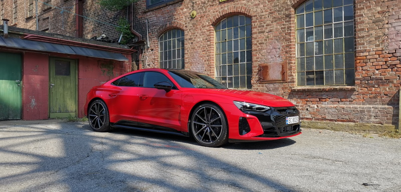

<!-- markdownlint-disable MD033 -->

> Cette liste décrit la gamme originale MY2021–2024 e-tron GT. Il ne s'agit pas d'un configurateur pour les modèles MY2025 et suivants révisés.

## Couleur de la peinture & garniture de peinture

| Titre | Désignation des marchandises | Numéro d'identification |
|-----|------|------|
|  [Ibis White](../../exterior/paint/#ibis-white)   | Non métalliques   |  A2   |
|  [Mythos black](../../exterior/paint/#mythos-black)  | Métallique   |  OE   |
|  [Florett Silver](../../exterior/paint/#florett-silver) | Métallique   |  L5   |
|  [Tactile green](../../exterior/paint/#tactile-green) | Métallique | V0 |
|  [Kemora Grey](../../exterior/paint/#kemora-grey) | Métallique | 8R |
|  [Suzuka grey](../../exterior/paint/#suzuka-grey) | Métallique   |  M1   |
|  [Tango red](../../exterior/paint/#tango-red)| Métallique   |  Y1   |
|  [Daytona Grey](../../exterior/paint/#daytona-grey) | Métallique, seulement ligne S/S | 6Y |
|  [Ascari Blue](../../exterior/paint/#ascari-blue) | Métallique  | 9W |
|  [Audi exclusive individual](../../exterior/paint/#audi-exclusive-paint-colors) | Plusieurs couleurs | T0Q0 |
|  [Singleframe grille in hekla grey](../../exterior/optics/#singleframe-in-hekla-grey) |    | 6 HD |
|  [Singleframe grille in body color](../../exterior/optics/#singleframe-in-body-color) |    | 6H1 |
|  [Singleframe grille in polished black](../../exterior/optics/#singleframe-in-polished-black) |    | 6H2 |

## Roues

| Titre | Désignation des marchandises | Numéro d'identification |
|-----|------|------|
| [19" 5-segment aero design](../../exterior/wheels/#19-5-segment-aero-design) |  | 47G |
| [20" 5 twin spoke offset design platina](../../exterior/wheels/#20-5-double-arm-offset-design-platina-grey) |  | 47K |
| [20" 5 double arm offset design black](../../exterior/wheels/#20-5-double-arm-offset-design-blackaluminium) |  |  47H |
| [20" 5 arm aero design](../../exterior/wheels/#20-5-arm-aero-design) |  |  47I |V-conception-roues-pour-e-tron-s) | Hiver | C0 |
| [21" 5 double arm concav module](../../exterior/wheels/#21-5-dobbel-arm-concav-module-black) |  | 44I|
| [21" 10 spoke trapez module design black](../../exterior/wheels/#21-10-arm-trapez-modul-design-black-polished) | | 47J|
| [21" 10 spoke trapez module design platina](../../exterior/wheels/#21-10-arm-trapez-modul-design-platina-grey) | | 47L|
| [21" 10 spoke trapez module design titan](../../exterior/wheels/#21-10-arm-trapez-modul-design-titan-grey-polished) | | 54C|

## Accessoires pour roues

| Titre | Désignation des marchandises | Numéro d'identification |
|-----|------|------|
| Jeu de réparation des pneus | | 1G8 |
| Bouchons et avertissements de boulons sécurisés | Norme | 1PC |
| [TPMS](../../technology/tpms/) | Direct | 7K3 |

## Chargement et chauffage

| Titre | Désignation des marchandises | Numéro d'identification |
|-----|------|------|
| Pompe à chaleur | Norme | 9M3 |
| [Comfort precondition](../../technology/climatecontrol/#auxiliary-air-conditioner-with-extra-convenience) |  | GA2 |
| Mont mural avec clip pour connexion |  | NJ2 |
| [Double Charge port](../../technology/onboardcharger/#optional-charge-port) | Norme  | JS1 |
| [Charging system compact](../../technology/chargingsystem/#e-tron-charging-system-compact) |  | NW1 |
| [Charging system connect](../../technology/chargingsystem/#e-tron-charging-system-connect) |  | NW2 |
| [22 KW charger](../../technology/onboardcharger/#optional-22kw-charger) |  | Pays |
| Système de recharge 400V 11KW plug |  | 73P|

## Matériel

| Titre | Désignation des marchandises | Numéro d'identification |
|-----|------|------|
| Paquet dynamique |  | PA2 |
| Paquet dynamique plus |  | PA3 |
| Modèle RS rouge |  | EEP |
| Emballage RS modèle gris | | PEG |

## Lumières

| Titre | Désignation des marchandises | Numéro d'identification |
|-----|------|------|
| [LED-headlights](../../technology/lights/) | Norme | 8IY |
| [Matrix LED lights](../../technology/lights/#matrix-led) |  | 8G4 |
| [Matrix LED lights with laser](../../technology/lights/#matrix-led-with-laser) |  | PXC |
| [LED rear lights](../../technology/lights/) | Norme | 8VM |

## Miroir et système de toit

| Titre | Désignation des marchandises | Numéro d'identification |
|-----|------|------|
| Miroir intérieur | variante automatique, sans cadre, standard | 4L6 |
| [Mirrors, electric adjustable and heated](../../exterior/mirrors/#functionality) | Norme | 6XD |
| [Mirrors, electric, retractable, curbautomatic](../../exterior/mirrors/#functionality) | | 6XK |
| [Mirrors, electric, retractable, curbautomatic, memory](../../exterior/mirrors/#functionality) | | 6XL |
| [Mirror house in veichle paint](../../exterior/mirrors/#mirror-style) | Norme | 6FA |
| [Mirror house in black](../../exterior/mirrors/#mirror-style) | | 6FJ |
| [Mirror house in carbon](../../exterior/mirrors/#mirror-style) | | 6FQ |
| [Panoramic roof](../../exterior/roof/) | | 3FG |
| [Carbon roof](../../exterior/roof/) | | 3FI |

## Système de verrouillage

| Titre | Désignation des marchandises | Numéro d'identification |
|-----|------|------|
| [Advance Key](../../technology/lockingsystems/#advance-key-option-pgc) | | 4I3 |
| [Advance Key with alarm/safelock](../../technology/lockingsystems/#advance-key-with-alarm-option-pgb) | | PGB |
| Immobilisation automatique | active avec la clé |  |
| [Powered tailgate](../../exterior/doors/#powered-tailgate) | Ouverture et fermeture électriques. Standard | |
| [Garage door opener](../../technology/garagedooropener/) |  | VC2 |

## Verre

| Titre | Désignation des marchandises | Numéro d'identification |
|-----|------|------|
| [Heat-insulating glass](../../exterior/windows/) | Norme | 4KC|
| [Windshield in acoustic glass](../../exterior/windows/) |  | 4GK |
| [Acoustic glass on side windows](../../exterior/windows/)  |  | VW0 |
| [Privacy glass](../../exterior/windows/#privacy-glass) |  | QL5 |

## Options extérieures

| Titre | Désignation des marchandises | Numéro d'identification |
|-----|------|------|
| Liste des bords noirs | cadre de fenêtre en aluminium | 4ZC |
| [Black optics](../../exterior/optics/) | | 4ZD |
| [Black optics plus](../../exterior/optics/) |  | 4ZP  |
| [Carbon optics](../../exterior/optics/) |  | 5L3  |

## Sièges

| Titre | Désignation des marchandises | Numéro d'identification |
|-----|------|------|
| [Sport seats](../../interior/seats/#sport-seats)  |  | 01G |
| [Sport seats plus](../../interior/seats/#sport-seats-plus)  |  | Q2J |
| [Sport seats pro](../../interior/seats/#s-sport-seats) |  | Q1J |
| [Electric adjustment](../../interior/seats/#seat-functionality) | |3L5 |
| [Electric adjustment with memory](../../interior/seats/#electric-adjustment) | | PV3 |
| [Heated front seats](../../interior/seats/#seat-heating) |  | 4A3 |
| [Ventilated seats](../../interior/seats/#ventilated-seats) | Seulement avec des sièges pro | 4D3 |
| [Ventilated and massage seats](../../interior/seats/#massage) | Seulement avec des sièges pro | 4D5 |
| [Fold-down rear seat back](../../transportation/#trunk) | Norme 40:20:40 | |
| ISOFIX et Top Tether pour le siège arrière | Norme | |
| Siège passager avant ISOFIX | Norme |  |

## Intérieur en cuir et siège

| Titre | Désignation des marchandises | Numéro d'identification |
|-----|------|------|
| Effet facbrique | Sièges standard | |
| Alcantara/cuir | | N7U |
| Alcantara Frequendez/Leather | Intérieur en ligne S | N7K |
| Cuir / mono pur 550 |  | N4M |
| Cuir de Milan |  | N5W |
| Cuir de valcône |  | N5D, N0K, N2R |

## Tableau de bord

| Titre | Désignation des marchandises | Numéro d'identification |
|-----|------|------|
| [Upper part of dashboard in leather](../../interior/interiormaterials/#leather-on-dashboard-imitated-leather-on-doorscenterconsole) | | 7 HD |
|[Upper part in leather, lower part dinamica](../../interior/interiormaterials/#full-leather-on-dashboard-door-and-lower-part-of-center-consol) |  | PEH |

## Conception intérieure

| Titre | Désignation des marchandises | Numéro d'identification |
|-----|------|------|
| [Headlining in Dinamica Microfibre](../../interior/headliner/) |  | 6NC |
| [Headlining in black cloth](../../interior/headliner/)  |  |  6NJ |
| [Inlays in Graphite Grey](../../interior/inlays/)  |  |  |
| [Inlays in Walnut Grey-Brown](../../interior/inlays/) |  | 5MT |
| [Inlays in Carbon Twill](../../interior/inlays/)  |  |  5MG |
| [Inlays in Palladium silver](../../interior/inlays/) | |  5TG |
| [Interior lighting](../../interior/lights/) | | T10 |
| [Contour and ambient light](../../interior/lights/#multicolor-contourambient-light-pack) |  | QQ2  |

## Roues directrices

| Titre | Désignation des marchandises | Numéro d'identification |
|-----|------|------|
| [Sport contour flat-bottom leather steering wheel, multi-function plus with heating and shift paddles](../../interior/steeringwheels/) |   | 1XP |
| [Flat-bottomed 3-spoke Alcantara multi-function plus steering wheel](../../interior/steeringwheels/)  |  | 1XW |
| [Sport contour 3-spoke leather flat bottom steering wheel, multi-function plus and energy recovery paddles](../../interior/steeringwheels/) |  | 2 FP |
| [Electric adjustment](../../interior/steeringwheels/#adjustment) | | 2C7 |

## Climat

| Titre | Désignation des marchandises | Numéro d'identification |
|-----|------|------|
| [3-zone climate control](../../technology/climatecontrol/) | Norme | KH5  |
| [Air Quality package](../../technology/airquality/) |  | 2V4 |
| [Parking climate](../../technology/climatecontrol/#auxiliary-air-conditioner) | Norme |  |
| [Parking climate with extra comfort](../../technology/climatecontrol/#auxiliary-air-conditioner-with-extra-convenience) |  | standard |

## Autres options d'intérieur

| Titre | Désignation des marchandises | Numéro d'identification |
|-----|------|------|
| Aucun paquet de fumeurs |  |  |
| Briquet et plateau en frêne |  | 9JC |
| Rebords de portes avant et arrière avec incrustations en aluminium  | Norme | 7MD  |
| Sills de portes avant et arrière illuminés avec incrustations en aluminium. logo e-tron GT |  | 7M9 |
| Seuils de porte avant et arrière éclairés avec incrustations de carbone. logo RS  | Seulement RS | VT3 |
| Sortie 12 volts | Coffre-fort avant, arrière et à bagages | Norme | |

## Système de diffusion électronique

| Titre | Désignation des marchandises | Numéro d'identification |
|-----|------|------|
| [Audi Virtual Cockpit](../../technology/uiandoperations/virtualcockpit/) | Norme |  |
| [MMI Navigation plus](../../technology/uiandoperations/mmi/) | Norme  | 7 août   |
| [Head up display](../../technology/uiandoperations/virtualcockpit/#virtual-cockpit-plus) |  | KS1 |
| [MMI Radio plus](../../technology/uiandoperations/mmi/)  | Norme |  |
| [Audi Sound system](../../technology/soundsystem/#audi-sound-system) | Norme  | 9VD  |
| [Bang & Olufsen Premium sound system](../../technology/soundsystem/#bang--olufsen-sound-system-with-3d-sound) |  | 9VS |
| Navigation et infodivertissement Audi Connect | Norme |   |
| Interface musicale Audi | Norme |   |
| Audi interface musique siège arrière |  | UF8 |
| Radio numérique | Norme  | VQ3 |
| [Audi Phone Box](../../technology/phonebox/) |  | 9ZE |
| [Audi Smartphone interface](../../technology/uiandoperations/smartphoneinterface/) | Norme |  1U1 |
| Interface Bluetooth | Norme | 9ZX |
| Audi connecter appel d'urgence |   | IW3  |

## Systèmes d'assistation du conducteur

| Titre | Désignation des marchandises | Numéro d'identification |
|-----|------|------|
| Pack d'aide pour les villes  | [Crossing assist](../../technology/drivingassistance/crossingassist/), [side assist](../../technology/drivingassistance/sideassist/), [exit warning](../../technology/drivingassistance/exitwarning/), [pre sense rear](../../technology/drivingassistance/presenserear/), [pre sense side](../../technology/drivingassistance/presenseside/), [cross traffic rear](../../technology/drivingassistance/crosstrafficassistrear/) | PCM |
| Pack d'assistance pour les voyages | [Adaptive cruise assist](../../technology/drivingassistance/adaptivecruiseassist/), [Adaptive cruise control](../../technology/drivingassistance/adaptivecruisecontrol/), [efficient assistant](../../technology/drivingassistance/predictiveefficiencyassist/),  [turn assist](../../technology/drivingassistance/turnassist/),[emergency assist](../../technology/drivingassistance/emergencyassist/) | CCP    |
| Aide paquet plus | Contient un forfait City Assist, un forfait Tour assist, un forfait Parking assist et un appareil photo 360 | PCJ |
| [Audi pre sense front](../../technology/drivingassistance/presensefront/) | standard | 6K8 |
| [Cruise control with speed limiter](../../technology/drivingassistance/cruisecontrol/) | standard | 8T6  |
| [Adaptive cruise assist](../../technology/drivingassistance/adaptivecruiseassist/)
| [Audi Drive select](../../technology/audidriveselect/) | Norme  |  |
| Capteur de lumière et de pluie | Norme |   |
| [Parking system plus](../../technology/drivingassistance/parkingsystemplus/)  |  standard |   |
| [Park assist](../../technology/drivingassistance/parkingsystemplus/) | | 7X5 |
| [360 camera](../../technology/drivingassistance/360camera/) |  |  PCZ |
| [Reversing camera](../../technology/drivingassistance/reversingcamera/)
| [Traffic sign recognition](../../technology/drivingassistance/trafficsignrecognition/) | Norme  | QR9  |
| [Audi active lane assist](../../technology/drivingassistance/activelaneassist/) | Norme |  |
| [Night vision](../../technology/drivingassistance/nightvision/) |   |  9R1 |

## Groupe motopropulseur et freins

| Titre | Désignation des marchandises | Numéro d'identification |
|-----|------|------|
| [Adaptive air suspension](../../drivetrain/suspension/) | Norme RS  | 1BK |
| [Damper adjustment](../../drivetrain/suspension/) | Norme GT | 1BH |
| [All-wheel steering](../../drivetrain/suspension/) |  | PHZ |
| Freins à disques avant et arrière |   |   |
| Freins en carbide avec coulisses noires |   | PC1  |
| Freins en carbide avec des coulisses oranges |   | PC2  |
| Freins en carbide avec coulisses rouges |   | PC3  |
| Freins céramiques avec caliporteurs gris |   | PC5  |
| Freins céramiques avec coulisses rouges |   | PC6  |

## Technologie / Sécurité

| Titre | Désignation des marchandises | Numéro d'identification |
|-----|------|------|
| [Front airbags](../../technology/safety/#front-airbags) | Standard pour l'avant  |   |
| [Head airbags](../../technology/safety/#head-airbags) | Norme pour l'avant et l'arrière |  |
| [Side Airbags](../../technology/safety/#side-airbags-front) avant et arrière |  Norme |    |
| Bouton pour désactiver les coussins gonflables avant | Pour le siège passager, standard | 4 UF  |
| Sportson e-tron |  | GM3 |
| Freins différentiels réglementés |   | GH3  |
| Quattro électrique | Norme | 1X1  |


