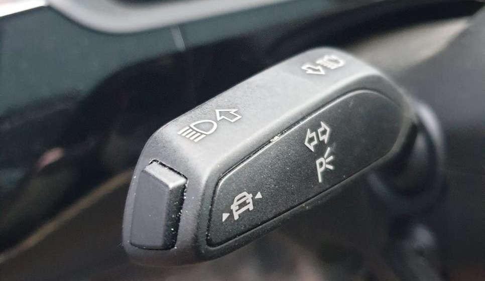

 A camera detects lane lines and the track that the car is following between them. In this process, the camera can distinguish between yellow lines in construction zones and standard white markings. If the car approaches a line without the turn signal being activated, the system helps the driver to steer back into the lane by means of gentle but noticeable interventions in the electromechanical power steering. In the MMI system, the driver sets how early the control intervention should occur. In the case of an early steering intervention point, the system guides the driver towards the middle of the lane by gentle, centering steering interventions. 
 
 With a late steering intervention point, Audi active lane assist does not intervene until shortly before the detected lane marking might be crossed; then it gives a corrective steering intervention in the proper direction. In addition, the driver may choose to be warned by a vibration of the steering wheel when crossing detected lane markings. 

 

The Active Lane Assist can be disabled on the button at the end of the direction handle. It is not possible to permanent disable it.

Active lane assist is standard equipment. (optionId **6I3**)

{}
