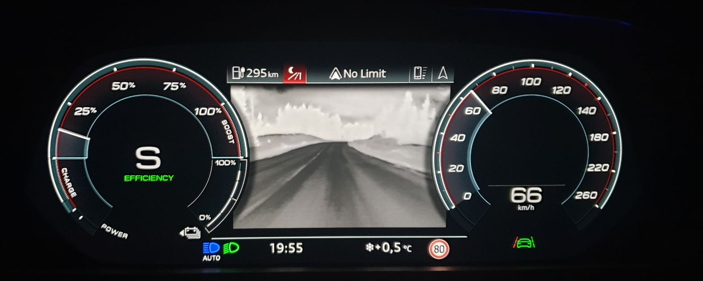

De kjøligere omgivelsene virker mørke, mens dyr og mennesker fremstår påfallende lyse.

Systemet, som har en rekkevidde på opptil 300 meter (984,3 fot), kan oppdage mennesker og større ville dyr på avstander mellom omtrent 10 og 90 meter (32,8 og 295,3 fot) og fremhever dem med gule markeringer. Hvis en farlig situasjon oppdages, avgis en varsellyd. Et varselsymbol vises i instrumentgruppen samt i head-up-displayet. Avhengig av frontlysene blir personer utenfor byens grenser opplyst med tre korte lysglimt.

Video nedenfor viser systemet i bruk.

