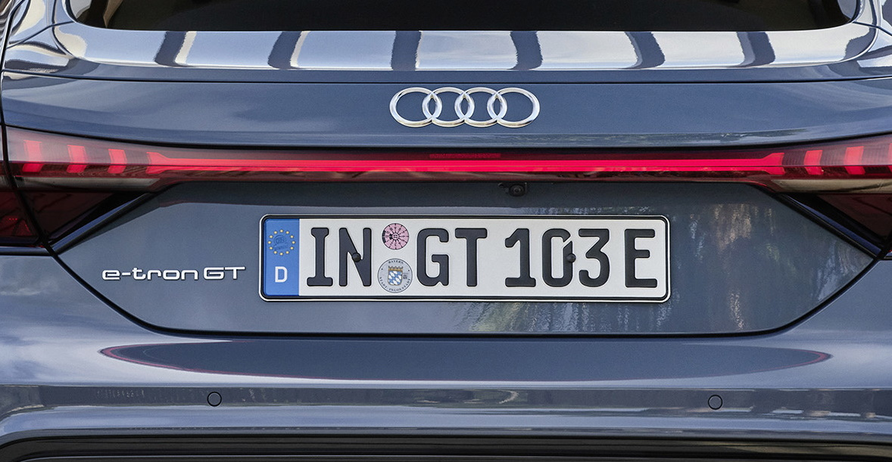

 It shows the calculated driving track based on the steering angle as well as auxiliary lines and guidelines. For parallel parking, the latter lines precisely direct steering into the parking space in conjunction with steering reversal points. The blue pictured surface in the camera image indicates where the vehicle will be positioned after the parking procedure.

 It is activated as soon as the driver engages reverse gear or pushes the respective button.

Reversing camera is standard on Audi e-tron GT.  Often it is replaced with [360 camera](../360camera).

{}
