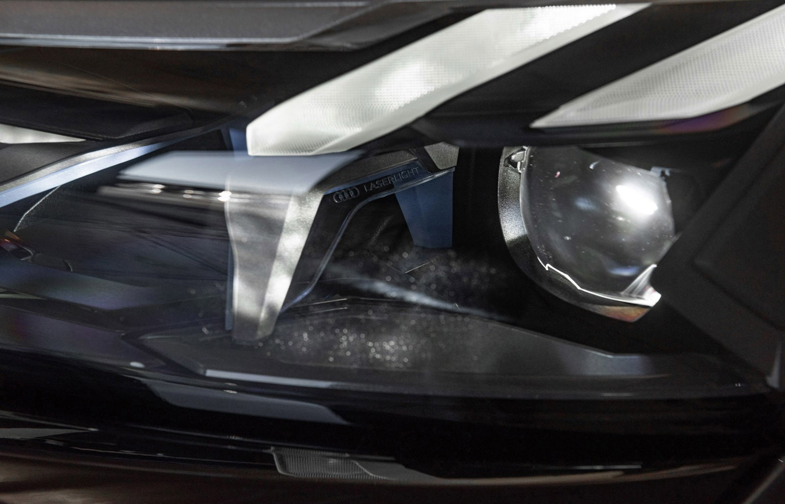
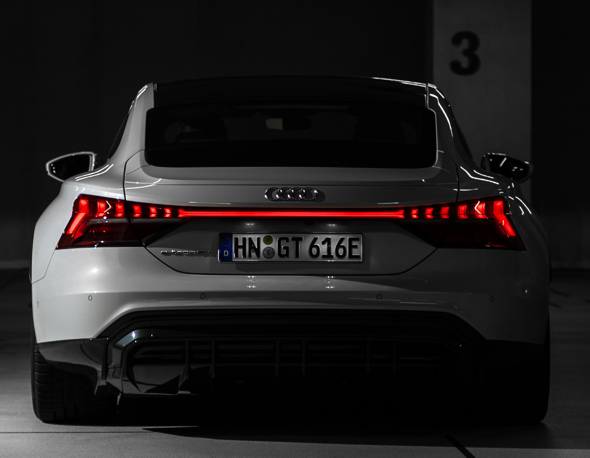

Frontlyktene og baklysene er karakteristiske elementer i eksteriørdesignen til e-tron GT quattro. Det er her karakteren til den elektrisk drevne gran turismo er fokusert. 

De er tredimensjonale skulpturer med dynamisk karakter og digital estetikk. De kileformede frontlyktene i e-tron GT er tilgjengelig i tre versjoner.

Audi leverer dem i LED-teknologi med dynamiske blinklys som standard.

## Matrix LED

Matrix LED-frontlyktene er også tilgjengelig som et alternativ; disse kommer som standard med RS e-tron GT. Deres kontinuerlige fjernlys kan lyse med maksimal lysstyrke uten å blende andre trafikanter. Alternativ-ID **8G4**

## Matrix LED med laser

Toppen er matrise-LED-frontlyktene med Audi laserlys. I midten av frontlysene, mellom nærlys- og fjernlysmodulene, er det et laserpunkt som aktiveres fra en hastighet på 70 km/t (43,5 mph) og dobler rekkevidden til fjernlyset. Den er innrammet av en X-formet trim med uttrykksfull design som er et lite kunstverk i seg selv. Den nedre delen består av frittstående eleme

## LED-baklys

En skulpturert lyslist spenner over hele bredden av bakenden av e-tron GT. Den går dynamisk over i pilsegmenter som øker i størrelse mot utsiden, og skaper dermed en umiskjennelig, mager baklyssignatur. Uavhengig av frontlyskonfigurasjonen, er baklysene utstyrt med lysdioder og dynamiske blinklys som sprer seg flatt under baklyssignaturen. Bremselyset er plassert under, i et lavt og mørkt område.

### Kommer hjem og forlater hjemmet animasjon: karakter gjort synlig

De førsteklasses frontlyktene tilbyr en annen karakteristisk funksjon: å komme hjem og forlate hjemmeanimasjoner foran og bak. Forlate-hjem-sekvensen, som aktiveres når dørene låses opp, er inspirert av kraften til en lydbølge: Belysningen av de enkelte elementene bygges opp raskt og kraftig, for så å trekke seg tilbake kort før den går all-in andre gang. Med RS-modellen er animasjonene enda mer dynamiske.

Denne animasjonen viser lysteknologien inkludert Matrix LED-frontlykter med laser som ekstra fjernlys i Audi e-tron GT.



{}
