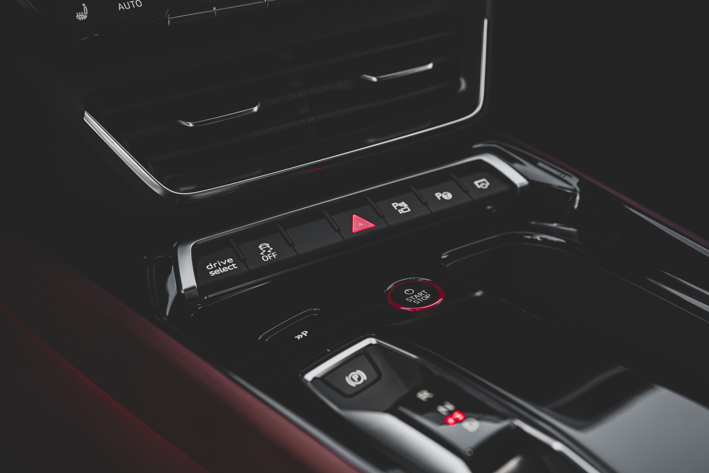
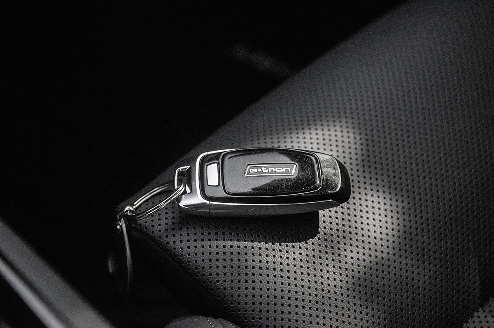

## Komfortnøkkel (Advance key) 

Standard komfortnøkkel gir praktisk kontroll over tilgang og motorstartautorisasjon uten at nøkkelen må betjenes aktivt

Ved å betjene dørhåndtaket kan kjøretøyet åpnes uten aktiv bruk av nøkkelen. Dette er mulig med alle dører. Adgangsautorisasjonen bekreftes av trådløs kommunikasjon mellom nøkkelen og kjøretøyet.

For å låse kjøretøyet fra utsiden, er alt du trenger å gjøre å trykke på en av sensorknappene på alle dørhåndtak.

Som standardnøkkel er forhåndsnøkkelen på Audi e-tron utstyrt med Keyless Go. Dette betyr
motorstartautorisasjonen frigis også uten aktiv betjening av komfortnøkkel.

For å gjøre dette må sjåføren sitte i kjøretøyet og ha med seg komfortnøkkelen.

Motoren startes og slås av ved hjelp av motorstart-stopp-knappen i midtkonsollen.

En høykvalitets visuell differensiering på toppen og bunnen av nøkkelen gjennom høyglans sorte komponenter og metallspenner i aluminiumslook gjør de innovative funksjonene til bekvemmelighetstasten synlige.

Komfortnøkkel er tilvalg **4I3**

## Komfortnøkkel og sensorstyrt bagasjerommsåpning og lukking av bakluken med alarm

Komfortnøkkelen gir praktisk kontroll over tilgang og motorstartautorisasjon uten at nøkkelen må betjenes aktivt

Pakken inkluderer følgende spesialutstyr:

- Komfortnøkkel inkludert sensorstyrt opplåsing av bagasjerom med bagasjeromslokk, elektrisk åpning og lukking
- Elektrisk bakluke
- Tyverialarmsystem

Bagasjeromslokket kan enkelt låses opp med en fotbevegelse (sparkbevegelse) bak.

Dette er tilvalg **PGB**

