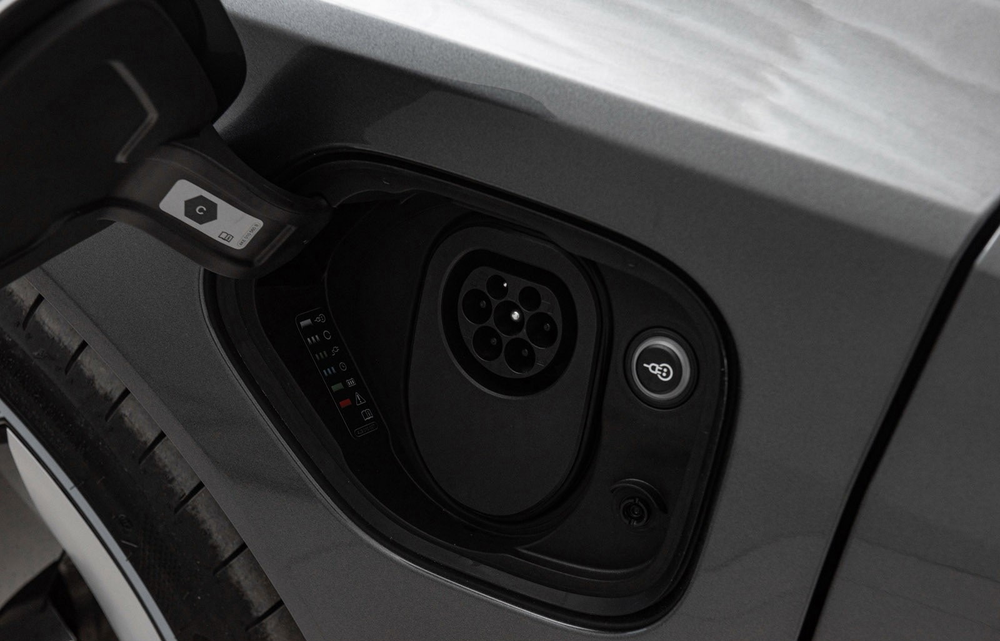

Den innebygde laderen er ansvarlig for å konvertere AC fra veggen til DC som brukes i batteriet.

Standard innebygd lader støtter opptil 11KW AC-lading.

Audi e-tron GT og Audi RS e-tron GT har ladeporter på begge sider av bilene.

I USA har ladeportene en [J1772-kontakt](https://en.wikipedia.org/wiki/SAE_J1772) for å koble til bilen, mens den i Europa har en [Type 2-kontakt](https://no) .wikipedia.org/wiki/Type_2_connector).

Porten på førersiden støtter kun AC-lading, mens porten på passasjersiden støtter både AC- og DC-lading.

For å lade bilen fra AC trenger du en Wallbox å koble til eller [ladesystemet som kan kobles til hjemmenettverket](../chargesystem).

### Valgfri 22KW lader

Du kan bestille en ekstra ladeenhet til bilen (AX5). Dette gir bilen 22KW ladekapasitet på en 400Volt 32A 3-fase tilkobling.

Alternativ-ID **KB4**

### Elektrisk drivenhet

I illustrasjonen under ser du plasseringen av ladeenhetene.

 Bare AC-lading går gjennom laderen. For DC-lading er CCS-porten direkte koblet til batteriet.

### Kapasitet basert på nettverk/uttak

| Connection | Plug  | capacity | charging 100%  e-tron GT |
| ------| ------| ---- |------- |
| 120Volt | Level 1 Domestic NEMA 5-20 | 1.2kW |  76 hours |
| 240Volt | Domestic NEMA 14-50 | 9.6kW |  9.5 hours |
| 230Volt | Domestic Type F | 1.8kW |  50.5 hours |
| 400V 32A 3phase | Red Industrial |  22KW | 4.5 hours |
| 400V 16A 3phase | Red Industrial |  11KW | 9 hours |
| 230V 32A 1phase | Blue Industrial |  7.2KW | 11.5 hours |
| 230V 16A 1phase | Blue Industrial |  3.6KW | 23 hours |

{}
