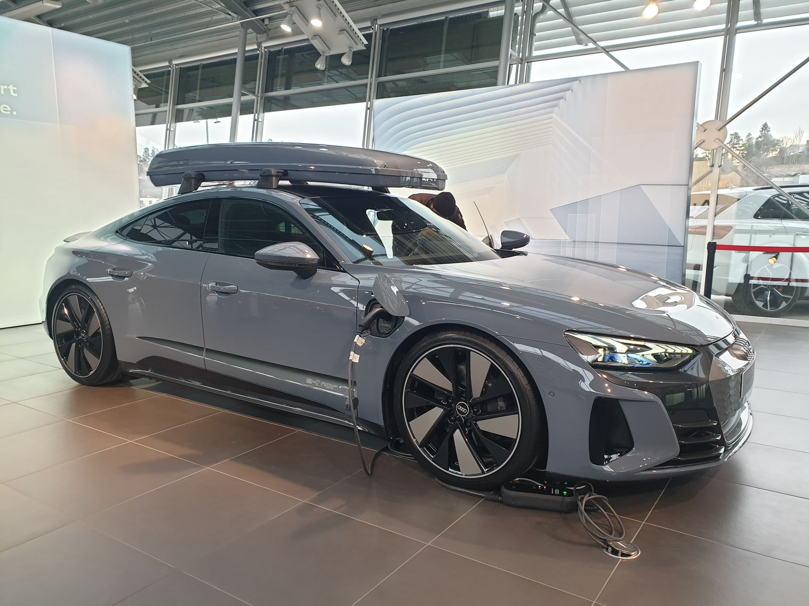

<!-- markdownlint-disable MD033 -->

## Bagasjerom

<figure>
    
    <figcaption><h4>Bagasjerom Audi e-tron GT</h4></figcaption>
</figure>

<figure>
    
    <figcaption><h4>Bagasjerom Audi e-tron GT</h4></figcaption>
</figure>

<figure>
    
    <figcaption><h4>Bagasjerom Audi e-tron GT</h4></figcaption>
</figure>

<figure>
    
    <figcaption><h4>Setene har en 40-20-40-konfigurasjon</h4></figcaption>
</figure>

<figure>
    
    <figcaption><h4>Setene har en 40-20-40-konfigurasjon</h4></figcaption>
</figure>

<figure>
    
    <figcaption><h4>Setene har en 40-20-40-konfigurasjon</h4></figcaption>
</figure>

## Frunk

<figure>
    
    <figcaption><h4>Frunk Audi e-tron GT</h4></figcaption>
</figure>

<figure>
    
    <figcaption><h4>Funken kan åpnes fra en knapp på førerdøren</h4></figcaption>
</figure>

## Taklast

Du kan lagre opptil 75 kg på taket.

<figure>
    
    <figcaption><h4>e-tron GT med takboks</h4></figcaption>
</figure>

## Eksempel på lagring

Her er noen eksempler på hva man kan lagre

<figure>
    
    <figcaption><h4>Real life example of storage capacity</h4></figcaption>
</figure>

<figure>
    
    <figcaption><h4>Real life example of storage capacity</h4></figcaption>
</figure>

<figure>
    
    <figcaption><h4>Real life example of storage capacity. 32 bottles in frunk</h4></figcaption>
</figure>

<figure>
    
    <figcaption><h4>Real life example of storage capacity</h4></figcaption>
</figure>