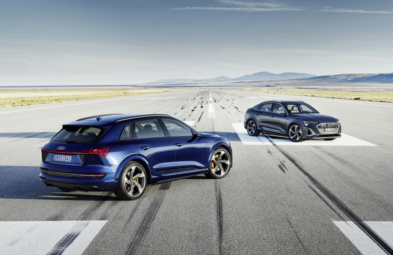
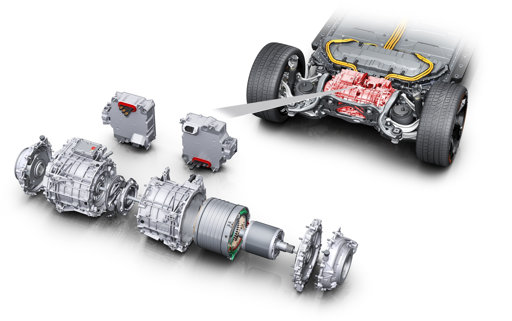
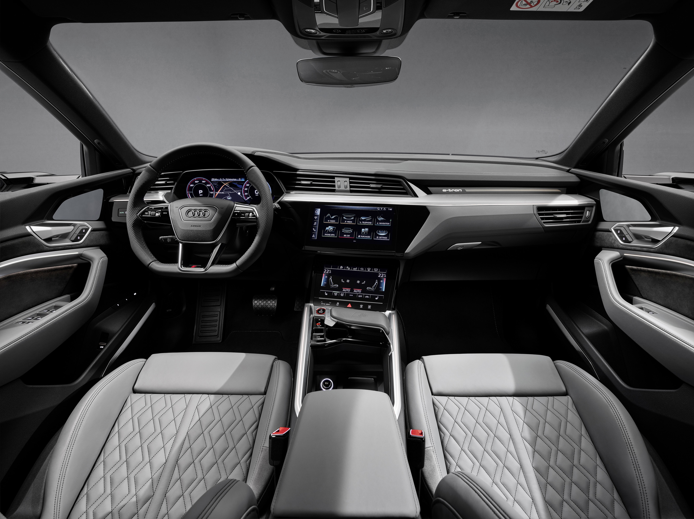

<!-- markdownlint-disable MD033 -->

Audi e-tron 55 had its world premiere on September 17. 2018 Later the Sportback was released together with the 50 and S version.

The car has been a big success for Audi and in Norway, it even became the most sold new passenger car in 2020, the first time for Audi in any market.

In April 2021 e-tron no 100.000 was produced.

<figure>
    
    <figcaption><h4>Audi e-tron 60S and Audi e-tron Sportback 60S</h4></figcaption>
</figure>

Audi e-tron has a wide range of options and advanced driving technologies. Here on electrichasgoneaudi.net, you find all details about e-tron. Everything from the different wheels to choose from to how the different driving assist system works.

## Audi e-tron drivetrain: battery and motors

Audi built a brand new drivetrain based on the MLB-Evo platform with the support of up to 3 powerful motors and a large battery on 95kWh. Adaptive Air suspension and progressive steering are standard.

The battery is available in two sizes

- 71.2 kWh gross / 64.7kWh net on Audi e-tron 50
- 95kWh gross / 86.5kWh net on Audi e-tron 55 / e-tron S

For the biggest battery, this means a WLTP range between 343km - 452 km depending on equipment trim and version.

Read all details about the motors, the battery, suspension, and more in our [Audi e-tron drivetrain section](drivetrain)

## Audi e-tron variants

Audi e-tron is currently available in 6 different variants. Here you find which are available.

- [Audi e-tron 50](/models/e-tron/variants/#audi-e-tron-50)
- [Audi e-tron 50 Sportback](/models/e-tron/variants/#audi-e-tron-50-sportback)
- [Audi e-tron 55](/models/e-tron/variants/#audi-e-tron-55)
- [Audi e-tron 55 Sportback](/models/e-tron/variants/#audi-e-tron-55-sportback)
- [Audi e-tron 60S](/models/e-tron/variants/#audi-e-tron-60s)
- [Audi e-tron 60S Sportback](/models/e-tron/variants/#audi-e-tron-60s-sportback)

 

Go to our [Audi e-tron variant sections](variants) for more details.

## Audi e-tron exterior

There is a huge number of exterior options to the Audi e-tron. Paint colors, body shapes, wheels, paint styles, different optics, mirror types, and many more options make it possible to have more than 50.000 different exterior designs.

[Go to exterior section](exterior) to read more about the exterior options

 

## Audi e-tron interior

Audi e-tron has a luxury interior with many options on seats, interior design, interior lights, and many more so that you can personalize the car as you like it.

[Go to interior section](interior) to read more about the different interior options available.

## Audi e-tron technology

Vorsprung Durch Technik have in more than 50 years been Audis mantra and Audi e-tron is no exception. It is loaded with advanced technology in many areas like Driver Assistance, lights, charging technology, and many more areas to give you a safe, comfortable, and luxurious journey.

[Read more in Audi e-tron technology section](technology)

## Audi e-tron specifications

Here you find the most relevant specifications for the different e-tron variants. Everything from range, top speed, battery size, and trailer capacity.

[Go to the specification sections](specifications)

## Audi e-tron dimensions

Here you find all dimensions for the Audi e-tron and Audi e-tron Sportback. Width, height, depth, +++

[Go to dimensions](dimensions)

## Transportation capabilities

In addition to the 5 seats, the e-tron has both a trunk and a frunk in addition to roof storage and trailer capabilities.

[Read more in transportation capabilties section](transportation)

## Audi e-tron model year changes

For every new model year, and sometimes in between, Audi has done updates to the Audi e-tron.

We have structured information about the different changes done since production start.

We also have a list of service updates.

[Go to model year changes section](mychanges)

## Audi e-tron options guide

Audi e-tron have so many options that it is almost impossible to get the overview.

In our options guide, we try to help you select the most important options.

We also list all options available.

[Go to options guide](optionguide)

## Audi e-tron knowledge exchange

Promoting sharing of knowledge between owners and others with knowledge about the all-electric models from Audi is an important goal with electrichasgoneaudi.net.

In our knowledge exchange section,  we have collected and answered the most Frequently asked questions about the Audi e-tron.
We have also collected common problems in our problem database for Audi e-tron.

[Go to knowledge exchange section](knowledgeexchange)

## Audi e-tron reviews

We have collected most of the online reviews of Audi e-tron for quick access.

[Go to reviews section](reviews)

## Audi e-tron multimedia

Here you find different multimedia content related to the Audi e-tron. Mostly videos.

[Go to multimedia section](multimedia)