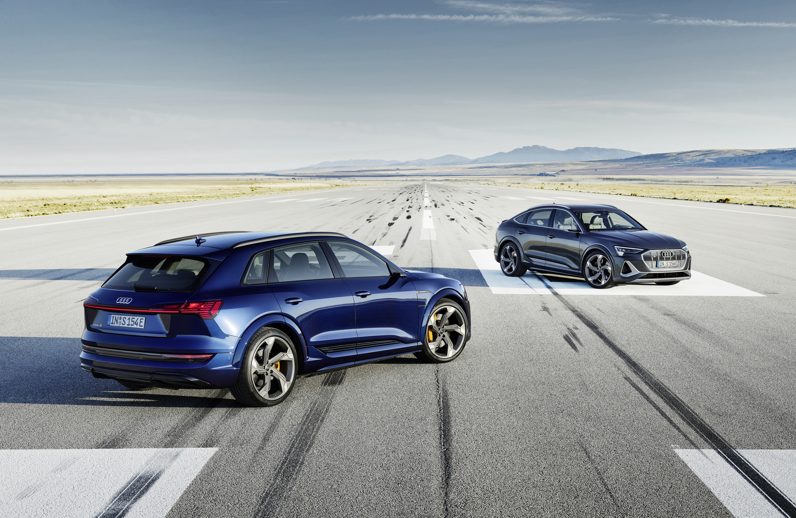

 The sporty SUV combines the space and comfort of a typical luxury class automobile with a range suitable for everyday use, catapulting the driver into a new era with the electrical all-wheel drive. Forward-looking, innovative, and electric – the next step into the future.

Audi e-tron 55 had world premiere at September 17. 2018 Later the Sportback was released together with the 50 and S version.

The car has been a big success for Audi and in Norway it even became the best selling car model in 2020.

The variants available are

- [Audi e-tron 50](/models/e-tron/variants/#audi-e-tron-50)
- [Audi e-tron 50 Sportback](/models/e-tron/variants/#audi-e-tron-50-sportback)
- [Audi e-tron 55](/models/e-tron/variants/#audi-e-tron-55)
- [Audi e-tron 55 Sportback](/models/e-tron/variants/#audi-e-tron-55-sportback)
- [Audi e-tron 60S](/models/e-tron/variants/#audi-e-tron-60s)
- [Audi e-tron 60S Sportback](/models/e-tron/variants/#audi-e-tron-60s-sportback)
  
Audi e-tron has a wide range of option and advanced driving technlogy. Below you can dig deep in to the different details about this car.

{}
