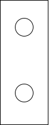

<!-- markdownlint-disable MD033 -->

## Zelltechnologie

Audi/Volkswagen verfolgt eine Multi-Vendor-Strategie bei Zellen. Das bedeutet, dass Audi verschiedene Anbieter von Lithium-Ionen-Zellen für verschiedene Batterien einsetzt. Auch die Anbieter haben sich seit der Weltpremiere des e-tron verändert.

### LG Chem.

Die Zelle, die vor Januar 2021 auf e-tron 55 verwendet wurde, ist LG Chem E66A. [LG Pouch Cell](https://www.youtube.com/watch?v=Q2Lczd7MjGc), hergestellt in [Poland](https://www.google.no/maps/search/lg+chem+poland/@51.0183429,16.8906359,995m/data=!3m1!1e3).

|Spec | Wert |
|-----|------|
| Hersteller | LG Chem. |
| Modell | LGX N2.1 |
| Nennkapazität |60 Ah |
| Nennspannung | 3,666666 V |
| Nennenergie | 219,907 Wh |
| Dicke|  16,5 mm |
| Breite | 100 mm |
| Höhe | 330 mm |
| Volumen | 0,544500 |
| Gewicht | 820 g |
| Volumentrische Energiedichte | 403 Wh/L |
| Gravimetrische Energiedichte | 268 Wh/kg |
| Chemie | [NCM 622](https://en.wikipedia.org/wiki/Lithium-ion_battery) |

<figure>
    
    <figcaption><h4>LGX N2.1 60AH Beutelzelle von LG Chem</h4></figcaption>
</figure>

<figure>
    
    <figcaption><h4>Batteriemodul mit 12 LG Chem Beutelzellen</h4></figcaption>
</figure>

### Samsung SDI

Audi hat Samsung SDI-Zellen für den 71kWh-Akku verwendet, der auf dem Audi e-tron 50 verwendet wird. Samsung SDI produziert die Zellen in [Budapest, Hungary](https://www.google.com/maps/place/Samsung+SDI+Hungary+Zrt./@47.6765476,19.168821,2130m/data=!3m1!1e3!4m5!3m4!1s0x0:0x45db42011a2687d9!8m2!3d47.6779532!4d19.170087). Sie sind vom Typ [Samsung Prismatic](https://www.samsungsdi.com/automotive-battery/products/prismatic-lithium-ion-battery-cell.html).

Nach Januar 2021 ersetzte Audi die Batteriezellen auf e-tron 55 Batterien mit [Samsung SDI cells](https://www.electrive.net/2020/07/23/audi-chef-duesmann-sieht-batterie-probleme-beim-e-tron-als-geloest/)Die Änderung wird angenommen, dass vor allem, weil LG konzentrierte sich auf andere Zellen zu anderen VAG Autos.

|Spec | Wert |
|-----|------|
| Hersteller | Samsung SDI|
| Modell |  |
| Nennkapazität |60 Ah |
| Nennspannung | 3,666666 V |
| Nennenergie | 219,907 Wh |
| Dicke|  ? |
| Breite | ? |
| Höhe | ? |
| Volumen | ? |
| Gewicht | ? g |
| Volumentrische Energiedichte | ? Wh/L |
| Gravimetrische Energiedichte | ? Wh/kg |
| Chemie | [NCM 622](https://en.wikipedia.org/wiki/Lithium-ion_battery) |

<figure>
    
    <figcaption><h4>e-tron Batteriemodul mit Samsung Prismenzelle und 71kWh Batteriepack</h4></figcaption>
</figure>

<figure>
    
    <figcaption><h4>Samsung Prismenzellen</h4></figcaption>
</figure>

## Batteriepackungen

Aktuell ist der Audi e-tron in 2 verschiedenen Akkupackgrößen erhältlich. [2024-model](../../mychanges/) Es wird eine größere Packung hinzugefügt.

### 95 kWh Batterie

Die Batterie für den Audi e-tron 55/e-tron 60S ist voll auf 95kWh und mit einer Nennspannung von 396 Volt.

Es besteht aus 36 Modulen mit jeweils 12 Zellen, die insgesamt 432 ergeben.

Die Zellen in jedem Modul sind in 4p3s-Konfiguration verbunden, d.h. 4 und 4 Zellen werden parallel gruppiert und dann in Serie geschaltet.

Da jede Zelle auf 60ah ist, gibt jede parallele Gruppe eine Kapazität von 240Ah. (4 x 60ah)

Wenn 36 Module wie diese in Serie geschaltet sind, beträgt die Nennspannung 396 Volt.

396 Volt * 240h = 95 040 Wattstunden (Wh) oder 95kWh (Kilowattstunden)

Jedes Modul ist auf 11 Volt und hat eine Kapazität von 240 x 11 = 2640 Wh oder 2,64 kWh.

Jedes Modul wiegt ca. 13 kg.

<figure>
    
    <figcaption><h4>Modul mit LG-Beutelzellen</h4></figcaption>
</figure>

Das Gesamtgewicht der Batterie beträgt 1532,2 lb (699,99 kg)

Für Modelle, die vor der Woche 47 im Jahr 2019 produziert werden, ist die verfügbare Batterie 83,6 kWh. Dies hat die Teilnummer 1 AX2. Für danach produzierte Modelle wurde der Puffer verringert, so dass die verfügbare Kapazität 86,5 kWh beträgt und die Reichweite um 3,4% erhöht wird.

### 71 kWh Batterie

Der Akku für den Audi e-tron 50 ist voll auf 71kWh und wurde entwickelt, um einen billigeren e-tron zu unterstützen.

Der 71kWh Akkupack hat 27 Module mit jeweils 12 Zellen, was 324 Zellen ergibt.

Ein Faktor ist, dass es die gleiche Nennspannung bei 396 Volt gibt.

Dies wurde durch die Änderung der Batteriearchitektur von 4 Zellen parallel zu 3 Zellen parallel möglich.

Da jede Zelle auf 60ah ist, gibt jede parallele Gruppe eine Kapazität von 180Ah. (3 x 60ah)

Wenn 27 Module wie diese in Serie geschaltet sind, beträgt die Nennspannung 396 Volt.

396 Volt * 180ah = 71 280 Wattstunden (Wh) oder 71kWh (Kilowattstunden)

Jedes Modul ist auf 14.666 Volt und hat eine Kapazität von 14.666 x 14.666 = 2640 Wh oder 2.64 kWh.

<figure>
    
    <figcaption><h4>Modul mit 12 60Ah Prismatischen Zellen von e-golf.</h4></figcaption>
</figure>

## Batteriegehäuse

Die 71kWh Batterie besteht aus 27 Modulen und alle befinden sich auf dem gleichen "Boden".

<figure>
    
    <figcaption><h4>71kWh Batterie für e-tron 50 mit 27 Modulen</h4></figcaption>
</figure>

Die meisten Batteriegehäuseteile werden mit dem größeren 95kWh-Akku wiederverwendet. Der 95kWh nutzt eine zweite Etage unter den Rücksitzen, um den Raum für die 36 Module zu bekommen.

<figure>
    
    <figcaption><h4>Batteriepack 95kWh mit 36 Modulen, davon fünf im zweiten Stock</h4></figcaption>
</figure>

<figure>
    
    <figcaption><h4>95kWh Akkupack</h4></figcaption>
</figure>

Das folgende Diagramm zeigt, wie der e-tron 50 / e-tron Sportback 50 weniger Module hat.

Um die Hochvoltbatterie des Audi etron zu schützen, wurden anspruchsvolle Maßnahmen getroffen, ein starker, umschließender Rahmen aus Aluminiumgußknoten und Strangpressprofilen sowie eine 3,5 Millimeter dicke Aluminiumplatte gegen Schäden durch Unfälle oder Bordsteine. Im Inneren ist eine gerüstartige Aluminiumstruktur verstärkt, die ebenfalls aus Strangpressprofilen besteht und die Zellenmodule wie ein Typkoffer hält.

<figure>
    
    <figcaption><h4>Integrierte Crashstruktur der Lithium-Ionen-Batterie</h4></figcaption>
</figure>

Einschließlich des Gehäuses mit seinen ausgeklügelten Crashstrukturen aus 47 Prozent Aluminiumstrangprofilen, 36 Prozent Aluminiumblech und 17 Prozent Aluminiumdruckgussteilen wiegt das Batteriesystem rund 700 Kilogramm (1.543,2 lb). Es ist an 35 Punkten an der Karosseriestruktur des Audi e-tron angeschraubt. Dies erhöht seine Torsionssteifigkeit um 27 Prozent und trägt zur hohen Sicherheit des Audi e-tron bei, ebenso wie das an der Außenseite des Batteriegehäuses angeklebte Kühlsystem. Im Vergleich zu einem herkömmlichen SUV bietet der Audi e-tron eine um 45 Prozent höhere Torsionssteifigkeit, ein wichtiger Parameter für präzises Handling und akustischen Komfort.

## Wärmemanagement

Die Batteriepacks sind so konzipiert, dass sie eine hohe Leistung über einen großen Bereich von Temperatur- und Ladezuständen bieten.

Ein Kühlsystem aus flachen Aluminium-Strangpressprofilen, die gleichmäßig in kleine Kammern unterteilt sind, hat die Aufgabe, den Hochleistungsbetrieb der Batterie langfristig zu erhalten.

 Der Wärmeaustausch zwischen den Zellen und dem darunter liegenden Kühlsystem erfolgt über ein unter jedes Zellenmodul gepresstes wärmeleitfähiges Gel, bei dem die Abwärme über das Batteriegehäuse gleichmäßig an das Kühlmittel abgegeben wird.

<figure>
    
    <figcaption><h4>Kühlung der Lithium-Ionen-Batterie über den Kühler</h4></figcaption>
</figure>

Die Batterie und alle ihre Parameter, wie Ladezustand, Leistungsabgabe und Thermomanagement, werden von der externen Batteriemanagement-Steuerung (BMC) verwaltet, die sich in der Insassenzelle auf der rechten A-Säule des Audi e-tron befindet. Die BMC kommuniziert sowohl mit den Steuereinheiten der Elektromotoren als auch mit den Zellenmodul-Steuerungen (CMC), die jeweils Strom, Spannung und Temperatur der Module überwachen.

<figure>
    
    <figcaption><h4>Batterieanschlussdose</h4></figcaption>
</figure>

Die Batterieanschlussdose (BJB), in die die Hochspannungsrelais und -sicherungen integriert sind, ist die elektrische Schnittstelle zum Fahrzeug. Sie ist in einem Aluminiumdruckgussgehäuse im vorderen Bereich des Batteriesystems angeordnet. Der Datenaustausch zwischen dem BMC, den CMCs und dem BJB erfolgt über ein separates Bussystem.



## Ladeleistung

Audi e-tron 55/S und Audi e-tron 50 sind eines der am schnellsten aufgeladenen Elektrofahrzeuge auf dem Markt.

Für den 71kWh Akku beträgt die maximale Ladegeschwindigkeit 125kW.

<figure>
    
    <figcaption><h4>Ladekurve Audi e-tron 50</h4></figcaption>
</figure>

Für den 95kWh Akku beträgt die maximale Ladegeschwindigkeit 150kW.

<figure>
    
    <figcaption><h4>Ladekurve Audi e-tron 55</h4></figcaption>
</figure>

[Diagram from FASTNED](https://support.fastned.nl/hc/en-gb/articles/360000815988-Charging-with-an-Audi-e-tron)

Mehrere Autos haben eine höhere Höchstgeschwindigkeit beim Laden, aber die konstant hohe Leistung von niedrigem SOC bis hohem SOC macht es schneller als die meisten anderen Autos.

<figure>
    
    <figcaption><h4>Ladekurve e-tron 55 im Vergleich zur Konkurrenz</h4></figcaption>
</figure>

Siehe Videovergleich unten.



Bei kaltem Wetter wird die typische Ladegeschwindigkeit am Anfang niedriger, bis die Temperatur steigt. Audi e-tron heizt die Batterie nicht vor dem Laden vor.


