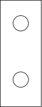
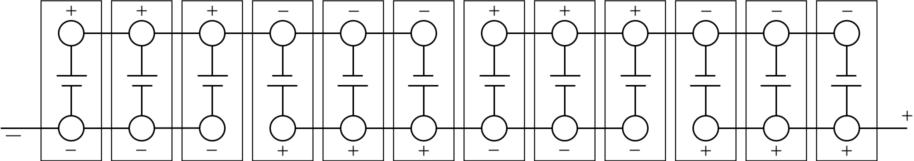

<!-- markdownlint-disable MD033 -->

## Technologie cellulaire

Audi/Volkswagen a une stratégie multivendeur sur les cellules. Cela signifie que Audi utilise différents fournisseurs de cellules Lithium-ion pour différentes batteries. Les fournisseurs ont également changé depuis que l'e-tron a eu sa première mondiale.

### LG Chem

La cellule utilisée sur e-tron 55 avant janvier 2021 est LG Chem E66A. Le type de cellule est [LG Pouch Cell](https://www.youtube.com/watch?v=Q2Lczd7MjGc), produits en [Poland](https://www.google.no/maps/search/lg+chem+poland/@51.0183429,16.8906359,995m/data=!3m1!1e3).

|Spécifique | Valeur |
|-----|------|
| Producteur | LG Chem |
| Modèle | LGX N2.1 |
| Capacité nominale |60 Ah |
| Tension nominale | 3 666666 V |
| Énergie nominale | 219,907 Wh |
| Épaisseur|  16,5 mm |
| Largeur | 100 mm |
| Hauteur | 330 mm |
| Volume | 0,544500 |
| Poids | 820 g |
| Densité énergétique volumétrique | 403 Wh/L |
| Densité énergétique gravimétrique | 268 Wh/kg |
| Chimie | [NCM 622](https://en.wikipedia.org/wiki/Lithium-ion_battery) |

<figure>
    
    <figcaption><h4>LGX N2.1 Cellule de poche 60AH de LG Chem</h4></figcaption>
</figure>

<figure>
    
    <figcaption><h4>Module batterie avec 12 cellules LG Chem</h4></figcaption>
</figure>

### Samsung SDI

Audi a utilisé les cellules Samsung SDI pour la batterie 71kWh utilisée sur le Audi e-tron 50. Samsung SDI produit les cellules en [Budapest, Hungary](https://www.google.com/maps/place/Samsung+SDI+Hungary+Zrt./@47.6765476,19.168821,2130m/data=!3m1!1e3!4m5!3m4!1s0x0:0x45db42011a2687d9!8m2!3d47.6779532!4d19.170087). Ils sont de type [Samsung Prismatic](https://www.samsungsdi.com/automotive-battery/products/prismatic-lithium-ion-battery-cell.html).

Après janvier 2021, Audi a remplacé les piles sur e-tron 55 batteries par [Samsung SDI cells](https://www.electrive.net/2020/07/23/audi-chef-duesmann-sieht-batterie-probleme-beim-e-tron-als-geloest/).Le changement est considéré comme étant principalement parce que LG se concentre sur d'autres cellules pour d'autres voitures VAG.

|Spécifique | Valeur |
|-----|------|
| Producteur | Samsung SDI|
| Modèle |  |
| Capacité nominale |60 Ah |
| Tension nominale | 3 666666 V |
| Énergie nominale | 219,907 Wh |
| Épaisseur|  ? |
| Largeur | ? |
| Hauteur | ? |
| Volume | ? |
| Poids | ? g |
| Densité énergétique volumétrique | ? Wh/L |
| Densité énergétique gravimétrique | ? Wh/kg |
| Chimie | [NCM 622](https://en.wikipedia.org/wiki/Lithium-ion_battery) |

<figure>
    
    <figcaption><h4>Module de batterie e-tron avec cellule prismatique Samsung et pack de batterie 71kWh</h4></figcaption>
</figure>

<figure>
    
    <figcaption><h4>Samsung cellules prismatiques</h4></figcaption>
</figure>

## Piles

Actuellement, l'Audi e-tron est disponible avec 2 différentes tailles de batteries. [2024-model](../../mychanges/) il y aura un paquet plus grand.

### Batterie de 95kWh

La batterie du Audi e-tron 55/e-tron 60S est entièrement sur 95kWh et avec une tension nominale de 396 volts.

Il se compose de 36 modules avec 12 cellules chacun qui donnent un total de 432.

Les cellules de chaque module sont connectées en configuration 4p3s. Les cellules 4 et 4 sont regroupées en parallèle puis connectées en série.

Comme chaque cellule est sur 60a, chaque groupe parallèle donne une capacité de 240ah. (4 x 60a)

Lorsque 36 modules de ce type sont connectés en série, la tension nominale est de 396 volts.

396 volt * 240ah = 95 040 Watt-heure (Wh) ou 95kWh (kilo Watt Heures)

Chaque module est sur 11 Volts et a une capacité de 240 x 11 = 2640 Wh ou 2,64 kWh.

Chaque module pèse environ 13 kg.

<figure>
    
    <figcaption><h4>Module avec cellules de poche LG</h4></figcaption>
</figure>

Le poids total de la batterie est de 1532,2lb (699,99 kg)

Pour les modèles produits avant la semaine 47 en 2019, la batterie disponible est de 83,6 kWh. La partie numéro 1 AX2. Pour les modèles produits après, le tampon a été diminué de sorte que la capacité disponible est de 86,5 kWh augmentant la gamme de 3,4%.

### Batterie 71kWh

La batterie de l'Audi e-tron 50 est entièrement sur 71kWh et a été créée pour supporter un e-tron moins cher.

Le pack de batterie 71kWh dispose de 27 modules avec 12 cellules chacun, donnant 324 cellules. Ce n'est pas une coïncidence qu'il dispose de 27 modules.

Un facteur est qu'il donne la même tension nominale à 396 volts.

Cela a été possible en changeant l'architecture de la batterie de 4 cellules en parallèle à 3 cellules en parallèle.

Puisque chaque cellule est sur 60a chaque groupe parallèle donne une capacité de 180a. (3 x 60a)

Lorsque 27 modules de ce type sont connectés en série, la tension nominale est de 396 volts.

396 volts * 180ah = 71 280 Watt-heure (Wh) ou 71kWh (kilowatt-heures)

Chaque module est équipé de 14.666 volts et a une capacité de 14.666 x 14.666 = 2640 Wh ou 2,64 kWh.

<figure>
    
    <figcaption><h4>Module avec 12 cellules Prismatic 60Ah de e-golf.</h4></figcaption>
</figure>

## Boîtier de batterie

La batterie 71kWh est composée de 27 modules et tous sont situés sur le même "sol".

<figure>
    
    <figcaption><h4>Batterie 71kWh pour e-tron 50 avec 27 modules</h4></figcaption>
</figure>

La plupart des pièces de la batterie sont réutilisées avec la plus grande batterie 95kWh. La 95kWh utilise un deuxième étage sous les sièges arrière pour obtenir la pièce nécessaire pour les 36 modules.

<figure>
    
    <figcaption><h4>Batterie 95kWh avec 36 modules, dont cinq au deuxième étage</h4></figcaption>
</figure>

<figure>
    
    <figcaption><h4>Batterie de 95kWh</h4></figcaption>
</figure>

Le diagramme ci-dessous montre comment le e-tron 50 / e-tron Sportback 50 a moins de modules.

Des mesures sophistiquées ont été prises pour protéger la batterie haute tension de l'Audi e-. Un cadre solide encastrant des nœuds en aluminium moulé et des sections extrudées, ainsi qu'une plaque en aluminium 3,5 millimètres (0,1 po) d'épaisseur protègent contre les dommages causés par les accidents ou les bordures. À l'intérieur, une structure en aluminium de type framework renforce le système de batterie.

<figure>
    
    <figcaption><h4>Structure intégrée de la batterie lithium-ion</h4></figcaption>
</figure>

Le boîtier, avec ses structures de choc sophistiquées comprenant 47 pour cent de sections en aluminium extrudé, 36 pour cent de tôle d'aluminium et 17 pour cent de pièces en aluminium moulé sous pression, pèse environ 700 kilogrammes (1 543,2 lb). Il est boulonné à la structure de la caisse du Audi e-tron à 35 points. Cela augmente sa rigidité torsionnelle de 27 pour cent et contribue au niveau élevé de sécurité du Audi e-tron, tout comme le système de refroidissement lié à l'extérieur du boîtier de la batterie.

## Gestion thermique

Les batteries sont créées pour donner des performances élevées sur une large gamme de niveaux de température et de charge.

Un système de refroidissement de sections extrudées en aluminium plat divisées uniformément en petites chambres a pour tâche de maintenir la batterie à haute performance sur le long terme.

 La chaleur est échangée entre les cellules et le système de refroidissement sous elles via un gel conducteur thermiquement pressé sous chaque module cellulaire. Dans une solution particulièrement efficace, le gel transfère uniformément la chaleur résiduelle au liquide de refroidissement via le boîtier de la batterie.

<figure>
    
    <figcaption><h4>Refroidissement de la batterie lithium-ion par le refroidisseur</h4></figcaption>
</figure>

La batterie et tous ses paramètres, tels que l'état de charge, la puissance et la gestion thermique, sont gérés par le contrôleur externe de gestion de batterie (BMC). Il est situé dans la cellule occupante sur la bonne colonne A du Audi e-tron. Le BMC communique à la fois avec les unités de commande des moteurs électriques et les contrôleurs de module cellulaire (CMC), chacun d'eux surveille le courant, la tension et la température des modules.

<figure>
    
    <figcaption><h4>Boîte de jonction de batterie</h4></figcaption>
</figure>

La boîte de jonction de batterie (BJB), dans laquelle les relais et fusibles haute tension sont intégrés, est l'interface électrique du véhicule. Enfermée dans un boîtier en aluminium moulé sous pression, elle est située dans la section avant du système de batterie. L'échange de données entre le BMC, les CMC et le BJB se fait par un système d'autobus séparé.



## Exécution de la charge

Audi e-tron 55/S et Audi e-tron 50 est l'un des véhicules électriques les plus rapides du marché.

Pour la batterie 71kWh, la vitesse de charge maximale est de 125kW.

<figure>
    
    <figcaption><h4>Courbe de charge Audi e-tron 50</h4></figcaption>
</figure>

Pour la batterie 95kWh, la vitesse de charge maximale est de 150kW.

<figure>
    
    <figcaption><h4>Courbe de charge Audi e-tron 55</h4></figcaption>
</figure>

[Diagram from FASTNED](https://support.fastned.nl/hc/en-gb/articles/360000815988-Charging-with-an-Audi-e-tron)

Plusieurs voitures ont une vitesse de charge supérieure, mais les performances élevées constantes de faible SOC à haute SOC le rend plus rapide que la plupart des autres voitures.

<figure>
    
    <figcaption><h4>Courbe de charge e-tron 55 comparée à la concurrence</h4></figcaption>
</figure>

Voir la comparaison vidéo ci-dessous.



Par temps froid, la vitesse de charge typique sera plus basse au début jusqu'à ce que la température monte. Audi e-tron ne préchauffe pas la batterie avant la recharge.


