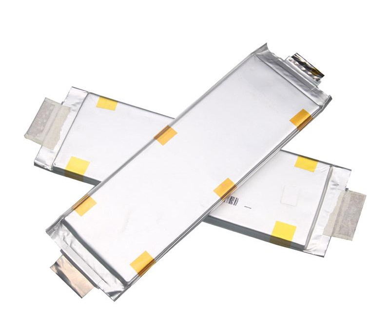
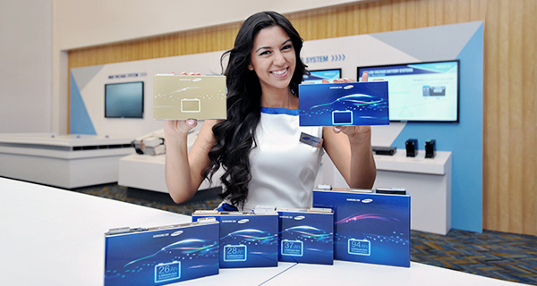
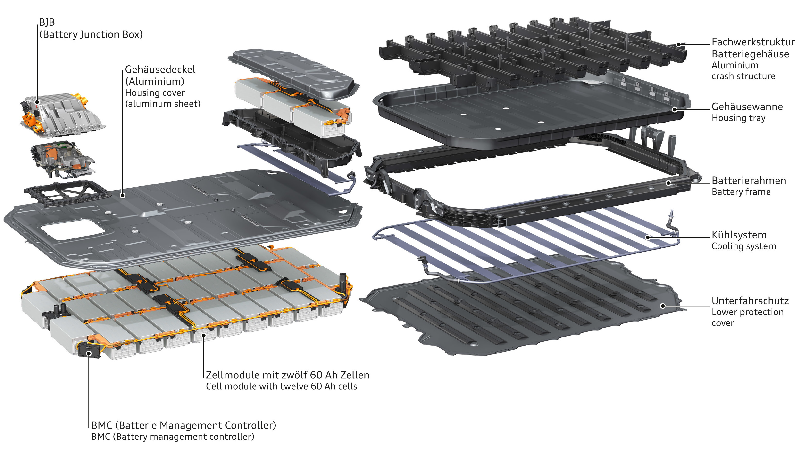
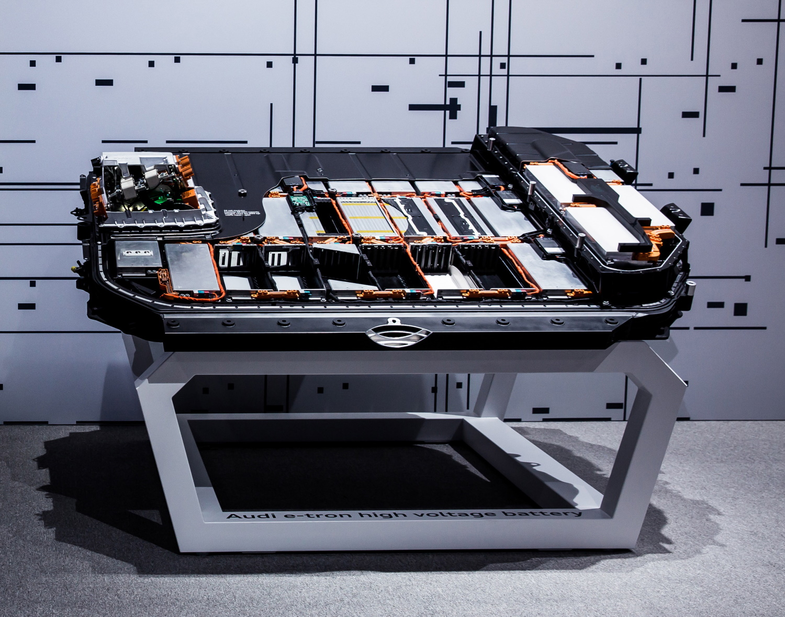
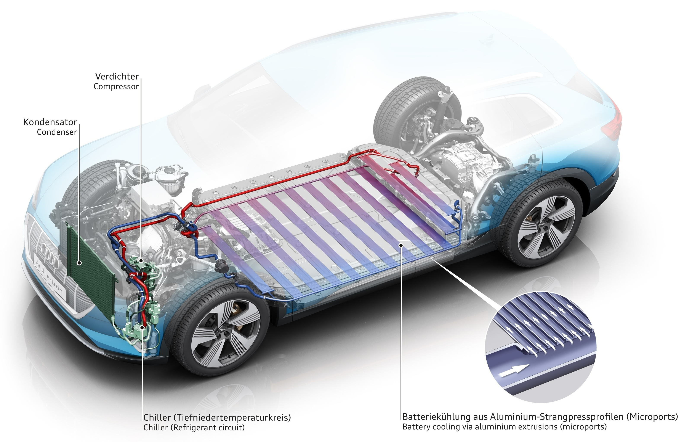
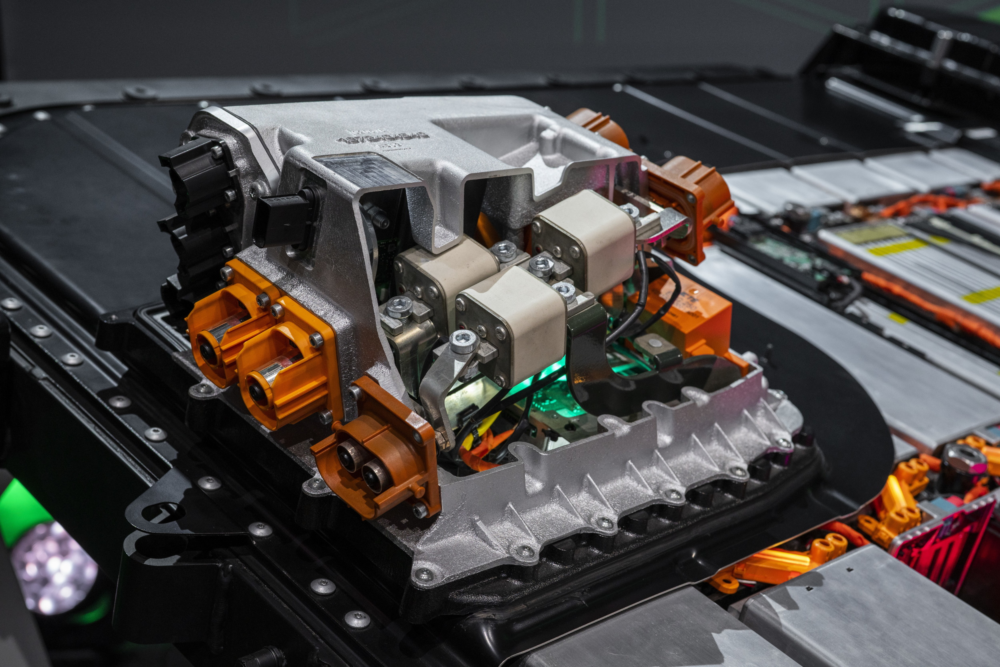
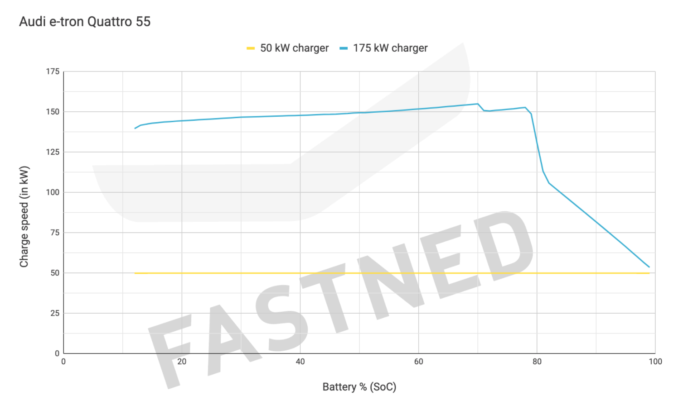

## Cell technology

Audi/Volkswagen has a multi-vendor strategy on cells. That means that Audi uses different vendors of Lithium-ion cells for different batteries.

Vendors have also changed since e-tron had the world premiere

### LG Chem

The cell used on e-tron 55 before january 2021 is LG Chem E66A. The cell type is [LG Pouch Cell](https://www.youtube.com/watch?v=Q2Lczd7MjGc) produced in [Poland](https://www.google.no/maps/search/lg+chem+poland/@51.0183429,16.8906359,995m/data=!3m1!1e3).

|Spec | Value |
|-----|------|
| Producer | LG Chem |
| Model | LGX N2.1 |
| Nominal Capacity |60 Ah |
| Nominal Voltage | 3,666666 V |
| Nominal energy | 219,907 Wh |
| Thickness|  16,5 mm |
| Width | 100 mm |
| Height | 330 mm |
| Volume | 0,544500 |
| Weight | 820 g |
| Volumetric Energy Density | 403 Wh/L |
| Gravimetric Energy Density | 268 Wh/kg |
| Chemistry | [NCM 622](https://en.wikipedia.org/wiki/Lithium-ion_battery) |

### Samsung SDI

For the 71kWh battery used on Audi e-tron 50, Audi has been using Samsung SDI cells since the beginning.
The cells are produced by Samsung SDI in [Budapest, Hungary](https://www.google.com/maps/place/Samsung+SDI+Hungary+Zrt./@47.6765476,19.168821,2130m/data=!3m1!1e3!4m5!3m4!1s0x0:0x45db42011a2687d9!8m2!3d47.6779532!4d19.170087)
They are of type [Samsung Prismatic](https://www.samsungsdi.com/automotive-battery/products/prismatic-lithium-ion-battery-cell.html)

After January 2021 Audi replaced the battery cells on e-tron 55 batteries with [Samsung SDI cells](https://www.electrive.net/2020/07/23/audi-chef-duesmann-sieht-batterie-probleme-beim-e-tron-als-geloest/). This is believed  mainly to be because LG focused on other cells to other VAG cars.

|Spec | Value |
|-----|------|
| Producer | Samsung SDI|
| Model |  |
| Nominal Capacity |60 Ah |
| Nominal Voltage | 3,666666 V |
| Nominal energy | 219,907 Wh |
| Thickness|  ? |
| Width | ? |
| Height | ? |
| Volume | ? |
| Weight | ? g |
| Volumetric Energy Density | ?  Wh/L |
| Gravimetric Energy Density | ? Wh/kg |
| Chemistry | [NCM 622](https://en.wikipedia.org/wiki/Lithium-ion_battery) |

## Battery packs

Currently, the Audi e-tron is available with 2 different battery pack sizes. It is expected that from the [2023-model](/models/e-tron/mychanges/) there will be added a larger pack.

### 95kWh battery

The battery for the Audi e-tron 55/e-tron 60S is totally on 95kWh and with a nominal voltage of 396 volts.

It consists of 36 modules with 12 cells each that give a total of 432.

The cells in each module are connected in 4p3s configuration. Meaning 4 and 4 cells are grouped in parallel and
then connected in serial.

Since each cell is on 60ah each parallel group gives a capacity of 240Ah. (4 x 60ah)

When 36 modules like this are connected in serial the nominal voltage is 396 volt.

396volt * 240ah = 95 040 Watt-hour (Wh) or 95kWh (kilo Watt Hours)

Each module is on 11 Volt and has a capacity of 240 x 11 = 2640 Wh or 2.64 kWh.

Each module weighs approx 13kg.

Total battery weight is 1532.2lb (699,99 kg)

For models produced before week 47 in 2019, the available battery is 83.6 kWh. This has part number 1 AX2.
For models produced after that, the buffer has been decreased so the available capacity is 86.5 kWh increasing the range by 3,4%.

### 71kWh battery

The battery for the Audi e-tron 50 is totally on 71kWh and was created to support a cheaper e-tron.

It has a total of 27 modules with 12 cells each that give a total of 324 cells. It is no coincidence that it has 27 modules.

One important factor was that it has to have the same nominal voltage at 396 volts.

This was possible by changing the battery architecture from 4 cells in parallel to 3 cells in parallel.

Since each cell is on 60ah each parallel group gives a capacity of 180Ah. (3 x 60ah)

When 27 modules like this are connected in serial the nominal voltage is 396 volt.

396volt * 180ah = 71 280 Watt-hour (Wh) or 71kWh (kilo Watt Hours)

Each module is on 14.666 Volt and has a capacity of 14.666 x 14.666 = 2640 Wh or 2.64 kWh.

## Battery housing

The 71kWh battery consist of 27 modules and all are located on the same "floor".

Most of the battery housing parts are reused with the larger 95kWh battery.
The 95kWh uses a second floor under the rear seats to get the room needed for the 36 modules.

The diagram below shows how the e-tron 50 / e-tron Sportback 50 has fewer modules.

Sophisticated measures have been taken to protect the high-voltage battery of the Audi etron. A strong enclosing frame of cast aluminum nodes and extruded sections, plus an aluminum plate 3.5 millimeters (0.1 in) thick protect against damage from accidents or curbs. Inside, a framework-like aluminum structure reinforces the battery system. Also 
comprised of extruded sections, it holds the cell modules like a typecase.

Including the housing with its sophisticated crash structures comprising 47 percent extruded aluminum sections, 36 percent aluminum sheet, and 17 percent diecast aluminum parts, the battery system weighs around 700 kilograms (1,543.2 lb). It is bolted to the body structure of the Audi e-tron at 35 points. This increases its torsional rigidity by 27 percent and contributes to the high level of the safety of the Audi e-tron, as does the cooling system bonded to the outside of the battery housing. Compared to a conventional SUV, the Audi e-tron offers 45 percent higher torsional rigidity, a key parameter for precise handling and acoustic comfort

## Thermal management

The battery packs are created to give high performance over a large range of temperature and charge levels.

A cooling system of flat aluminum extruded sections divided uniformly into small chambers has the task of maintaining the battery’s high-performance operation over the long term.

 Heat is exchanged between the cells and the cooling system beneath them via a thermally conductive gel pressed beneath each cell module. In what is a particularly efficient solution, the gel evenly transfers the waste heat to the coolant via the battery housing.

 

The battery and all of its parameters, such as charge status, power output, and thermal management, are managed by the external battery management controller (BMC). This is located in the occupant cell on the right A-pillar of the Audi e-tron. The BMC communicates both with the control units of the electric motors and the cell module controllers (CMC), each of which monitors the current, voltage, and temperature of the modules.

The battery junction box (BJB), into which the high-voltage relays and fuses are integrated, is the electrical interface to the vehicle. Enclosed in a die-cast aluminum housing, it is located in the front section of the battery system. Data exchange between the BMC, the CMCs, and the BJB is via a separate bus system.

## Charging performance

Audi e-tron 55/S and Audi e-tron 50 is one of the fastest charging EVs on the market.

For the 71kWh battery, the max charge speed is 125kW

For the 95kWh battery, the max charging speed is 150kW.

[Diagramm from FASTNED](https://support.fastned.nl/hc/en-gb/articles/360000815988-Charging-with-an-Audi-e-tron)

There are several cars with higher top speed on charging, but the consistently high performance from low SOC to high SOC makes it overall faster than most other cars.

[Charging curve](chargingcurve.jpg "e-tron 55 charging curve compared with competition")

See video comparison below.



In cold weather, the charging speed typical will get lower in the beginning until the temprature comes up. Audi e-tron does not pre-heat the battery before charging.

{}
