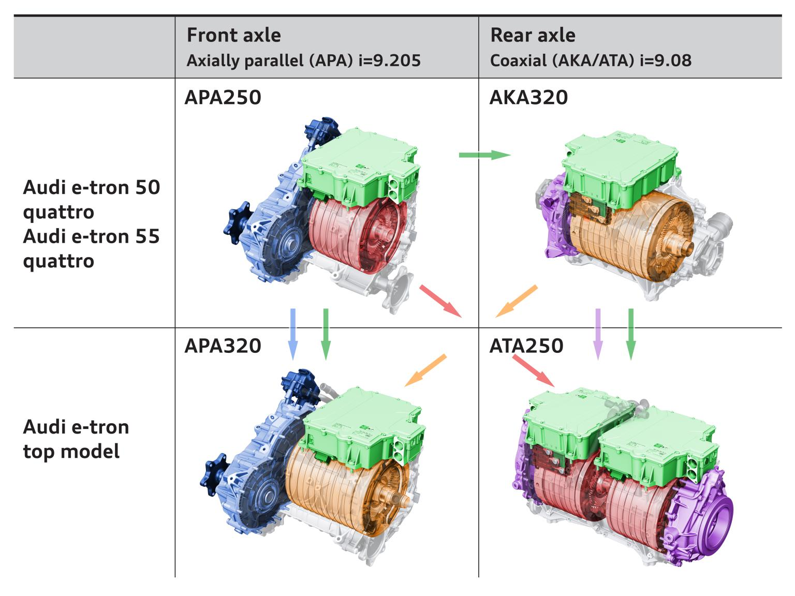
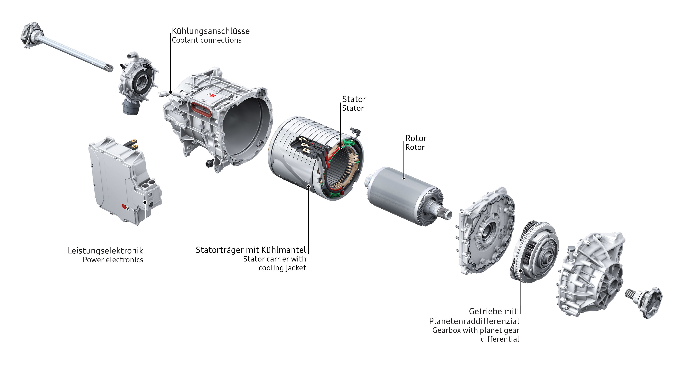
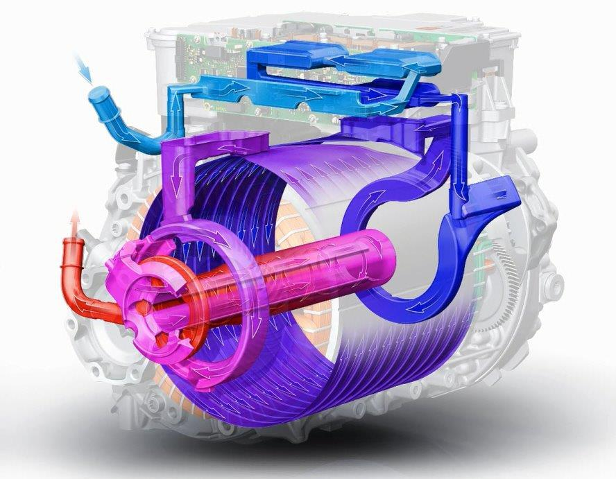

### Motor configuration

They have designed two [induction motors](https://en.wikipedia.org/wiki/Induction_motor) (asynchronous motors) that is used in the 3 different configuration.

Audi e-tron 50 quattro, e-tron 55 quattro and e-tron S uses the same motors but in different configuration 

It is one with 247Nm torque called 250 and one with 314Nm torque called 320. 
They are used in different configuration on the different models depending on version.

On e-tron 50 on e-tron 55 they have the 250 in front with a parallel (APA250) axle and the 320 rear with coaxial axle (ATA320). In e-tron S they have the 320 in front (APA320) and two 250 in back (ATA250)

The table below summarizes the performance for the version

|   | APA250 | ATA320 | APA320 | 2 x ATA250 |
| ------------- | ------------- | ------------- | ------------- |  ------------- |
| Power           |                      125 kW  | 140kW | 129kW | 205 kW |
| Power w/boost | 135 kW  | 165 kW | 157 kW | 276 kW |
| Torque | 247 Nm  | 314 Nm| 314 Nm | 494 Nm |
| Torque w/booost | 309 Nm  | 355 Nm| 355 Nm | 618 Nm |

## Drivetrain motor setup

### Audi e-tron 55 & Audi e-tron 50 motor setup

For both e-tron 50 and e-tron 55 Audi uses the AKA320 drive unit for the rear. This is a drive unit with 314nm torque (355nm with boost on e-tron 55)  and it has a coaxial configuration on the axels (axels goes through the unit)

The motors have a 2 stage plantaery gear differentsial

### Audi e-tron 60S 

In the e-tron S model Audi has moved the rear motor from e-tron 50 and e-tron 55 to the front and taken two front motors and combined them together on the rear axle.

2 x 138 kW boost power  /  2 x 70kW continuous power  /  2 stages, 1 gear  /  liquid cooled

Total 155kg.

This technical animation shows the total axle drive set up in the Audi e-tron S.



Animation of the drivetrain construction, twin motor and coolant circuit of the Audi e-tron S Sportback.



### Cooling

Each motor have liquid stator cooling, bearing plate cooling and rotor internal cooling that Audi e-tron maximum thermal robustness under all operating conditions.

This diagram shows how the rotor internal cooling helps keep the temprature low.

This animation shows the cooling and heat dissipation of the twin-coax drive.

{{ < youtube YXaR8RSU2Sw > }}

{}
