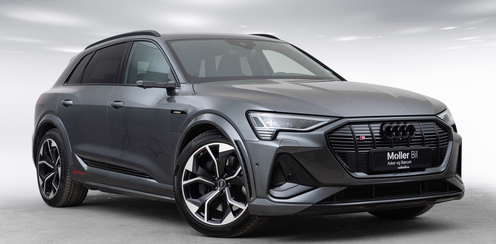
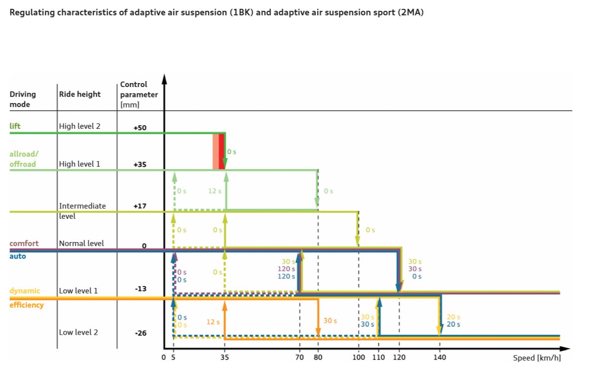
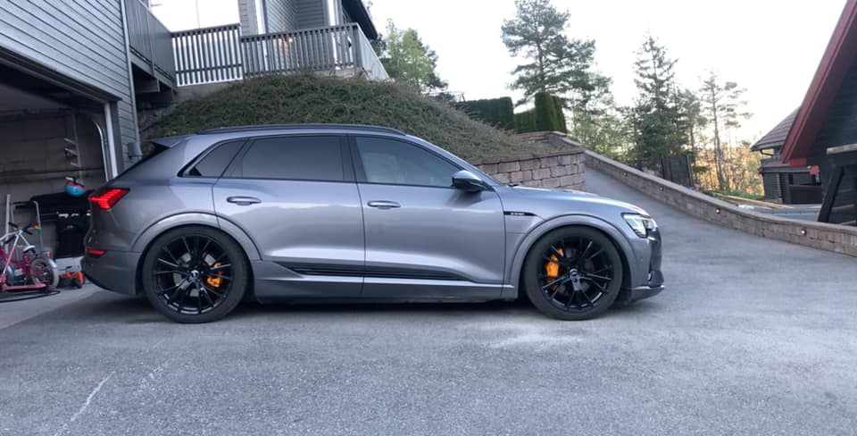

Adaptiv luftfjæring med elektronisk demping er standardutstyr på Audi e-tron. Typen av dempingskontroll som tilbys varierer mellom de to understellsversjonene,
**adaptiv luftfjæring** og **adaptiv luftfjæring sport** som er standard på e-tron S og S-Line e-tron.

Den adaptive luftfjæringen – et luftfjæringssystem med kontrollert demping – tilbyr et bredt spekter mellom jevn cruising og sportslig håndtering.
Avhengig av hastigheten og førerens preferanser, justerer den kjørehøyden individuelt i henhold til veiforholdene.
Luftfjæringen tilbyr også nivåregulering som funksjon av belastning.

Den sentrale chassiskontrollenheten, den elektroniske chassisplattformen (ECP), styrer individuelt funksjonen til støtdemperne på hvert hjul kl.
sykluser i størrelsesorden millisekunder – i henhold til veibanens tilstand, kjørestilen og modusen sjåføren angir i Audi drive select dynamisk håndteringssystem.
Magnetspjeldventiler varierer den volumetriske strømmen til hydraulikkvæsken.

Adaptiv luftfjæring har alternativ-ID **1BK** og adaptiv luftfjæring sport har alternativ-ID **2MB**

## Regulerende egenskaper

Reguleringsegenskapene (regulering av kjørehøyder avhengig av kjøretøyets hastighet og modus) er identiske på begge versjoner.
På andre Audier som Q7 og Q8 er Adaptive Sports Suspension 1 cm lavere. Men slik er det ikke på Audi e-tron.

Diagrammet under viser hvordan dette justeres avhengig av hastighet.

Illustrasjonen viser kontrollstrategien for luftfjæringssystemene. Ved å velge den foretrukne kjøremodusen i Audi drive select, bestemmer føreren kjøretøyets kjørehøyde og dynamiske egenskaper.
Samtidig stilles også forskjellige kjørehøyder automatisk inn innenfor den valgte kjøremodusen, avhengig av gjeldende kjøretøyhastighet. Et eksempel på dette kan sees i kontrollstrategien når "auto"-modus er valgt:
Hvis kjøretøyet for øyeblikket er innstilt på en annen kjørehøyde, settes det normale nivået ved å endre luftvolumet i luftfjærene hvis modusen velges når kjøretøyet står stille eller kjører med en hastighet under 120 km/t.

Dersom kjøretøyet deretter overskrider en hastighet på 120 km/t, vil kjørehøyden umiddelbart senkes med 13 mm til lavt nivå 1. Hvis hastigheten deretter øker ytterligere til minst 140 km/t og blir der i 20 sekunder, vil turen økes ytterligere til minst 140 km/t. høyde vil
senkes igjen med ytterligere 13 mm til motorveinivå. Hvis hastigheten deretter reduseres igjen og kjøretøyet kjøres med en hastighet på 110 km/t eller lavere i en varighet på 30 sekunder,
kjørehøyden heves med 13 mm til den tidligere innstilte kjørehøyden. Hvis hastigheten reduseres ytterligere til 5 km/t, heves kjøretøyet umiddelbart til opprinnelig nivå (normalt nivå).

## Senker bilen

Selv du kan justere kjørehøyden, noen vil ha den enda lavere. Her er noen eksempler på biler senket med senkekoblinger eller programvarejustering.

{}