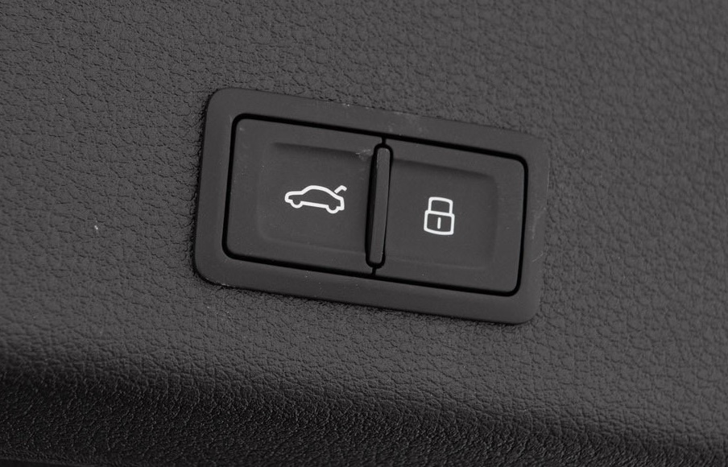

## Automatic locking

You can enable locking of doors when driving. This settings is found in MMI

## Child safety

From driver seat you can enable child safety for rear window and doors.

## Powered tailgate

All e-tron have powered tailgate.

## Door lights

All door are equiped with lights

## Servo closing

With servo closing of doors the doors are closed automatic the last cm. 

OptionID **GZ2**

## Keyless entry

If you get the [advance key option](/models/e-tron/technology/lockingsystems/#advance-key-option-pgc) you get keyless entry to the car

## Kick sensor tailgate

If you get the [advance key option](/models/e-tron/technology/lockingsystems/#advance-key-option-pgc) you get kick sensor for the tailgate

## Locking from tailgate

If you get the [advance key option](/models/e-tron/technology/lockingsystems/#advance-key-option-pgc) you get a locking button on tailgate
so you can lock the car.

{}
