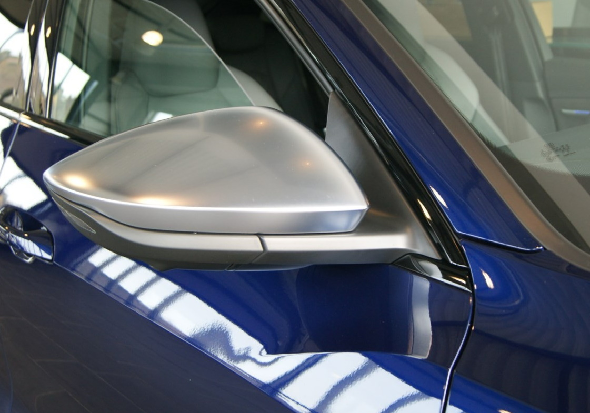

## Functionality

Electric adjustable mirrors are standard on Audi e-tron (option ID 6XD). They are controlled in the drivers door on the joystick.

There are some optional mirros

- Heated with memory : **6XG**
- heated, auto dimmed and electric retractable : **6XK**
- heated, auto dimmed, electric retractable with memory : **6XL**

## Mirror Style

## Virtual mirrors

The virtual exterior mirrors of the Audi e-tron not only provide a new technology experience, but also many practical benefits in terms of comfort and safety. Their flat support integrates a small camera whose image is digitally processed and shown on high-contrast 7-inch OLED displays in the interior. The driver can enter different settings using the touchscreen function. OptionID **PAF**

{}
