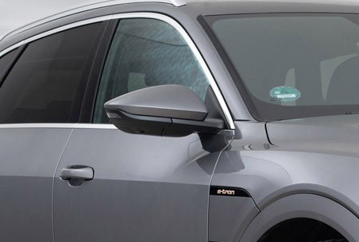

## Funksjonalitet

Elektrisk justerbare speil er standard på Audi e-tron (alternativ ID 6XD). De styres i førerdøren på joysticken.

Det er noen valgfrie speil

- Oppvarmet med minne: **6XG**
- oppvarmet, automatisk dimmet og elektrisk uttrekkbar: **6XK**
- oppvarmet, automatisk dimmet, elektrisk uttrekkbar med minne: **6XL**

## Speilstil

## Virtuelle speil

De virtuelle utvendige speilene til Audi e-tron gir ikke bare en ny teknologiopplevelse, men også mange praktiske fordeler når det gjelder komfort og sikkerhet. Deres flate støtte integrerer et lite kamera hvis bilde er digitalt behandlet og vist på 7-tommers OLED-skjermer med høy kontrast i interiøret. Sjåføren kan angi forskjellige innstillinger ved hjelp av berøringsskjermfunksjonen. OptionID **PAF**

{}
